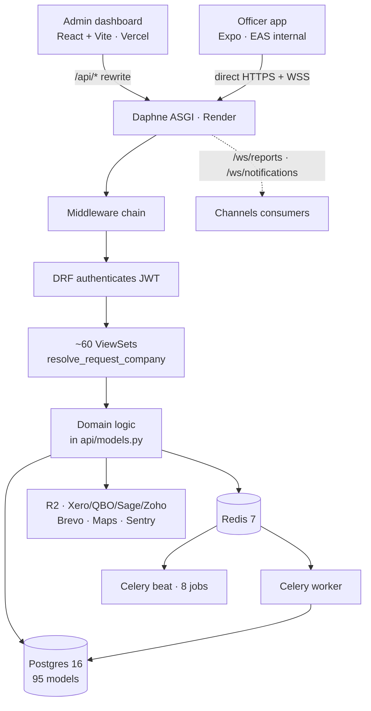
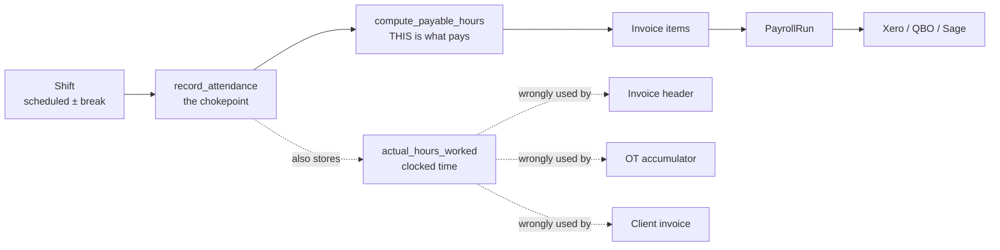

# Mead Security Engineering Audit

2026-09-17 · @Someone

An audit of the Mead Security platform — Django/DRF backend, React admin dashboard, Expo mobile app — answering one question: if a real security company started depending on this tomorrow for shifts, attendance, payroll, invoices, incidents and staff management, what could go wrong, and what must be fixed before that happens.

Twelve specialist investigations ran in parallel against a live Docker stack with a seeded database, so findings are verified at runtime where possible rather than read from source alone. Every finding below carries a location, an evidence trail and an honest confidence label.

## Method, and how to read this against the previous audit

This is the second pass over this codebase, and the difference between the passes matters more than anything else here.

The first pass is `GOAL.md` at the repo root, dated 2026-09-07, with its execution contract in `full_fix.md`. It says plainly that it was static: no test, request or query was ever run, because Docker was not up. Its remediation then landed across roughly twenty commits. Its changelog marks most items Done, several Built-but-disarmed behind a feature flag, and a few Deferred under a standing rule that nothing changes what anybody gets paid without an explicit instruction.

This pass ran with the stack up: Django API, Postgres 16 seeded with one tenant (14 users, 578 shifts, 127 invoices), Redis, a Celery worker, and a beat scheduler dispatching jobs throughout. So this report executes the test suite, issues real authenticated requests, and inspects the live schema rather than inferring it from migration files.

Running things cuts both ways, and two findings I was ready to report as critical dissolved under execution. They are recorded here because they show the standard of proof this report holds itself to.

- **Eight Celery beat entries looked unregistered** when checked by importing the app in a short-lived process. Had that been true, payroll runs, auto-checkouts and licence-expiry jobs would never have fired. Checked properly against the running worker with `celery -A core inspect registered`, all eight resolve, and the beat log shows continuous dispatch on cadence. The import-based check gives a false negative because autodiscovery has not completed. **Not a finding.**
- **`float()` on the pay path.** `shifts/views.py:1096` assigns `float(actual_hours)` into a `DecimalField`, which looks like the classic binary-float-in-wages bug and appears to contradict the prior audit's claim that money is Decimal end to end. Tested directly: Django 5 sanitises the float to five significant decimals, so `7.675` and `8.005` land identically whether they arrive as float or string. **Not a finding** — the Decimal claim holds.

One methodological caveat affects the numbers in this report. Twelve agents sharing one container collided on the single test database, because Django derives its name from `DB_NAME` and the project has no `pytest.ini`, `conftest.py` or test-DB isolation of any kind. Those collisions produce errors that read exactly like product failures. Runs were re-issued with a per-agent database. That the suite cannot tolerate two concurrent runs is itself recorded below as a testing-infrastructure finding.

## Executive summary

**Do not give this to a security company tomorrow.** Six confirmed defects would each, on their own, cause serious harm within the first week of real use: officers recorded as no-shows and paid nothing for shifts they worked, every officer's pay readable by anyone who can register an account, unlicensed officers rostered onto licensed doors with nothing to stop it, and clients invoiced at roughly a quarter of the intended margin. None of these are speculative; all six were reproduced against a running system.

That verdict deserves an important qualification, because it is not the verdict on the codebase as a whole. **This is a substantial and in places genuinely expert piece of software.** The shift model is row-per-slot, which makes capacity drift structurally impossible. Money is `Decimal` end to end and I tested the one place that looked like a violation — it holds. `claim_shift` locks the row properly. The bulk-shift wizard does a real server-side conflict preview before committing, which is better than most commercial schedulers. The overtime engine emits per-tier line items with a revenue-neutrality assertion. The duplicate-invoice and shift-overlap constraints from the previous audit are physically present in Postgres and their regression tests pass. Somebody here understands both the domain and the craft.

The problem is that the strong parts sit next to unguarded ones, and nothing in the development process distinguishes them.

### The shape of the risk

The defects cluster into four groups, and the grouping matters more than the individual counts because each group has one root cause.

**1. Tenancy is enforced per-view, by hand, 63 times.** There is no base model, no default manager, no row-level security — so each of roughly sixty ViewSets re-derives "which company is this?" itself. Most now do it correctly through one shared resolver, which is a real improvement from the last audit. But three do not, and the failures are not subtle: the billing helpers filter only `if company:` with no `else`, so when no company resolves they return **everything**. Compliance records carry no company column at all.

**2. Attendance has no safety net.** Pay derives from a chain — check-in, check-out, hours, invoice — in which every link assumes the previous one succeeded. When a check-in fails on a phone with no signal, the app says it was saved, queues nothing, and a background job converts the shift to a no-show within 30 minutes. Nothing downstream notices, and the officer cannot see the record to dispute it.

**3. Compliance is a reporting layer presented as an enforcement layer.** The models exist, the dashboards render, and the licence-to-role check produces a `warning` that no caller ever promotes to a block.

**4. Nothing catches regressions.** No CI runs the tests. No backup has been demonstrated. The health check returns green without touching the database. A bad merge reaches production unimpeded and undetected.

### The pattern worth internalising

Two findings in this audit are the same mistake, and it is the one that should change how work is done here.

The previous audit's mobile fixes for offline check-in, geofence radius and GPS accuracy were written into `mobile/src/screens/shifts/v2/CheckInFlowV2.tsx`. That file has a route registered and **zero navigation call sites** — it never executes. The screen that does run received two of the three fixes and never received the offline one at all. The prior audit had itself just deleted 7,354 lines of dead v1 screens for exactly this reason; the next round of fixes then landed in a different dead file.

The same shape appears on the backend. There are 8,514 lines in modules named `optimized_tasks.py`, `optimized_models.py`, `compliance_query_optimizations.py` and `multi_tenant_db_functions.py`. They are orphaned — nothing imports them — while the live invoice path runs with no `select_related` at all and issues 7,226 queries for one page.

In both cases the names advertise that the problem is solved, and a reasonable engineer reading the tree would believe it. **Delete dead code before fixing anything near it, and confirm the file you are editing is on an execution path.** That single habit would have prevented a meaningful fraction of what follows.

### What this means for the previous audit

`GOAL.md` was good work and most of it landed correctly — the constraints are real, `X-Company-ID` genuinely works now, the mass-assignment holes are closed. But a static audit cannot see a helper that fails open, a fix applied to an unreachable file, or an endpoint that costs 7,226 queries. **Roughly half of the P0 findings in this report were invisible to the method that produced the last one.** That is an argument for running the stack, not an argument against the previous work.

## Architecture map



**Three authorisation boundaries, and only the third one works.** `TenantMiddleware` sits after `AuthenticationMiddleware` but before DRF authenticates, so on JWT traffic `request.user` is anonymous there and the middleware is inert — it sets `current_company = None` on every API request. DRF then authenticates. Only inside each ViewSet does `resolve_request_company(request)` run, and that is the sole place tenancy is genuinely enforced. This is why every ViewSet must remember to call it, and why forgetting is invisible.

**Tenancy is a join, not a column.** Of 95 models, **only 12 carry a `company` foreign key**. `Shift`, `Invoice`, `InvoiceItem`, `SIALicense`, `StaffProfile`, `IncidentReport`, `ComplianceViolation`, `WorkingHoursMetrics` and `PayRate` have none — so "which tenant owns this row?" must be re-derived through a join in every view that touches it, and seven different join expressions for the same concept exist in the codebase. That is the structural root cause behind P0-A, P0-E and P0-F: they are three instances of one missing invariant.

**There is no service layer for the core domain.** Business logic lives in `api/models.py` (7,961 lines, 66 classes; `Shift` alone is 1,194 lines with 32 methods) and in views. `api/services/` contains only notification and email helpers. The two genuine service layers — `leave_management/services.py` and `finance_integrations/services.py` — are both in satellite apps, and both are noticeably cleaner than the core.

### Deployment and the surfaces that matter

| Surface | Stack | Deploys to | Size | Status |
| --- | --- | --- | --- | --- |
| `backend/` | Django 5.2 + DRF + Channels, Daphne | Render, from `main` | \~90k LOC Python | Live |
| `frontend/` | React 18 + Vite + TS | Vercel, from `main` | 271 files, 72,898 LOC | Live |
| `mobile/` | Expo 54, RN 0.81, React 19 | EAS internal distribution | 223 files, 68,297 LOC | Live |
| `frontend-legacy/` | previous admin UI | nowhere | 330 files | Frozen, zero deploy references |

Files are served from a **private R2 bucket**, but the bytes are streamed back through Django rather than presigned (`api/views.py:4411` → `api/utils/sia_documents.serve`). That is safe — access is checked on every read — but it puts licence-scan downloads on the application's request budget.

One production defect falls out of the diagram: the admin dashboard derives its WebSocket URL from `window.location`, producing `wss://admin.meadsecurity.co.uk/ws/reports/`. `vercel.json` has **no `/ws` rewrite**, and Vercel does not proxy WebSocket upgrades in any case. Report progress therefore degrades silently to five-second polling in production. Mobile is unaffected because it dials the Render origin directly.

## Product capability matrix

**Complete** = works end to end and is reachable from a UI. **Partial** = works with a material hole. **Broken** = present but does not do what it appears to. **Missing** = no implementation, or backend-only with no reachable UI.

| Capability | Web | Mobile | Backend | Database | Status |
| --- | --- | --- | --- | --- | --- |
| Shift create / edit / publish | Complete | manager screens | Complete | Complete | **Complete** |
| Bulk shift creation with conflict preview | Complete | — | Complete | Complete | **Complete** |
| Open-shift broadcast and claim | read-only | Complete | Complete | Complete | **Complete** — but the available-shifts query has no company filter |
| Reusable shift templates | **no UI** | — | Complete | Complete | **Missing (orphaned)** — model, ViewSet and service client exist; zero component callers |
| Officer-to-officer shift swap | Complete | Complete | Complete | Complete | **Complete**, auto-approves, and never checks the target's licence |
| Clock-in / clock-out | — | Complete | Complete | Complete | **Broken offline** — see P0-B |
| Manual check-in / auto-checkout | Complete | — | Complete | Complete | **Complete** |
| Attendance review and time adjustment | Partial | — | Complete | Complete | **Partial** — timesheet approve button has no handler |
| Statutory capacity logbook | Complete | Complete | Complete | Complete | **Complete** |
| Incident reporting | Complete | Complete | Complete | Complete | **Partial** — evidence never leaves the phone |
| SIA licence upload and verification | Complete | Complete | Complete | Complete | **Complete** as storage; **not enforced anywhere** |
| Licence-to-role enforcement | client-side only | none | **warning only** | — | **Broken** — see P0-C |
| Working-time compliance | dashboards | — | reporting only | no company FK | **Broken** — never consulted at assignment; cross-tenant |
| Staff payroll invoicing | Complete | view | Complete | Complete | **Partial** — header disagrees with its own items |
| Client invoicing | Complete | — | Complete | Complete | **Broken** — billed at pay rate, see P0-D |
| Accounting export (Xero/QBO/Sage/Zoho) | Complete | — | Complete | Complete | **Partial** — double-posts on retry |
| Leave management | Complete | Complete | Complete | Complete | **Complete** |
| Venue management and geofence | Complete | — | Complete | Complete | **Complete** |
| Recruitment and conversion to staff | Complete | — | Complete | Complete | **Complete** |
| Notifications to officers | — | Complete | Partial | Complete | **Partial** — push fires on two events only |
| Notifications to managers | **none** | — | rows only | Complete | **Broken** — no notification client exists in the web app at all |
| Sickness / late / no-show / emergency cover | none | none | none | — | **Missing** |
| Inventory / equipment | none | none | none | none | **Missing entirely** |
| Multi-company officer support | — | — | partial | partial | **Broken** — blind spot in both directions |

### Two entries worth expanding

**Manager notifications do not exist on the web.** Grepping `notifications/inbox`, `ws/notifications` and `useNotifications` across `frontend/src` returns zero matches, and none of the 37 service clients is a notification client. The backend correctly writes `Notification` rows for missed capacity checks, venues at capacity, and staff cancellations — and no manager-facing surface ever reads them. Several correctly-implemented server-side alerts are therefore silently defeated at the last hop. Staff cancellations go further: they are sent as **Expo push to managers**, who use the web admin and hold no device token.

**Only one channel reaches an officer inside five minutes**, and only for two events: a new or newly-published assignment, and an open-shift broadcast. Those are the only paths in the product that call the push service for an officer. A cancellation, a no-show flag, a licence problem or an urgent replacement produces at most an in-app row and a WebSocket frame, which lands only if the app is foregrounded. There is no SMS implementation — `SystemSettings.sms_notifications` is a dead toggle.

## Critical bug report

Ranked by severity and business impact, not by how interesting they are. Every P0 below was **reproduced against a running system**; none is inferred from reading alone.

### P0-A · Any account can read every officer's pay on the platform

**Confirmed (executed).** `api/views_billing.py:1040`, `:199`, `:206`.

The three billing scope helpers filter with `if company: qs = qs.filter(...)` and **no `else` branch**. When no company resolves, no filter is applied. `POST /api/v1/users/` is `AllowAny` because `REGISTRATION_REQUIRES_INVITE` defaults to `False` (`core/settings.py:603`), and `UserSerializer.create` assigns no membership — so a self-registered account resolves to `None`, which here means *unfiltered*.

My own reproduction against the seeded database, inside a rolled-back transaction:

```
membershipless user -> resolve_request_company = None
GET /api/v1/billing/invoices/?kind=staff  -> 200  rows=127   (every invoice in the database)
GET /api/v1/invoices/                     -> 200  rows=0     (correctly scoped)
```

The contrast in those last two lines is the whole finding: `InvoiceViewSet` fails **closed**, the billing facade fails **open**, and they read the same table.

**Impact.** Every tenant's payroll and every officer's pay, readable by anyone who can complete a signup form. With named individuals joined in, this is a GDPR Article 33 notifiable breach. `_company_qs` also feeds the mutating `regenerate` action (`:1098`), so another tenant's payroll can be rewritten.

**Fix.** Return `.none()` when no company resolves, exactly as `finance_integrations/scoping.py:23` already does — roughly six lines. Then set `REGISTRATION_REQUIRES_INVITE=True` in production as defence in depth.

### P0-B · An officer who works a shift with no signal is recorded as a no-show and paid nothing

**Confirmed.** The chain runs `mobile/src/screens/shifts/v2/ShiftDetailsScreenV2.tsx:354` → `backend/api/tasks.py:1936` → `backend/api/models.py:2271` → `backend/api/models.py:3608`.

1. Check-in fails on a weak connection. The app tells the officer "Check-in saved locally — will sync when you have internet" and **queues nothing**.
2. Within 30 minutes `detect_attendance_exceptions` flips the shift to `no_show` and appends `"[Auto] No-show detected: no check-in 30 minutes after shift start."`
3. Recovery is then blocked on status — `check_in()` refuses anything not `scheduled` or `active`.
4. Invoicing selects only `status='approved'` with non-null hours. **Zero pay.**

**Impact.** A worked shift becomes a documented no-show with an accusatory note, automatically, within 45 minutes, while the officer's phone tells them it was saved. The only recovery is a manager raising a `TimeAdjustment` — so the officer must know to complain about a record they cannot see. In a trade where guards are often on poor indoor signal, this will happen in week one.

**Fix.** Queue on failure (MOB-1) and stop deleting failed queue items at startup (MOB-2). Both edits are in the *live* screen, not `CheckInFlowV2.tsx`, which never executes.

### P0-C · Nothing prevents rostering an unlicensed officer onto a licensed door

**Confirmed.** `api/models.py:922`, `:1061`, `api/utils/shift_validators.py:394`, `shifts/views.py:2744`.

`User.security_roles` is a free-form `JSONField` with **no relationship of any kind** to `SIALicense.license_type` — they are separate enums with non-identical values (`steward`, `retail`, `static`, `mobile`, `event` exist as roles but as no licence type). `is_eligible_for_shifts()` accepts *any* valid licence of *any* type. The only code in the repository that maps a shift role to a licence type emits `'severity': 'warning'` into `warnings[]`, and the sole caller that promotes a warning to a blocking conflict promotes `on_leave` and nothing else.

The web scheduler does hard-block an expired licence — in the browser. `frontend/src/features/scheduling/lib/violations.ts:7` says so in its own header: *"This is deliberately runtime-only — it doesn't talk to the backend."*

**Impact.** An officer with a CCTV licence and `'ds'` in `security_roles` can be rostered on a nightclub door, published, and checked in, with no alert at any stage. Under the Private Security Industry Act 2001 that is a criminal offence for **both the officer and the company**, and grounds for review of the client's premises licence. The system neither prevented it nor recorded that it happened. For a product whose selling proposition is compliance, this inverts the value proposition.

**Fix.** A server-side mapping from `security_role` to required `license_type`, enforced at assignment and again at check-in. This is a product decision as much as an engineering one — the previous audit deliberately chose alert-over-block at check-in so as not to strand an officer on a live site over a data-entry error, which is sound. But *assignment* time has no such excuse: blocking there is free.

### P0-D · Clients are invoiced at the officer's pay rate instead of the client bill rate

**Confirmed (executed).** `api/models.py:7539`, inside `ClientInvoice.generate_for_venue_period`:

```python
rate = shift.get_effective_hourly_rate() or Decimal('0')
```

`Shift.bill_rate` exists (`api/models.py:1775`, help text *"Hourly bill rate charged to client for this shift"*), is populated by every creation path, and is read for money in exactly **one** place in the codebase — a dashboard KPI — and never on an invoice. `ClientInvoiceItem.rate` carries its own help text, *"Client billing rate per hour (distinct from staff pay rate)"*, and the generator fills it from the pay rate.

Generating a real client invoice for one venue's 69 approved shifts, rolled back:

```
subtotal GBP 9,335.25   VAT 1,867.05   total GBP 11,202.30
if it had used bill_rate: subtotal would be GBP 12,267.23
lost margin on this one invoice: GBP 2,931.98
realised margin 1.45%  —  intended 25.00%
```

**Impact.** The client is undercharged; officer pay is unaffected (separate model, separate method — the bug cannot move wages by a penny). The business operates at roughly 1.5% gross margin instead of 25% and the invoices look entirely normal. This is the finding most likely to be fatal commercially rather than technically.

**Fix.** Use `shift.bill_rate` with a documented fallback. Add a test asserting `ClientInvoiceItem.rate != InvoiceItem.rate` for a shift where the two differ.

### P0-E · One tenant's admin can silently re-configure every other tenant's working-time rules

**Confirmed (SQL inspected).** `api/views.py:5155`, `:5207`, `:5599`, and `ComplianceProfileViewSet.set_active` at `:5180`:

```python
ComplianceProfile.objects.all().update(is_active=False)
profile = self.get_object(); profile.is_active = True; profile.save()
cache.delete('compliance_settings')
```

`ComplianceProfile`, `ComplianceViolation` and `WorkingHoursMetrics` carry **no company foreign key at all**, and the gate is `role == 'admin'` — a global attribute. So any admin of any company lists every company's violations with officer identities joined in, and clicking "set active" deactivates every other tenant's compliance profile and makes their own globally active. The cache flush makes it take effect immediately.

**Impact.** Cross-tenant read of regulated compliance records, plus a cross-tenant **write** that changes the statutory working-time rules other companies' officers are evaluated against.

### P0-F · An ordinary officer can read every colleague's pay

**Confirmed (executed).** `BillingInvoiceFacadeViewSet` (`api/views_billing.py:183`) carries `permission_classes = [IsAuthenticated]` and no role gate, while `ClientInvoiceViewSet` gates on role at `api/views.py:9095`. Two facades over the same tables, each with its own hand-rolled authorisation.

Reproduced with a real `role='staff'` user from the seeded database: `GET /api/v1/billing/invoices/?kind=staff` returned **200 with all 127 invoices**, spanning every officer in the company.

**Impact.** In an employment context, colleagues reading each other's wages is a direct confidentiality breach and an industrial-relations problem. The structural defect is not the missing check — it is that fixing one facade does not fix the other, and neither is canonical.

### P0-G · Any authenticated officer can create a new tenant company

**Confirmed (reproduced).** `api/views.py:7659-7670`, with the fall-through at `:7684`.

This one was found by a **correctly-failing existing test** — `test_staff_user_cannot_initiate_onboarding` has been asserting `201 != 403` all along, inside the standing failure count nobody reads.

```python
def get_permissions(self):
    # initiate_onboarding and get_progress only require IsAuthenticated since they handle
    # users who don't have company memberships yet during the onboarding process.
    if self.action in ['initiate_onboarding', 'get_progress']:
        permission_classes = [IsAuthenticated]
```

`initiate_onboarding` then checks only whether the caller *already* owns a company with incomplete onboarding. For every security officer that is false, so it falls straight through to "create new company and onboarding" with no role check at all. The server's own log during the failing test confirms it: `New company created: Test Security Ltd (… Trial: False, Tier: starter)`.

**Impact.** A `role='staff'` officer with a valid JWT POSTs `/api/v1/onboarding/initiate/`, receives `201`, and owns a new tenant — the highest privilege level in the model. Repeatable, with no rate limit. Trial and subscription accounting is bypassed.

**The comment is what caused this.** Its justification is real for a genuinely new signup; the fix is to gate on *not already being staff of an existing company*, rather than dropping the permission class for everyone.

### P1 — high severity

| ID | Finding | Location | Confidence |
| --- | --- | --- | --- |
| P1-a | `force_complete` silently discards the manager's typed hours. It never sets `_explicit_hours`, so `save()` overwrites the figure with `check_out_time − check_in_time`, defaulting to `start_time` and `now()`. Manager types 8, payroll stores 9 — and the error grows the later the shift is closed. | `shifts/views.py:1096`, `api/models.py:1970` | Confirmed (executed) |
| P1-b | The same endpoint accepts `-5` hours and stores `actual_hours_worked = -5.00`; `'eight'` returns HTTP 500 with the raw Python coercion error. No serializer, no bounds, no type check. It also bypasses the invoice lock on already-approved, already-exported payroll. No client calls it. | `shifts/views.py:1036-1121` | Confirmed (executed) |
| P1-c | Deleting a `Shift` cascades away its invoice line item but leaves the invoice header claiming the money. Already true of **10 invoices worth GBP 1,304.80** in the seeded database. | `InvoiceItem.shift` = `CASCADE` | Confirmed |
| P1-d | Turning on `OT_BASIS_ALIGNED` — the previous audit's deferred fix — **deletes 100% of overtime** (32.60h → 0h) because migration `0071` added `payable_hours` with no backfill and 413 of 418 approved shifts are NULL. The deferred fix is now more dangerous than the bug. | migration `0071` | Confirmed |
| P1-e | The invoice header reports clocked hours while its own line items carry payable hours. **124 of 127 invoices disagree with themselves**, by 165.69 hours in total. `hourly_rate` on the document is `total_amount / total_hours` — a meaningless number printed on a contractor's invoice. | `api/models.py`, `generate_for_staff_period` | Confirmed |
| P1-f | An approved shift landing in an already-invoiced period can never be paid. `recalculate_from_shifts` rediscovers shifts only from the invoice's *existing* line items, so anything never emitted is permanently invisible. | `api/models.py:3863` | Confirmed |
| P1-g | The overtime accumulator sums clocked hours against a threshold that pays payable hours — **25.4% more overtime** than a consistent basis would produce. | OT engine | Confirmed |
| P1-h | A failed or timed-out Xero export double-posts on retry; the export button binds an invoice to whichever tenant's Xero connection happens to be first. | `finance_integrations/` | Confirmed |
| P1-i | No CI runs any test, lint, type-check or build. The two workflows present are read-only Claude integrations that cannot fail a build or block a merge. | `.github/workflows/` | Confirmed |
| P1-j | `/api/v1/invoices/` issues **7,226 queries** and 1.34 MB for one page of 100. `page_size` is ignored globally — `CustomPagination` declares `page_size_query_param = 'limit'` and is attached to one ViewSet. Clients have no workaround. | `api/views.py:3258`, `:202` | Confirmed (measured) |
| P1-k | The stale shadow resolver at `shifts/serializers.py:95` guards venue writes on shift create and resolves the wrong company for any multi-company user. | `shifts/serializers.py:95`, `:263` | Confirmed (executed) |
| P1-l | Report cleanup is scheduled in `celery_app.py` by a dict that `config_from_object` silently discards, so `REPORT_FILE_RETENTION_DAYS` is enforced by nothing and report files accumulate on a container with no persistent disk. `generate_scheduled_report` has zero callers, so `ScheduledReport` is configurable and can never fire. | `core/celery_app.py:68` | Confirmed (beat log) |

**P1-a and P1-b are one root cause, not two bugs.** `force_complete` and `manual_checkout` both bypass `record_attendance` — the single attendance write path that `docs/attendance-source-of-truth.md` designates as the chokepoint. Everything else follows from that one bypass: the manager's typed hours are discarded because `_explicit_hours` is only ever set inside the chokepoint; no `TimeAdjustment` is created, so the signal that owns the invoice lock never fires; validation that lives in the chokepoint never runs, which is why negative hours persist; and the model's own 24-hour guard surfaces as a 500 with a raw `ValidationError` list rather than a 400. Fix the bypass and all four consequences close together. Fix them individually and the next endpoint that skips the chokepoint reopens them.

### Unverified but material

`generate_for_staff_period` has no `venue__company` filter (`api/models.py:3608`). Its callers are scoped; the scoping is lost at the point that actually reads the shifts. With a dual-membership officer, Company A's payroll run would build an invoice containing Company B's shifts, pay for them, and disclose B's venues and rates on the payslip — then B's run would hit the unique constraint, receive A's invoice, and link it into B's payroll. **No user in the seeded database has more than one active membership, so this cannot fire here.** To verify: create a dual-membership officer with approved shifts at both companies and run both crons.

### The admin dashboard — built, wired to nothing

The web app deserves its own note because its failure mode is distinctive. It contains almost none of the sloppiness the brief anticipated: **no `alert(`, no raw `console.*`, no empty `onClick={() => {}}`, and no form that validates then fails to submit.** The previous audit's cleanup held, and the five `data/mocks.ts` fixture files — including the 926-line payroll one — have degenerated into type-and-formatter modules behind a constant-false flag. They do not render.

The expensive class here is different: **56 frontend API calls hit no backend route at all.** Whole features are fully built in the client and 404 on contact, silently — Deputy integration (11 of 12 endpoints absent), company member administration, onboarding, compliance live status and settings, and self-service SIA licence editing. A manager inviting a colleague, or an officer editing their own licence, simply finds that nothing happens and no error appears.

Alongside that:

- **The payroll sign-off screen renders fabricated money as live data.** `RightRailCards.tsx:51` falls back to a hardcoded composition — Base 58,940 · OT 1.5× 10,820 · OT 2× 3,210 · Bank holiday 4,880 · Annual leave 2,400 · Special event 3,960, totalling GBP 84,210 — whenever the composition query is slow, errors, or returns empty. The fallback arm is **not** gated by the mocks flag. Its sibling card two components down was already fixed for exactly this pattern, with a comment explaining why; this one was missed.
- **Three primary bulk-action buttons have no click handler**, including *"Approve N selected"* on the timesheets screen. Timesheet approval at scale is non-functional, and the button computes elaborate enabled-state logic before doing nothing.
- **Five pages render a failed load as "nothing to show"** — on a compliance screen, an empty list reads as a safety claim.
- **There is no role gate in the web app.** `AuthGuard` is mounted bare, so `allowedRoles` and `requireOnboarding` both default false. Authorisation rests entirely on per-page checks that most pages do not have. (The backend is the real boundary, and mostly holds — but the client offers none.)
- **`X-Company-ID` is never sent, and not one TanStack query key is company-scoped.** Today that silently locks multi-company users to their primary company. The moment a company switcher ships, the unkeyed cache will serve the previous tenant's dashboard, invoices, roster and venues for up to ten minutes — a client-side cross-tenant leak against a correct backend. **Key the cache before shipping any switcher, not alongside it.**
- **The invoice header contradicts its own line items on screen**, which is the money finding above surfacing directly to an operations manager.
- **Payroll money actions fire with no await, no error handling and no double-submit guard.**

## Security findings

The security lane AST-walked every view class in all five apps — **74 ViewSets and 19 APIViews** — extracted each one's querysets, permissions and actions, cross-referenced them against the live URL resolver so unrouted classes were not reported as exposed, and then executed the attacks. Everything below marked Confirmed was run.

### The multi-tenant verdict

**Isolation holds for the core object types and fails badly outside them.** My own spot check — Company A's admin reaching for Company B's shift, invoice, venue, staff record, plus a write — returned 404 on every one, and scoped lists returned zero rows. That result is real, and it is the reason a casual test would pass. But it covers only Group 1.

| Group | ViewSets | Verdict |
| --- | --- | --- |
| 1 — correctly scoped, runtime-verified | majority | Sound |
| 2 — **fail open** when no company resolves | 9 | **P0 read, and write** |
| 3 — **no tenancy at all** (model has no company FK) | 10 | **P0 to P2** |
| 4 — unexploitable, or scoped by another axis | several | Acceptable |
| 5 — could not reach or verify | listed in full | Unknown |

### The attack that chains everything

Registration is open (`REGISTRATION_REQUIRES_INVITE` defaults `False`), and a self-registered account has **no membership**, so every fail-open helper treats it as unscoped. From one signup, all of the following were executed successfully:

- **Read every tenant's invoices, payroll runs, statements and statutory capacity records** (S-1).
- **Mark another tenant's invoice paid** — `POST /api/v1/billing/invoices/B-0001/mark-paid/` returned `200`, status now `paid`. The side effects fired in full: the victim officer was emailed, a WebSocket "paid" notification pushed, an `AuditLog` row written attributing the act to the attacker, and the victim tenant's payroll run totals recomputed around a payment that never happened (S-2). `void`, `reject`, `edit_shift_rate` and 13 other detail actions share the same resolver.
- **Create approved, arbitrarily-priced shifts inside any company** — `POST /api/v1/shifts/create_multi_staff/` with another tenant's venue, `"hourly_rate": "999.00"` and `"status": "approved"` returned `201`. Three failures stack: the action name falls outside `IsManagerOrAdmin.WRITE_ACTIONS` so there is no role gate; `MultiStaffShiftSerializer` is a bare `Serializer` that never inherits the venue tenant guard; and `status` and `hourly_rate` are declared client-writable. An approved shift at an arbitrary rate flows directly into payroll (S-22).

The guarded sibling refuses the identical request — `POST /api/v1/shifts/` returns `400 {'venue': ['Venue does not belong to the current company']}` — which isolates the cause exactly.

### Privilege escalation the previous audit left half-closed

`GOAL.md` named the pattern precisely: *"business rules enforced in custom DRF actions, absent from the default CRUD routes on the same ViewSet."* It fixed four cases. **Five more are live**, all confirmed:

| Object | Gated action | Ungated sibling |
| --- | --- | --- |
| `StaffProfile` | `approve` (`IsAdminUser`) | default `PATCH` — officers self-approve |
| `ShiftExchange` | `approve` (role check) | default `PATCH` |
| `OpenShiftRequest` | `approve` (role check) | default `PATCH` |
| `Shift` | `create` (`IsManagerOrAdmin`) | `create_multi_staff` |
| `Invoice` | `update_status` (role check) | the whole billing facade |

Two concrete escalations: `PATCH /api/v1/users/me {"security_roles":["ds","cctv","cp","k9"]}` returns `200` and the roles stick — `UserSerializer` correctly makes the field read-only, but `update_my_user` assigns the attribute directly and never touches the serialiser. The change is **logged, not prevented**. And `PATCH /api/v1/staff-profiles/<own id>/ {"is_approved": true}` succeeds because `read_only_fields` lists the camelCase alias `isApproved` but not the real field `is_approved`. Chained, an officer self-qualifies as a dog handler and self-approves their vetting; only the SIA licence status still requires a manager — the one thing the previous audit got fully right.

### Stored SQL, executable across tenants

`ReportTemplate` carries a `sql_query` column and the model has no company foreign key. Any staff user can execute another tenant's stored template through `preview` (S-3), and `limit` is interpolated into the SQL from client input (S-15).

### Credentials in git history — rotate today

I verified this myself. Commit `72e8f04d` added `agents/.env.whatsapp` and is reachable from `main` and `origin/main` right now:

```
TWILIO_ACCOUNT_SID   = <34 chars>   (AC + 32 hex — live format)
TWILIO_AUTH_TOKEN    = <32 chars>   (live format)
WHATSAPP_WEBHOOK_SECRET = <42 chars>
```

Removing the file from the working tree did not remove the blob. `mobile/google-services.json` is in history the same way (`a1e0cd88`); gitignoring it stopped GitHub's scanner firing but did not unpublish it. **Rotate the Twilio token, the WhatsApp webhook secret and the Firebase key now** — they are compromised regardless of what is decided about rewriting history. A tracked live Sentry DSN in `frontend-legacy/.env.production` is lower severity: write-only, so the risk is event-quota injection rather than data access.

The repository is otherwise clean — no AWS, Google, Stripe, Slack, GitHub or SendGrid keys, and no private keys, in any tracked file.

### What the previous audit genuinely closed

Worth recording, because it is a real result: **P0-1, P0-2, P0-3, P0-4, P0-6, P1-6, P1-8, P3-14, P3-15 and P3-16 all verified closed at runtime.** Staff cannot create or self-approve shifts or invoices, cannot self-issue a valid licence (the server derives `status=pending`), cannot move a venue geofence, and `X-Company-ID` now correctly returns `403` for a company the user does not belong to. P1-7 could not be positively confirmed — the endpoints returned `403` to the test fixture, so the scoping code never executed — but nothing leaked.

## Data integrity

The seeded database was generated through the **production** `Invoice.generate_for_staff_period()` path, not by writing rows directly. Integrity defects found in it are therefore real application defects rather than seeding artefacts — a useful property, and the reason the numbers below carry weight.

**One caveat governs every clean result here: this database holds one tenant.** Every cross-tenant check passed *vacuously*. A check that cannot fail has not been passed.

### What is sound

- **Both constraints from the previous audit are physically present**: the GiST exclusion constraint `shift_no_overlapping_assignment` on `shifts`, and the partial unique index `uniq_live_invoice_per_staff_period` on `invoices`, plus all four supporting btree indexes.
- **Zero schema drift.** A from-scratch migration run produces a database identical to the long-lived seeded one — 108 constraints and 507 indexes, matching in both directions. No migration failed to land.
- **Nothing pending.** `makemigrations --check --dry-run` reports no changes. (There are 74 `api` migrations, not the 77 CLAUDE.md states.)
- Payroll run headers reconcile against their invoices.

### Deletion destroys money and evidence

This is the most serious data-integrity finding, and it has **already happened in this database**.

`InvoiceItem.shift` is `CASCADE`. Deleting a shift silently deletes its invoice line items while the invoice header keeps its total. Confirmed live: **10 invoices, GBP 1,304.80 of header totals no longer supported by any line item; 5 of those have a non-zero total and zero line items.** 21 of the deleted shifts had real attendance recorded.

The pattern is systemic rather than isolated:

| Cascade | Deleting this… | …destroys |
| --- | --- | --- |
| `Shift.staff_user` = CASCADE | a User | every shift they ever worked |
| `Invoice.staff_user` = CASCADE | a User | every invoice they were ever paid |
| `Shift.venue` = CASCADE | a Venue | every shift ever worked there |
| `ClientInvoice.venue` = CASCADE | a Venue | every client invoice raised against it, **including issued and paid ones** |
| `TimeAdjustment.shift` = CASCADE | a Shift | the manager-signed pay correction |
| `ShiftStatusHistory.shift` = CASCADE | a Shift | its entire status history |

**Only two `PROTECT`s exist in the whole codebase, and both are on reference data rather than money.** For a payroll system this is backwards: an employment record is exactly what must survive an accidental delete. Removing a leaver erases the evidence of what they were paid.

### A production risk waiting on the next deploy

`backend/build.sh` runs migrations inside the build — deliberately, because Render drops `preDeployCommand` for this service. The constraints added by the previous audit **have never encountered a violating row**: the dev database was reset by the fresh-migration gate, and a from-scratch test database is empty at migrate time. Neither instrument can tell you whether production has an overlapping assignment or a duplicate live invoice.

If it does, `ADD CONSTRAINT` aborts, the build fails, and the API 502s. **Run the detection queries against production before the next deploy** — they are the only instruments that settle it.

### Other confirmed issues

- **An undeclared PL/pgSQL trigger on `shifts`** — `shift_compliance_check`, firing `check_shift_compliance()` after every status change, installed by migration `0022`. It is in no model, so the ORM cannot see it and no developer reading `models.py` would know it exists.
- **Five irreversible data migrations** (`RunPython` with no `reverse_code`), including `0031_populate_company_slugs` and `0038_fix_users_without_memberships`. No rollback path exists.
- **One migration hard-codes a single-tenant assumption** (`0055_venue_company_not_null`).
- **Unique keys missing a tenant dimension** — `CapacityLogbookSignoff.shift_group`, `WorkingHoursRegulation.country_code` and `LeaveType.name`/`code` are globally unique, so one tenant's row blocks another's.
- **`ProviderConnection.tenant_id`** is `unique=True`, `blank=True`, **not** `null=True` — the one genuine instance of the empty-string-uniqueness class. `SecurityCompany.registration_number` has the same shape in the schema but every write path supplies a value, so it is not reachable in practice. My earlier concern there was right about the pattern and wrong about which column it bites.
- **Approved leave overlapping an assigned shift**, and **rejected shifts retaining billable hours**, both present in the seeded data.

## Money and payroll

Every figure below was computed against the seeded database inside rolled-back transactions; the database was verified byte-identical afterwards (578 shifts / 127 invoices / 423 items / GBP 56,789.06 gross, unchanged).

### The chain, and the quantity that actually pays



**Pay is scheduled-minus-break**, via `Shift.compute_payable_hours()` (`api/models.py:2619`). Clocked time is *not* what pays — except on auto-checkout, where it becomes `min(actual, scheduled)`. That is a defensible design. The problem is that **three downstream consumers read the clocked figure instead**, and a fourth path switches basis silently.

This single inconsistency is the root cause behind four separate symptoms, which is why they should be fixed together rather than one at a time:

| Consumer | Reads | Should read | Measured effect |
| --- | --- | --- | --- |
| Invoice header (`total_hours`) | clocked | payable | **124 of 127 invoices disagree with their own line items**, 165.69 h total |
| Weekly OT accumulator | clocked | payable | **+25.4% overtime** vs a consistent basis |
| Client invoice | clocked | payable | clients billed for a different quantity than staff are paid |
| Admin correction path | raw clocked, break included, **uncapped** | payable | silently switches that shift's basis |

A consequence worth stating plainly: `hourly_rate` printed on a staff invoice is computed as `total_amount / total_hours`. Because the numerator comes from payable hours and the denominator from clocked hours, **the rate printed on a document sent to a contractor is a meaningless number**.

### An officer and their manager will read different earnings from the same shifts

This one becomes a payroll dispute, and it is structural rather than a refresh-timing artefact.

**Mobile** computes earnings from `GET /invoices/stats/` (`api/views.py:3300`), and its docstring states the intent deliberately: every invoice the officer would actually be paid on — **draft, pending, sent, paid, overdue** — excluding only rejected, cancelled and superseded, and explicitly *not* filtering by source, because an admin-created invoice is real money owed.

**Web** displays `totals.outstanding` from `compute_stats_for_queryset` (`api/serializers_billing.py:459`). That dictionary is initialised with keys for `sent`, `overdue`, `paid`, `draft` and `outstanding` — **and no `pending` key at all**, so an invoice deriving to `pending` increments the *count* and contributes to **no money total anywhere on the page**. `outstanding` is then `sent + overdue` only.

So mobile counts draft and pending; the web's headline figure counts neither. **The two are wrong relative to each other by construction and always will be.** An officer looking at their phone and a manager looking at the dashboard are reading different numbers off the same shifts, with nothing on either screen to indicate why.

There is a third number on the same web page: the Outbox tab badge counts `draft + pending + sent + overdue`, while the Outstanding total prices only the `sent + overdue` subset of exactly those invoices. `/invoices` therefore shows a count over one set and a total over a narrower one, unlabelled.

### Where money actually goes wrong

**Revenue — the largest single item.** Client invoices are priced at the officer's pay rate rather than `Shift.bill_rate` (P0-D above). On one venue's 69 shifts that is GBP 2,931.98 of margin, turning an intended 25% into a realised 1.45%.

**Payments that never happened.** `POST /billing/invoices/{id}/mark-paid/` skips the approval gate the run-level endpoint enforces, and the Xero payment webhook has no idempotency, bypasses approval, and never sets `paid_date`.

**Double-posting.** A failed or timed-out Xero export double-posts on retry. The export button binds an invoice to whichever tenant's Xero connection happens to be first.

**Hours that can never be paid.** An approved shift landing in an already-invoiced period is permanently invisible, because `recalculate_from_shifts` rediscovers shifts only from the invoice's *existing* line items — anything never emitted cannot be found again. GBP 2,758 of worked hours currently sits in states that no report totals.

**Money claimed but not owed.** `InvoiceItem.shift` is `CASCADE`, so deleting a shift removes its line item while the invoice header keeps claiming the amount. Already true of **10 invoices worth GBP 1,304.80** in the seeded data — and that data was generated through the production code path, so these are real application defects, not seeding artefacts. The web lane found it surfacing directly in the UI: invoice **PAY-140** displays *"8.8 hours · 0 line items"*. Header and line-item hours render together in four places, so the contradiction is visible to whoever is signing the invoice off.

**The deferred fix is now the hazard.** `OT_BASIS_ALIGNED` ships `False`, and the previous audit deliberately left it disarmed so as not to move anyone's pay. Turning it on today **deletes 100% of overtime** — 32.60 h to 0 h, GBP 245.04 on seeded data — because migration `0071` added `payable_hours` with no backfill and 413 of 418 approved shifts are NULL. The safe sequence is backfill first, verify, then flip. Flipping first would look like a clean switch and quietly zero every officer's overtime.

### What is genuinely right

`Decimal` holds end to end — I tested the one apparent violation and Django sanitises it. The duplicate-invoice partial unique index (`uniq_live_invoice_per_staff_period`) and the shift-overlap GiST exclusion constraint are **physically present in Postgres**, the seeded data contains zero duplicates by three independent measures, and `api/tests/test_invoice_concurrency.py` passes 9/9 under an isolated database. Payroll run headers reconcile against their invoices. The previous audit's P1-1 and P1-4 are genuinely closed.

Currency, VAT and invoice numbering are the weak spot on the presentation side: hardcoded or absent, with the seeded company carrying `currency='USD'` while operating in GBP.

## Mobile report

### The finding that reframes the rest

**`CheckInFlowV2.tsx` never executes.** It has a route registered in `MainNavigator.tsx:83`, a barrel export and a param type — and **zero `navigate('CheckInFlow', …)` call sites** anywhere in the app. There is no deep-link config either, so it is unreachable by any path. The check-in that actually runs is `ShiftDetailsScreenV2.handleCompleteCheckIn` at `:320`.

That matters because **the previous audit's offline, geofence and GPS-accuracy fixes were written into that dead file.** The live screen received two of the three on the check-in half and never received the offline fix at all. The prior audit had itself just deleted 7,354 lines of dead v1 screens for exactly this reason.

### Offline and data loss — the P0 cluster

**Four of the five check-in outcomes tell the officer their check-in was queued. Nothing is queued in any of them.**

| Condition | What the officer is told | Actually queued? |
| --- | --- | --- |
| Server confirmed 200 | "Check-in complete" | genuinely recorded |
| Timeout | "Saved locally; will sync when connection improves" | **No** |
| Network error | "Saved locally; will sync when back online" | **No** |
| Server 4xx/5xx — e.g. off-site, not assigned | "Saved locally and will retry" | **No** |
| Any other throw | "Your check-in was saved but will sync" | **No** |

The 4xx case is the worst: a server that has **definitively refused** the check-in tells the officer it will retry. Redux is then set to `in_progress` so the shift renders as active on the phone, and the sync banner shows a queue count of **0** — accurately, because nothing was queued — which the officer reads as "everything is synced". The one honest indicator, the permanent-failure alert in `useNetworkStatus.ts:45`, cannot fire on this path.

Combined with the no-show job described in P0-B, an officer with poor signal is told they clocked in, is recorded as absent 30 minutes later, cannot recover the shift because `check_in()` refuses any status but `scheduled` or `active`, and is paid nothing.

**The check-out path is well built and is the model to copy.** It separates hard server refusals (no queue, specific messages) from genuine connectivity failures (queue, honest message), with a comment explaining why queueing a 4xx once caused an infinite retry loop. Whoever wrote that understood the problem exactly; it was never carried across to check-in.

Two further data-loss defects compound it: every failed queue item is **deleted at app startup**, and items stranded in `processing` are invisible and never retried.

### Evidence that never leaves the phone

`mediaUploadService` has `private useS3 = false`, so `uploadToBackend` returns the **local `file://` URI** as the upload result. `incidentService` stores those as the incident's photos and videos, and the payload it actually sends to the server contains only venue, shift, time, description, severity and actions taken. The officer sees *"Report submitted"*. **Photographic evidence of an incident never leaves the device.**

Check-in and check-out photos have the same shape: the backend field is documented as base64, a working `convertToBase64` helper exists and is used by the three statutory checks screens — and never by check-in or check-out, which send a device file path. Signatures are correct.

Behind this sits a plain bug: `incidentService` and `mediaUploadService` both do `import { api } from './api'`, and **`api.ts` exports no member called `api`**. It is `undefined`, so `getIncidents` throws a `TypeError` that is caught and logged at *info* level as a routine offline fallback. Incident history therefore only ever shows local device records, and has presumably never shown anything else.

### Other fake completeness

- **Voice incident reporting does not exist.** No audio recording code anywhere in `src/` — yet the app declares `NSMicrophoneUsageDescription` ("for voice-to-text incident reporting") and Android `RECORD_AUDIO`. That is an App Store review and privacy-declaration risk for a capability that was never built.
- **Subscription gating is a hardcoded mock** — `// TODO: Replace with actual API call`, a fake 500 ms delay, and a hardcoded PREMIUM tier. No endpoint is ever called.
- **Mobile cannot complete a password reset.** The confirm screen reads a token from an email deep link, and no `linking` config exists anywhere in the app. The backend endpoint exists and is unreachable.
- **Twelve endpoint paths in `api.config.ts` exist in no backend router** — `/shifts/active/` (the action is `active_shifts`), `/notifications/` (registered at `notifications/inbox`), `/staff/profile/`, `/media/upload`, and others. Most have zero callers, but `shift-checks` is live in `syncService` and dormant only because nothing currently enqueues that action type. It is the same shape the previous audit removed for breaks.
- **25 dead files, 12,477 lines, zero importers.**

### Test and type health

`npm test` is **green and close to meaningless**: 4 test files against 223 source files, 45 tests passing. There is zero coverage of `syncService`, `locationService`, `authService`, `shiftsService`, `incidentService`, any Redux slice, or any check-in/check-out path. A 50% coverage threshold is declared in `jest.config.js` and never enforced, because `npm test` runs bare `jest` with no `--coverage`.

**The TypeScript check does not run at all.** `npx tsc --noEmit` aborts during config resolution with `TS5098` — `tsconfig.json` pins `moduleResolution: "node"` while the inherited Expo base sets `customConditions` — and type-checks **zero files**. Forced to run, it reports **247 errors**, a meaningful share of them genuine broken imports and missing fields rather than cosmetic drift. The previous audit's "677 → 539" figures cannot have come from this command in its current state, so the toolchain has drifted since.

## Missing features

Each of these is absent rather than broken, and each is listed with the operational event that creates the need. Nothing here is invented from a template — where a capability could not be found, the searches are recorded in the source reports.

### The night-of gap — the weakest area of the product

Security operations is mostly exception handling, and **none of the exceptions are handled**. The table below is what an operations manager must do by hand today.

| Event | What the system does | What the manager must do | Complexity |
| --- | --- | --- | --- |
| Officer calls in sick at 19:40 for a 21:00 door | **Nothing** — sickness exists only as a dated, approval-based leave type | Ring officers from memory or a WhatsApp group; reassign; ring the venue | Medium |
| No-show at 21:30 | Flips status to `no_show` silently; **notifies nobody** | Notice it themselves, if they happen to have the current week open | Small |
| Officer running 25 minutes late | Nothing, then marks them a no-show at 30 minutes | Take the call outside the system; remember not to trust the no-show flag | Small |
| Emergency replacement needed | Nothing. A `publish_to_pool` branch exists on cancel with **zero callers** and is latently broken | Find a replacement by phone; create a shift; publish; hope the push lands | Medium |
| Officer walks off at 01:00 | A `logger.warning` in the console | Discover it from the venue; close the shift manually | Medium |
| Venue wants a third guard now | Nothing urgent — only create, publish, wait for the batched broadcast | Phone round | Medium |

The single highest-value item in this table is **a no-show alert that reaches a human**. The detection already works; it simply tells nobody. That is a small change with a large operational return.

### Inventory and equipment — absent entirely

There is no model, table, endpoint or screen for equipment on any surface. A full model census across all three apps found nothing: no asset, equipment, device, kit, key, radio or uniform.

The scenario that makes this matter is not asset tracking in general — it is **key holding**. The product's own `SIALicense.LICENSE_TYPE_CHOICES` includes `('key', 'Key Holding')`, an SIA-licensable activity whose contracts carry contractual and insurance requirements for a custody chain. *"Who signed out the site keys on Saturday night?"* is a question a client will ask, and the system offers the licence type while being unable to support the work that licence covers. Body cams and hi-vis are the ordinary cases; keys are the one with legal weight. **Complexity: Large.**

### Manager notifications on the web

The backend correctly writes `Notification` rows for missed capacity checks, venues at capacity and staff cancellations. **No web surface reads them** — there is no notification client among the 37 services and no `useNotifications` anywhere. Staff cancellations are worse: they are sent as Expo push to managers, who use the web admin and hold no device token. Several correctly-built server-side alerts are defeated at the last hop. **Complexity: Medium**, and it unlocks value already paid for.

### Client contract requirements

A venue cannot express *"2 door supervisors and 1 CCTV operator, Friday and Saturday 21:00–03:00"*. Coverage is therefore measured against whatever was rostered rather than against what was contracted, so the system cannot answer the two questions a client actually asks: were we short, and are we being billed for what we agreed. **Complexity: Medium.** This is also the precondition for a defensible client-facing service report.

### Smaller gaps with real operational cost

- **Reusable shift templates are built and unreachable.** `ShiftTemplate`, its ViewSet and three service-client methods all exist; zero components call them. A recurring roster is rebuilt by hand every week. **Small** — this is wiring, not building.
- **Non-SIA qualifications are unmanaged** — first aid, fire marshal, conflict management all expire and none is tracked against assignment.
- **Officer working preferences are collected and ignored** by the scheduler.
- **An officer working for two companies is a blind spot in both directions** — neither working-time limits nor double-booking checks span tenants, by construction. Worth stating to clients as a known limit rather than discovering it after an incident.
- **No SMS fallback.** `SystemSettings.sms_notifications` is a dead toggle with no implementation behind it. For night-of urgency, push alone is thin.
- **Incident evidence cannot be exported** in any form a licensing officer, insurer or police force would accept — and per the mobile section, the photographs never reach the server in the first place.

## Technical debt

### Architecture debt

**Tenancy has no structural home.** 95 models, 12 with a `company` column, roughly sixty ViewSets each re-deriving scope by hand through one of seven different join expressions. Three P0s in this report are three instances of that one missing invariant, and the next ViewSet written will be unscoped by default with nothing to object.

The highest-leverage single item in this entire audit is not a fix but a test: **one test that walks the DRF router, instantiates every ViewSet with a synthetic request, and asserts the compiled SQL of `get_queryset()` carries a tenant predicate.** That one test would have caught P0-A, P0-E, P0-F and the seven other unscoped ViewSets in a single run — and would keep catching them. A companion test asserting no write route is weaker than the strictest gate on its own ViewSet would have caught the five privilege escalations. Naming endpoints one at a time will keep missing the next one.

**Business logic lives in models and views.** `api/models.py` is 7,961 lines; `Shift` alone is 1,194 lines with 32 methods. `api/views.py` is 9,974. There is no service layer for the core domain — the two that exist are in satellite apps and are noticeably cleaner, which is a useful existence proof.

**Two facades over the same money tables**, each with hand-rolled authorisation, neither canonical. That is the structural cause of P0-F rather than a missing decorator.

### Code debt

**Dead code that actively misleads.** This is not cosmetic here — it has twice caused fixes to be applied to files that never execute:

| Dead thing | Size | Why it matters |
| --- | --- | --- |
| `CheckInFlowV2.tsx` | routed, zero call sites | Received three of the previous audit's mobile fixes |
| 25 mobile files | 12,477 lines | Zero importers |
| `optimized_tasks.py`, `optimized_models.py`, `compliance_query_optimizations.py`, `multi_tenant_db_functions.py` | 8,514 lines | Names imply the performance path is handled; the live path has no `select_related` at all |
| 8 frontend files | — | Zero importers |
| `frontend-legacy/` | 330 files | Frozen, zero deploy references |
| \~24 `backend/test_*.py` scripts | — | Standalone scripts that hit the dev DB at import; not tests |

**Client-side business logic that can drift from the server**: SIA validity tiering exists in two frontend files *and* the backend with three thresholds; attendance variance classification exists in the client and in a Celery job; the expired-licence block exists only in the browser.

**Type safety is not enforced anywhere.** Mobile's `tsc` aborts on a config error and checks zero files (247 errors when forced to run). The frontend reports 368 lint errors. `@ts-nocheck` sits on the scheduling write path.

### Testing debt

The authoritative backend baseline, run on an isolated database so nothing else could interfere, is 135 failed, 296 passed and 9 errors across 440 tests. CLAUDE.md documents "\~51 tests fail on a clean checkout" — the real figure is about 2.6 times that, so the team is judging its own safety net against a materially wrong picture. At 135 standing failures the suite can no longer detect a regression, because nobody can distinguish a new failure from the existing noise. There is **no `pytest.ini`, `conftest.py` or `pyproject.toml`**, so there are no shared fixtures, no markers, no coverage configuration, and no test-database isolation — which is why twelve agents running in parallel collided on one database and produced errors indistinguishable from product failures.

The failures concentrate tightly, which is the good news — six files hold 128 of the 135:

| File | Failing |
| --- | --- |
| `api/test_compliance_api.py` | 40 |
| `api/test_regional_compliance_api.py` | 22 |
| `api/tests/test_recruitment_conversion.py` | 21 |
| `api/tests/test_recruitment_api.py` | 19 |
| `api/test_onboarding_api.py` | 15 |
| `api/tests/test_views.py` | 11 |
| `api/test_multi_tenant_performance.py` | 4 failed + 9 errors |
| `leave_management/tests.py` | 3 |

**Most of these are dead fixtures rather than signals**, which is worth establishing before anyone quarantines the suite. Roughly 140 of the 163 come from three fixture drifts: about 40 creating a `Venue` without `company_id`, about 40 passing `business_email=` to `SecurityCompany`, and 11 from `StaffProfile.date_of_birth` being NOT NULL with no default. They are cheap to repair, and repairing them restores the signal rather than hiding it.

One detail says everything about how closely the suite is watched: three `leave_management` failures come from a hard-coded `LeaveEntitlement(year=2024)`. **They began failing at 00:00 on 1 January 2025 and nobody noticed for 21 months.**

The residue is what matters. Two correctly-failing tests were reporting real product bugs the whole time — P0-G above, and a second at `api/views.py:7773` where `get_progress` short-circuits on the default `role=='staff'` and returns a hard-coded "fully onboarded" 200 to a user with no membership at all. The test lane was careful to note that the second is **not** a cross-tenant leak despite its test name, since the company returned is a synthetic stub.

**A correction to my own earlier figures.** An initial run reported 158 failures and 48 errors. That run was contaminated: twelve agents were executing pytest concurrently against the single shared test database, and Django derives its name from `DB_NAME`. Re-running in isolation moved the errors from 48 to 9 and cleared `shifts/tests.py` (13 errors) and `api/tests/test_invoice_concurrency.py` (9 errors) entirely — both now pass, which independently corroborates the money and database lanes on the invoice-concurrency constraints. The failure count barely moved, so **the 135 failures are real and the errors mostly were not.**

**The command CLAUDE.md documents as the way to run backend tests runs zero tests.** It aborts at collection, so a developer following the project's own instructions sees `1 error` and no results. Separately, **115 tests are invisible** to the naive directory-scan commands and **14 can never be collected at all**, `api/tests.py` among them. Counting the files the documented command misses, the fuller failure figure is **163 failed and 9 errored**, about 3.2× what CLAUDE.md states — and the list of failing files it gives is wrong in both directions.

**Coverage, measured for the first time in this audit: 37% overall**, with `api/views_billing.py` — invoicing and payroll — at **15%** and `api/views.py` at **28%**.

### The regression guards all pass, and nothing runs them

This is the most encouraging result in the report. I ran the seventeen files that guard the previous audit's security and money fixes together, on an isolated database:

```
220 passed in 152.64s
```

Every one. `test_tenant_isolation`, `test_company_switching`, `test_invoice_authz`, `test_invoice_concurrency`, `test_invoice_lock`, `test_sia_authz`, `test_sia_document_access`, `test_venue_geofence_authz`, `test_serializer_mass_assignment`, `test_payroll_math`, `test_ot_basis`, `test_shift_audit_trail`, `test_statutory_check_integrity`, `test_shift_authz`, `test_overnight_attendance`, `test_checkin_window` and `shifts/tests.py`. The test lane rates `test_payroll_math.py` (25/25) the best file in the repository, and `shifts/tests.py` (39/39) among the strongest — while being invisible to the default command.

So the protection exists and is good. **Nothing executes it on a change.** That is why ENG-010 and a CI pipeline are worth more than any individual fix in this report: the assets are already built and simply unused.

### Critical workflow coverage

| Workflow | Guarded? | Where |
| --- | --- | --- |
| Multi-company isolation | **Yes, strong** | `test_tenant_isolation`, `test_company_switching` |
| Permission enforcement | **Yes, strong** | `test_shift_authz`, `test_invoice_authz`, `test_serializer_mass_assignment` |
| Payroll calculation | **Yes, strongest in repo** | `test_payroll_math` (25/25) |
| Invoice generation and locking | **Yes** | `test_invoice_concurrency`, `test_invoice_lock` |
| Shift create / assign / publish | **Yes** | `shifts/tests.py` (39/39, invisible by default) |
| Clock-in / clock-out, overnight | **Yes** | `test_checkin_window`, `test_overnight_attendance` |
| SIA licence authz and documents | **Yes** | `test_sia_authz`, `test_sia_document_access` |
| Statutory checks | **Yes** | `test_statutory_check_integrity` |
| Geofence | **Authorisation only** | `test_venue_geofence_authz` — no distance-calculation test |
| Notifications | **Thin** | `test_notifications` |
| Incident lifecycle | **Thin** | 2 files |
| **Password reset** | **None** | zero test files reference it |
| **Offline check-in replay** | **None** | mobile has no coverage of `syncService` at all |
| **SIA role-to-licence enforcement** | **None** | the behaviour does not exist to test |
| **Inventory** | n/a | the feature does not exist |

**115 tests are invisible**, measured precisely: `pytest shifts/` collects 52 and silently skips `shifts/tests.py`'s 39; `leave_management/` collects 33 and skips 28; **`finance_integrations/` collects zero** — 34 tests that no documented command has ever run. And `api/tests.py` (14 tests) is **permanently uncollectable by any command**, because the `api/tests/` package shadows the module name, so naming it explicitly errors out. CLAUDE.md advises naming these files explicitly, which does not work for that one.

CLAUDE.md's "\~51" turns out to be arithmetically exactly the `api/tests/` subdirectory count — someone counted one directory and stopped. It omits the 28 `leave_management/` failures that the same command does run, and four of the seven files it names as the failure sites are not in the documented command's scope at all.

Mobile has 4 test files for 223 source files and a declared 50% coverage threshold that is never enforced, because `npm test` runs bare `jest` with no `--coverage`. The frontend has no test suite at all; its `tsc --noEmit` is clean, and the only genuine automated gate anywhere in the system is that same `tsc` running incidentally inside the Vercel build.

### Infrastructure debt

No CI gate of any kind. No backup or restore procedure. Five irreversible data migrations. Beat schedule state on an ephemeral filesystem. An undeclared PL/pgSQL trigger the ORM cannot see. Migrations inside the build — deliberate and correct for this platform, but it means a single violating row can 502 the API.

### Documentation debt

`CLAUDE.md` is mostly accurate and genuinely useful, which makes its errors more dangerous rather than less. Corrections found in this audit: beat uses the **file-based PersistentScheduler**, not `DatabaseScheduler`; there are **74** `api` migrations, not 77; the `get_user_company` helpers are now **centralised delegates**, not independent copies to be cloned; the stated test baseline understates the real failure count substantially; and `render.yaml` has drifted far enough that it should carry a warning at the top of the file rather than only in prose.

## Production readiness

Assessed per category with the evidence behind each, rather than as a single verdict.

| Category | Assessment | Evidence |
| --- | --- | --- |
| **Security** | **Not ready** | 6 confirmed P0s, several exploitable from an open self-registration. Live Twilio credentials reachable from `origin/main`. |
| **Data integrity** | **Partially ready** | Constraints are real and verified; schema has zero drift. But CASCADE deletes have already destroyed GBP 1,304.80 of line items, and only two `PROTECT`s exist in the codebase. |
| **Monitoring** | **Not ready** | Health check returns 200 without touching the database. No durable record that any Celery task ever ran. The frontend has no error tracking at all. |
| **Backups** | **Unknown, and undemonstrated** | RPO and RTO are genuinely unknown. No backup script, no cron, no restore procedure, no drill. The only mention in the repository is an unchecked checkbox in `README.md:322`. |
| **Error handling** | **Partially ready** | A broad `except Exception` pattern returns HTTP 500 with the raw Python error to clients, and several silent swallows hide failures in attendance and notification paths. |
| **Testing** | **Not ready** | See below. |
| **Deployment** | **Not ready** | No CI gate of any kind. No migration rollback path; 5 irreversible data migrations. |
| **Scalability** | **Not ready for growth** | `/api/v1/invoices/` at 7,226 queries per page; several endpoints scale with total company shifts rather than page size. |
| **Recovery** | **Not ready** | No rollback strategy for a bad migration or deploy. Mobile cannot be rolled back at all and has no API version negotiation. |

### Deployment has no gate whatsoever

`.github/workflows/` contains exactly two files, both read-only Claude integrations that produce commentary and **cannot fail a build or block a merge**. There is no test job, no lint job, no type check, no build verification, no security scan, no `CODEOWNERS`, no manual production approval and no migration safety check. Render and Vercel auto-deploy from `main`.

So a merge reaches production with zero automated verification — and, because the backend suite has a large standing failure count, there is not even a stable manual baseline a reviewer could eyeball. Combined with a health check that always reports green, a bad merge arrives unimpeded and undetected. **Note that even enabling branch protection would not help today, because there are no status checks available to require.**

### Nobody would learn that payroll did not run

The honest answer to "how would the team find out that Celery stopped, that a payroll run was skipped, or that the API is 500ing?" is: **a human notices, or a worker complains.**

- The health check verifies neither database nor Redis, so the platform reports healthy while Postgres is unreachable.
- Beat keeps its schedule in a file on an ephemeral filesystem rather than in the database, so a deploy across a scheduled moment can silently skip a weekly or monthly payroll run.
- There is no durable record that any task ever ran.
- The frontend has no Sentry wiring at all.

The cheapest fix in this entire audit sits here: payroll runs leave a durable artefact, so a single alert on "expected run absent" would close the highest-consequence blind spot for very little work.

### Backups — stated plainly

**RPO: unknown. RTO: unknown.** Render may well be taking managed Postgres backups on the current plan, but they are referenced in no document, their retention is recorded nowhere, no restore has been demonstrated, and `render.yaml` is known to have drifted so even the plan is unconfirmed. R2 has no lifecycle, versioning or backup configuration anywhere in the repository, and R2 does not version objects by default.

For a system holding UK workers' bank details and SIA licence scans of identity documents, *"Render probably has backups"* is not a recovery position. This is also a **precondition for several other fixes** in the roadmap — the encryption-key work and any migration rollback both assume a restorable snapshot exists.

### Dependencies and configuration

Container versions match the requirements files exactly. There is real drift between the container and what Render installs, which should be reconciled. More consequential is the set of environment variables whose absence **degrades a security feature silently rather than failing loudly** — R2 storage falling back, Sentry quietly off, an unset webhook secret. Those are the settings most likely to be wrong in production without anyone knowing, and they deserve a startup assertion.

## Recommended roadmap

Ordered by consequence, not by effort. Phase 1 is small in code and large in risk reduction — most of it is single-line changes in the right places.

### Phase 1 — Emergency, before any real production use

| Task | Problem | Solution | Files | Size |
| --- | --- | --- | --- | --- |
| **Rotate the leaked credentials** | Live Twilio SID/token and WhatsApp webhook secret reachable from `origin/main`; Firebase key likewise | Rotate in the provider consoles **first**; decide about history rewriting afterwards. Add a pre-commit secret scanner | Twilio, Meta, Firebase consoles | S |
| **Close the fail-open helpers** | No company resolved means no filter, so any signup reads all tenants' pay | Return `.none()` on `None` in all three helpers, mirroring `finance_integrations/scoping.py:23` | `api/views_billing.py:199,206,1040` | S |
| **Gate registration** | `AllowAny` signup is the delivery vehicle for three P0s | `REGISTRATION_REQUIRES_INVITE=True` in production | env | S |
| **Role-gate the billing facade** | Officers read and mutate colleagues' pay | Add the role check `ClientInvoiceViewSet` already has | `api/views_billing.py:183` | S |
| **Fix `create_multi_staff`** | Any account creates approved, arbitrarily-priced shifts in any company | Add to `WRITE_ACTIONS`; make `status`/`hourly_rate` server-derived; pass `request` into serializer context and apply the venue guard | `shifts/views.py:1535`, `shifts/serializers.py:575` | S |
| **Close the self-grant paths** | Officers self-assign security roles and self-approve vetting | Delete the `security_roles` branch; add `is_approved` to `read_only_fields` | `api/views.py:4257`, `api/serializers.py:360` | S |
| **Queue check-ins on failure, stop deleting the queue** | A worked shift becomes an unpaid no-show | Port the check-out screen's error handling to check-in; remove the startup purge | `ShiftDetailsScreenV2.tsx:351-381`, sync startup | M |
| **Bill clients at `bill_rate`** | \~23 points of margin lost on every client invoice | Use `shift.bill_rate` with a documented fallback | `api/models.py:7539` | S |
| **Scope the compliance models** | One tenant reconfigures every tenant's working-time rules | Add and backfill `company`; scope all three querysets; make `set_active` company-local | `api/views.py:5139-5616`, migration | M |
| **Fix `force_complete`** | Manager types 8, payroll stores 9; negatives accepted; invoice lock bypassed | Set `_explicit_hours`; add a serializer with bounds; route through `record_attendance` | `shifts/views.py:1036` | S |

### Phase 2 — Reliability

1. **The tenancy ratchet test** — walk the router, assert every `get_queryset()` compiles SQL with a tenant predicate, and that no write route is weaker than the strictest gate on its ViewSet. This is the highest-leverage item in the report.
2. **A CI pipeline that gates merges** — the scoped pytest paths, `npm run lint`, `npm run build`. Then fix or quarantine the standing failures so the signal means something.
3. **A real health check** — separate liveness from readiness; readiness touches Postgres and Redis.
4. **Alert on a missing payroll run** — the cheapest high-value monitoring in the system, because the artefact already exists.
5. **Backups with a demonstrated restore**, and a written RPO/RTO. Precondition for several later items.
6. **`PROTECT` the money path** — stop `InvoiceItem`, `TimeAdjustment` and `ShiftStatusHistory` vanishing with a shift; soft-delete users and venues.
7. **Backfill `payable_hours`, then flip `OT_BASIS_ALIGNED`** — in that order, with a before/after report. Flipping first zeroes every officer's overtime.
8. **Run the constraint detection queries against production** before the next deploy.

### Phase 3 — Product completion

1. **SIA role-to-licence enforcement**, server-side, blocking at assignment and alerting at check-in.
2. **Night-of exceptions** — sick call, running late, no-show alert that reaches a human, emergency replacement. Start with the no-show alert: detection already works and tells nobody.
3. **A manager notification surface on the web** — the backend already writes the rows.
4. **Make incident evidence reach the server**, and export it in a form an insurer or licensing officer would accept.
5. **Wire up shift templates** — built, tested, unreachable.
6. **Client contract requirements**, so coverage is measured against what was sold.

### Phase 4 — Scale

1. `select_related`/`prefetch_related` on the invoice path; fix `page_size_query_param`; stop filtering serialized lists in Python.
2. Rework the endpoints that scale with total company shifts rather than page size.
3. Add `company_id` columns to the hot tables so tenancy stops being a join.
4. Shard or lock the global beat tasks before multi-tenant load arrives.

### Phase 5 — Advanced

Equipment and key custody. Multi-company officers as a first-class concept. SMS fallback for night-of urgency. Client-facing service reports. Row-level security as the tenancy backstop.

## Engineering backlog

Implementation-ready tickets for the Phase 1 work. Each carries the acceptance criteria and the test that proves it.

### ENG-001 · Rotate leaked credentials and add a secret scanner

**Type** Security · **Priority** P0 **Problem** Commit `72e8f04d` added `agents/.env.whatsapp` with a live Twilio account SID, auth token and WhatsApp webhook secret. It is reachable from `main` and `origin/main` today. `mobile/google-services.json` is in history the same way. **Expected** No live credential is reachable from any branch, and a new one cannot be committed. **Current** Credentials are live and published. **Notes** Rotate in the Twilio, Meta and Firebase consoles first — rotation is what makes them safe, not history rewriting. Decide separately whether to `git filter-repo`. Add `gitleaks` or `detect-secrets` as a pre-commit hook and a CI job. **Acceptance** Old Twilio token returns 401; new secrets live only in Render/EAS; a test commit containing a fake key is rejected by the hook. **Tests** A CI job that fails on a planted secret.

### ENG-002 · Billing scope helpers must fail closed

**Type** Security · **Priority** P0 **Problem** `_staff_qs`, `_client_qs` and `_company_qs` filter with `if company:` and no `else`, so an unresolved company returns every tenant's rows. Confirmed: a membership-less signup reads all 127 invoices. **Expected** No resolved company returns an empty queryset. **Current** Returns everything. **Notes** `finance_integrations/scoping.py:23` already does this correctly — copy it. Roughly six lines across `api/views_billing.py:199,206,1040`. **Acceptance** A membership-less authenticated account gets 0 rows from `/billing/invoices/`, `/billing/payroll-runs/` and `/billing/statements/`, and 404 on every detail action. **Tests** A membership-less fixture asserting empty list and 404 detail across all 16 facade actions; assert the target row is byte-identical after each write attempt, not merely that a 4xx came back.

### ENG-003 · Require an invite to register

**Type** Security · **Priority** P0 **Problem** `POST /api/v1/users/` is `AllowAny`; a self-registered account has no membership, which is the precondition for ENG-002's exposure and for ENG-005. **Expected** Production requires an invite. **Current** Open self-signup. **Notes** The flag exists and defaults `False`. This is defence in depth — ship it **with** ENG-002, not instead of it. **Acceptance** Unauthenticated `POST /api/v1/users/` returns 403 in production config. **Tests** Assert 403 unauthenticated and 201 for a manager.

### ENG-004 · Role-gate the billing facade

**Type** Security · **Priority** P0 **Problem** `BillingInvoiceFacadeViewSet` carries `IsAuthenticated` and no role check. A `role='staff'` user reads all 127 invoices across every colleague. **Expected** Officers see only their own; only managers and admins mutate. **Current** Everyone sees everything. **Notes** `ClientInvoiceViewSet:9095` has the check to copy. Longer term, one policy object consumed by both facades — two hand-rolled authorisations over the same tables is the real defect. **Acceptance** Staff GET returns only their own invoices; staff `mark-paid`/`void`/`reject`/`edit_shift_rate` return 403. **Tests** Per-action role matrix across all 16 actions.

### ENG-005 · `create_multi_staff` — add the role gate, tenant guard and server-derived fields

**Type** Security · **Priority** P0 **Problem** Three failures stack: the action name falls outside `IsManagerOrAdmin.WRITE_ACTIONS`; `MultiStaffShiftSerializer` is a bare `Serializer` that never inherits the venue guard, and the view never puts `request` in its context; `status` and `hourly_rate` are client-writable. Confirmed: a membership-less account created an `approved` shift at another tenant's venue at GBP 999/hour. **Expected** Managers and admins only; venue must belong to the resolved company; status and rate server-derived. **Current** 201 for anyone, any company, any rate. **Notes** The guarded sibling `POST /api/v1/shifts/` correctly returns 400 for the identical payload — use it as the reference. **Acceptance** Staff → 403; manager with another tenant's venue → 400; client-supplied `status`/`hourly_rate` ignored. **Tests** The four cases above, asserting row counts in the victim tenant afterwards.

### ENG-006 · Close the two self-grant paths

**Type** Security · **Priority** P1 **Problem** `PATCH /users/me` assigns `security_roles` directly, bypassing the serializer that correctly makes it read-only. `StaffProfileSerializer.read_only_fields` lists the camelCase alias `isApproved` but not the real field `is_approved`, so officers self-approve their vetting. **Expected** Neither is self-writable. **Current** Both return 200 and persist. **Notes** Then audit every `read_only_fields` in `api/serializers.py` for an alias listed without its underlying field — this serializer exposes eleven aliases and the trap is structural. **Acceptance** Both PATCHes leave the values unchanged. **Tests** Extend `SecurityRolesAuthzTests` to cover `/users/me`, which is exactly why this survived the last audit.

### ENG-007 · Check-in must queue on failure and stop being purged

**Type** Bug · **Priority** P0 **Problem** Four of five check-in outcomes tell the officer the check-in was saved locally; none queues anything. Failed queue items are then deleted at app startup, and `processing` items strand invisibly. A worked shift becomes an automatic no-show and is paid nothing. **Expected** Connectivity failures queue and replay; hard server refusals say so honestly and do not queue. **Current** Nothing queues; the message is false in four of five cases. **Notes** **The check-out path in the same file already does this correctly** — port it. Edit the live screen `ShiftDetailsScreenV2.tsx:351-381`, not `CheckInFlowV2.tsx`, which never executes. **Acceptance** Airplane-mode check-in appears in the sync queue with a visible count and replays on reconnect; a 4xx shows the server's reason and does not queue. **Tests** Jest coverage for `syncService` enqueue/replay/permanent-failure — currently zero.

### ENG-008 · Bill client invoices at `bill_rate`

**Type** Bug · **Priority** P0 **Problem** `ClientInvoice.generate_for_venue_period` prices line items with `get_effective_hourly_rate()` — the officer's pay rate — while `Shift.bill_rate` exists, is populated everywhere, and is never used for money. Measured: GBP 2,931.98 lost on one venue's 69 shifts; 1.45% realised margin against 25% intended. **Expected** Client items priced at `bill_rate`. **Current** Priced at pay rate. **Notes** Decide the fallback when `bill_rate` is null and document it. Staff pay is unaffected — separate model, separate method. **Acceptance** For a shift where the two rates differ, `ClientInvoiceItem.rate != InvoiceItem.rate`. **Tests** Assert margin on a fixture venue; add a regression test pinning the two rates apart.

### ENG-009 · Scope the compliance models to a company

**Type** Security · **Priority** P0 **Problem** `ComplianceProfile`, `ComplianceViolation` and `WorkingHoursMetrics` carry no `company` FK, the gate is the global `role=='admin'`, and `set_active` runs `ComplianceProfile.objects.all().update(is_active=False)` — deactivating every other tenant's profile and flushing the cache so it takes effect immediately. **Expected** Each tenant reads and writes only its own compliance configuration. **Current** Platform-wide read and write. **Notes** Add and backfill `company`; scope all three querysets; make `set_active` company-local. Same treatment for the seven other unscoped ViewSets. **Acceptance** Tenant A's `set_active` leaves tenant B's active profile untouched. **Tests** Two-tenant fixture asserting isolation on read and on `set_active`.

### ENG-010 · The tenancy ratchet test

**Type** Refactor · **Priority** P1 **Problem** Tenancy is enforced by hand in roughly sixty places with no structural guarantee. Three P0s in this report are three instances of one missing invariant, and nothing prevents the next one. **Expected** A new unscoped ViewSet, or a write route weaker than its ViewSet's strictest gate, fails CI. **Current** Nothing objects. **Notes** Walk the DRF router, instantiate each ViewSet with a synthetic request, assert the compiled SQL of `get_queryset()` contains a tenant predicate. Second test: enumerate each ViewSet's action registry and assert no `POST`/`PATCH`/`PUT`/`DELETE` route is weaker than the strictest gate on that ViewSet. Allow an explicit, annotated exemption list for genuinely global reference data. **Acceptance** Both tests fail today on the known offenders and pass once ENG-002, ENG-004, ENG-005 and ENG-009 land. **Tests** It is the test.

## The ten things to fix first

Ranked by consequence. Items 1 through 6 are each a few lines of code; their size is not proportional to their risk.

**1. Rotate the leaked Twilio and Firebase credentials.** Do this today, before anything else in this report. A live account SID, auth token and webhook secret are reachable from `origin/main` right now. Rotation is what makes them safe — removing the file does not, and the decision about rewriting history can wait.

**2. Make the three billing scope helpers fail closed, and require an invite to register.** These two go together: the `if company:` with no `else` is the defect, and open self-registration is what turns it into an internet-facing one. Today any signup reads every tenant's payroll, and can mark another tenant's invoice paid — which emails the victim officer, pushes a notification, writes an audit row naming the attacker, and recomputes the victim's payroll totals around a payment that never happened. Close the onboarding-initiate endpoint at the same time — it lets any authenticated officer create a tenant company they own, which is the same class of "who is allowed to become what" defect and was already being reported by a failing test nobody was reading.

**3. Fix `create_multi_staff`.** Any authenticated account — including a membership-less signup — creates `approved` shifts at another company's venue at an arbitrary hourly rate, and approved shifts flow into payroll. This is a direct route from a signup form to money.

**4. Queue check-ins on failure and stop purging the queue.** An officer working a shift on poor signal is told the check-in was saved, is recorded as a no-show 30 minutes later, cannot recover it, and is paid nothing. The check-out path in the same file already does this correctly — port it. Edit the live screen, not `CheckInFlowV2.tsx`, which never executes.

**5. Bill client invoices at `bill_rate`.** The column exists, is populated everywhere, and is never used for money. Roughly 23 points of gross margin on every client invoice — GBP 2,931.98 on a single venue's month. This is the finding most likely to be commercially fatal rather than technically.

**6. Role-gate the billing facade.** An ordinary officer currently reads all 127 invoices, spanning every colleague's pay. In an employment context that is a confidentiality breach and an industrial-relations problem.

**7. Give the compliance models a company, and make `set_active` company-local.** One tenant's admin clicking "set active" currently deactivates every other tenant's compliance profile and makes their own globally active, with a cache flush so it takes effect immediately. For a product sold on compliance, this inverts the proposition.

**8. Enforce SIA role-to-licence server-side, blocking at assignment.** Nothing today prevents rostering a CCTV-licensed officer onto a nightclub door. The only mapping in the codebase produces a warning that no caller promotes to a block, and the expired-licence check runs only in the browser. This is criminal liability for both the officer and the company, and it is the finding that most directly threatens whether the product can be sold at all.

**9. Add CI, and the tenancy ratchet test.** Nothing currently gates a merge — no tests, no lint, no type check, no build. And the single highest-leverage test in this report is one that walks the router and asserts every `get_queryset()` carries a tenant predicate and no write route is weaker than its ViewSet's strictest gate. That one test would have caught four of the P0s above in a single run, and would keep catching them. Without it, this list regenerates.

**10. Get a backup you have actually restored.** RPO and RTO are genuinely unknown for a system holding UK workers' bank details, pay history and licence scans. The only mention of backups anywhere in the repository is an unchecked checkbox in the README.

### One trap to avoid on the way

Do **not** flip `OT_BASIS_ALIGNED` to finish the previous audit's deferred work until `payable_hours` has been backfilled. Migration `0071` added the column with no backfill and 413 of 418 approved shifts are NULL, so turning the flag on today **deletes 100% of overtime** — measured at 32.60 hours and GBP 245.04 on seeded data. It would look like a clean switch and would quietly zero every officer's overtime. Backfill, verify against a before/after report, then flip.

## Re-verification, 2026-09-19

Before any fix, every finding above was re-checked against `fix/sia-licence-cards` (`2797acf1`). **All were still open**; none had been closed by the audit-second-pass or licence-card commits. The re-check added five items the audit did not name:

- `StatementViewSet.get_queryset` (`api/views_billing.py:1519`) has the same fail-open `if company:` shape as the three billing helpers.
- `PayrollRunViewSet` (`api/views_billing.py:1036`), including `regenerate`, is `IsAuthenticated` with no role check.
- `initiate_onboarding` also promotes the caller to `role='admin'` (`api/views.py:7738`).
- A queued mobile check-out carries no `check_out_time`, so its replay sends `occurred_at: undefined` (`ShiftDetailsScreenV2.tsx:586-592` → `syncService.ts:245`).
- Facade `mark-paid` accepts `draft` and `pending` invoices (`api/views_billing.py:320`), skipping approval.

## Change log

Record intent before modifying, and outcome after — same discipline as `GOAL.md`.

| Date | Item | Files | Intended change | Actual change | Verified by | Status |
| --- | --- | --- | --- | --- | --- | --- |
| 2026-09-19 | Safety net (ENG test infra) | `backend/pytest.ini`, `core/settings.py`, `api/tests/test_api_legacy.py` (moved from `api/tests.py`), `api/tests/test_optimized_reporting_pipeline.py`, deleted `api/tests_team_presence.py` | Make a bare `pytest` collect every real test and nothing else; isolate concurrent test DBs. | As intended. `api/tests.py` was shadowed by the `api/tests/` package and could never be collected — moved into it (7 of its 14 now pass). `tests_team_presence.py` imported `UserPresenceStatus`, which migration `0044` deleted; removed. The psutil file now skips instead of aborting collection. Collected: 609. | Baseline on isolated DB: **429 passed, 170 failed, 9 errors, 1 skipped**. Regression-guard set 246/246. | Done |
| 2026-09-19 | CI + secret scanning (ENG-001 part, P1-i) | `.github/workflows/ci.yml`, `.pre-commit-config.yaml` | A merge gate: guards required, full suite informational, frontend build, mobile Jest, gitleaks on the diff. | As intended. Biome is informational (337 standing errors); `npm run build` (which includes `tsc`) is required. Branch protection must be enabled by the repo owner once the workflow has run. | YAML validated; every command in it run locally and green. Not yet run on GitHub. | Done, awaiting first run |
| 2026-09-19 | Docs | `AUDIT-2026-09-17.md`, `CLAUDE.md`, `docs/audit-2026-09-17-prod-checks.sql` | Record the audit; correct CLAUDE.md; write the read-only production checks. | As intended. CLAUDE.md: real test baseline, `resolve_request_company` as the one resolver and the fail-closed rule, beat-scheduler difference. The SQL was dry-run against the dev DB and reproduces the audit's figures (413/418 NULL `payable_hours`; 10 unsupported invoice headers). | Dry run. | Done |
| 2026-09-19 | P0-A, P0-F, S-2 (ENG-002, ENG-004) | `api/views_billing.py`, `api/serializers_billing.py` | Billing helpers fail closed; facade and payroll runs manager/admin only. | As intended, plus: `StatementViewSet` had the same fail-open shape; `PayrollRunViewSet` had no role check; the `PAY-<n>` fallback matched any invoice whose pk was `n`, so mark-paid on one number could settle another; statements accepted another tenant's venue; the Xero export and "connected" flag used whichever tenant connected first. All fixed. Officers read their own pay via `/invoices/`, so the facade is manager/admin only rather than "own invoices". | `api/tests/test_p0_authz.py` — Billing* and Statement* classes, all failed pre-fix. | Done |
| 2026-09-19 | S-22 (ENG-005) | `shifts/views.py`, `shifts/serializers.py` | Role gate, tenant guard, server-derived status on `create_multi_staff`. | As intended. Every client already sends `status: 'scheduled'`; the field is now a one-choice ChoiceField. Managers keep setting `hourly_rate`, as on single create. | `CreateMultiStaffTests` (6), 5 failed pre-fix. | Done |
| 2026-09-19 | ENG-006 | `api/views.py`, `api/serializers.py` | Close `security_roles` via `/users/me` and `is_approved` via staff-profile PATCH. | As intended. Noted, not changed: officers can still self-edit `pay_frequency` and `employmentType` — pay-adjacent, needs a decision. | `SelfGrantTests` (2), both failed pre-fix. | Done |
| 2026-09-19 | P0-G | `api/views.py`, `api/test_onboarding_api.py` | Officers of an existing company cannot create a tenant. | As intended; it also promoted the caller to `role='admin'`. The existing test's "staff" user had no membership, which made it identical to a new signup; given one. `get_progress` no longer tells a company-less account it is onboarded. `test_onboarding_api.py` 15 → 12 failures. | `OnboardingTenantCreationTests` (2). | Done |
| 2026-09-19 | P0-E (ENG-009) | `api/views.py`, `api/serializers.py` | Scope compliance records per company. | **Worse than reported.** `set_active` and regulation `activate`/`deactivate` declared `IsAdminUser`, but the ViewSets' own `get_permissions()` discarded it: any signed-in account, officers included, could switch the working-time profile or switch off a country's regulation. Now: violations, metrics, summaries, reports, alerts, bulk resolve scoped via venue/membership; `set_active` sets the admin's own `SecurityCompany.compliance_profile`; `is_active` in the profile list means "active for your company"; regulation writes are platform-staff only. No migration: scoped by join, company column deferred to Phase 4. The violations endpoint was also crashing on every request (two redundant DRF `source=` args) — fixed. | `ComplianceTenancyTests` (8). | Done |
| 2026-09-19 | S-3, S-15 | `api/views.py`, `api/utils/report_generator.py` | Stop tenant users executing stored SQL; bound `limit`. | As intended. S-15 is weaker than reported: the injected SQL ran, then the response failed on a type comparison, so the attacker got a 400 and a timing channel, not rows. Also found: report jobs and their files visible across tenants to any `role='admin'` — scoped. | `ReportTemplateTests`, `ReportJobTenancyTests`. | Done |
| 2026-09-19 | P1-k | `shifts/serializers.py` | Delegate the shadow resolver; fail the venue guard closed. | As intended. | Covered by `CreateMultiStaffTests` and the shift guards. | Done |
| 2026-09-19 | ENG-010 tenancy ratchet | `api/tests/test_tenancy_ratchet.py`, `api/views.py` | Test that fails on any new unscoped ViewSet. | Two halves: queryset inspection, and an HTTP pass over every list route with a seeded tenant (needed because plain ViewSets hide their querysets). It found five more fail-open ViewSets — capacity, fire-exit and toilet checks, logbook sign-offs, missed slots — fixed. Allowlist: 11 global/reference ViewSets plus `BlackoutPeriodsViewSet` (Phase 2). Proven to catch a reverted P0-A fix. | 2 tests. | Done |
| 2026-09-19 | 1B regression check | — | Full suite per file vs baseline. | Only improvements: `test_onboarding_api.py` 15 → 12 failures; +37 new passing tests; every other file identical. Totals 469 passed, 167 failed, 9 errors. | Isolated-DB full run. | Verified |
| 2026-09-19 | P0-D (ENG-008) | `api/models.py`, migration `0075`, `api/views_billing.py`, `api/views.py`, `api/serializers_billing.py`, frontend `ModernInvoice.tsx`/`ClassicInvoice.tsx`, new `report_client_billing_delta` | Price client lines at `Shift.bill_rate`; hold a line with no bill rate (D-A). | As intended. New `ClientInvoiceItem.needs_rate` (additive). Issue/send refuse with 409 `bill_rate_missing` while any line is held; the manager sets the client rate from the invoice via `edit_shift_rate`, which now works on client drafts and writes `bill_rate` only — `hourly_rate` (officer pay) is untouched. Measured on the seeded venue in a rolled-back transaction: **24.00% realised margin** against the audit's 1.45%. The explicit-rate `ClientInvoiceViewSet.generate` path already took a manager-supplied rate and is unchanged. | `api/tests/test_p0_money.py::ClientBillRateTests` (4), all failed pre-fix. | Done |
| 2026-09-19 | P1-a, P1-b | `shifts/views.py`, `shifts/serializers.py` | Route `force_complete` / `manual_checkout` through `record_attendance`; bound hours. | As intended, in one transaction. Typed hours persist (was: 8 typed, 9 stored); -5, "eight", 30 → 400; a check-out that would exceed 24 h → 400 (was a raw 500); an approved invoice → 409 `invoice_locked` with nothing written. The final status is still `completed`/`no_show`, as before. **Pay-affecting (D-G):** on a shift that already had attendance, the typed hours now become a TimeAdjustment, which is what pay reads — previously pay silently stayed at scheduled hours. Shifts with no prior attendance still pay scheduled hours. | `ForceCompleteTests` (4), `ManualCheckoutTests` (2). | Done |
| 2026-09-19 | Payments that never happened | `api/views_billing.py` | Facade mark-paid must not skip approval. | Staff invoices must be `approved`; client invoices must be issued (pending/sent/overdue). Matches the run-level officer endpoints. | `MarkPaidApprovalTests` (3), 2 failed pre-fix. | Done |
| 2026-09-19 | `generate_for_staff_period` company filter | — | Add `venue__company` only if no officer has two active memberships in production. | **Not applied — waiting on production query 0.4(c).** Behaviour-neutral if the count is 0; moves pay otherwise (D-C). | — | Deferred |
| 2026-09-19 | 1C regression check | — | Full suite per file vs the 1B run. | Only change: `test_p0_money.py` +13 passing. Every other file identical; 482 passed, 167 failed, 9 errors, all standing. | Isolated-DB full run. | Verified |
| 2026-09-19 | Dead file first | `mobile/src/screens/shifts/v2/CheckInFlowV2.tsx` (deleted), `MainNavigator.tsx`, `navigation.ts`, `v2/index.ts` | Delete the routed-but-unreachable check-in screen that received the last audit's mobile fixes. | As intended: 1,219 lines, zero `navigate()` call sites. | `tsc` and Jest. | Done |
| 2026-09-19 | P0-B / MOB-1 (ENG-007) | `ShiftDetailsScreenV2.tsx`, new `src/utils/attendanceFailure.ts` | Check-in queues on connectivity failure and tells the truth on a refusal. | One rule for both outcomes: 4xx → the server's reason, "you are not checked in", nothing queued, shift not marked active; timeout / no network / 5xx / unexpected → queued with the device time, and only then "saved on this phone". It used to say "saved locally" in four of five cases and queue nothing. | `attendanceFailure.test.ts` (8). | Done |
| 2026-09-19 | MOB-2 + stranded items | `mobile/App.tsx`, `syncService.ts` | Stop purging failed items at startup; recover `processing` items. | Startup purge removed (a failed attendance item is the only evidence the officer tried). `init()` re-queues items left `processing` when the app was killed mid-request; replay is idempotent via `already_checked_in`. | `syncService.test.ts` (5) — first coverage of the queue. | Done |
| 2026-09-19 | Queued check-out time | `ShiftDetailsScreenV2.tsx` | Add the missing `check_out_time`. | As intended; the replay sent `occurred_at: undefined`. | Covered by the replay test shape. | Done |
| 2026-09-19 | P0-B backend recovery | `api/models.py`, `api/tasks.py` | A flagged offline replay may lift an automatic no-show into review. | As intended: only a no-show carrying the job's `[Auto]` marker, only when the device time is within the shift, always `needs_attendance_review`; a manager-recorded no-show is never lifted; a live late check-in still is not (the running-late case is Phase 3). The marker is now one constant used by the job and the check. Nothing is approved or paid by this path. | `shifts/test_offline_no_show_recovery.py` (4), the lift case failed pre-fix with the audit's exact error. | Done |
| 2026-09-19 | Mobile type-check | `mobile/tsconfig.json` | Make `tsc` run. | Removed the local `module: commonjs` / `moduleResolution: node` overrides that contradicted Expo's base (TS5098); Expo's `preserve`/`bundler` is what Metro does. `tsc` now checks the project: **247 errors on the pre-change code (the audit's forced count), 246 after**, none in touched files. Not yet a CI gate — burning down the 246 is Phase 2. | Counted in a clean worktree of the pre-change commit. | Done |
| 2026-09-19 | 1D regression check | — | Full suite per file vs the 1C run; mobile Jest; mobile `tsc`. | Only change: `shifts/test_offline_no_show_recovery.py` +4. 486 passed, 167 failed, 9 errors, all standing. Mobile Jest 58 passed (was 45). `tsc` 246 (was 247). | Isolated-DB full run. | Verified |
| 2026-09-19 | P0-C (D-B: warn and record) | new `api/utils/licence_requirements.py`, `api/utils/shift_validators.py`, `api/signals.py`, `shifts/views.py`, `shifts/serializers.py`, frontend `SchedulingState.tsx`, `BulkShiftWizard.tsx`, `schedulerService.ts` | One role→licence mapping, evaluated on every assignment path; warn the manager; record it; extend the check-in alert. | As intended, non-blocking throughout. Mapping asserts only same-name licences (ds, sg, cctv, cp, k9); steward/retail/static/mobile/event now raise `unverifiable_role` instead of being skipped. A Shift post_save signal writes an AuditLog `licence_warning` (actor, company, role, warnings) on any newly-made assignment — create, edit, bulk, multi-staff, swap, claim, script — once per officer/role. Create/update and multi-staff responses carry `licence_warnings`; the scheduler shows them as a warning toast on create, edit, assign and move; the bulk wizard marks the slot "licence check". Check-in now also alerts on a valid licence of the wrong kind (`licence_does_not_cover_role`). **Needs business confirmation:** whether any licence covers another role (e.g. DS ⇒ SG), and what the five unmapped roles require. | `api/tests/test_sia_assignment_warnings.py` (8) — 7 failed pre-fix (verified by stashing the fix); the bulk-preview test was added after. | Done |
| 2026-09-19 | 1E regression caught by the guards | `api/utils/licence_requirements.py`, `api/tests/test_sia_assignment_warnings.py` | Full suite per file vs 1D. | The first run failed one regression guard: `test_checkin_window.py::test_a_licensed_officer_raises_no_alert` — a door-supervisor holder on a security-guard shift. My same-name-only mapping flagged it. That pairing is lawful (the SIA's door supervisor licence covers security guarding) and the guard already encoded it, so the mapping now accepts DS for SG; the guard was not changed. Two tests pin it (DS ⇒ SG covered; SG ⇏ DS). Still listed for business confirmation. | Guards 23/23 on the affected files, then a full re-run. | Done |
| 2026-09-19 | 1E regression check | — | Full suite per file vs the 1D run. | Only change: `test_sia_assignment_warnings.py` +10. 496 passed, 167 failed, 9 errors, all standing. `makemigrations --check` clean. | Isolated-DB full run. | Verified |
