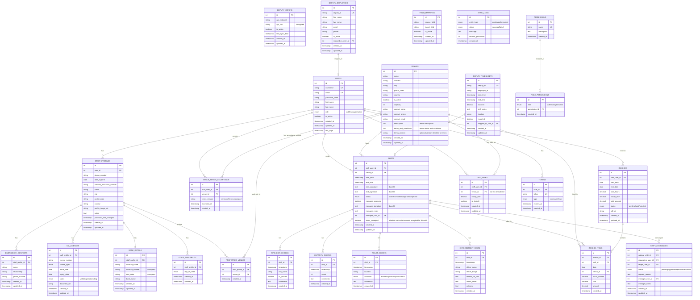

```mermaid
erDiagram
    %% User-Related Tables
    USERS {
        int id PK
        string username UK
        string email UK
        string password_hash
        string first_name
        string last_name
        enum role "staff/manager/admin"
        boolean is_active
        timestamp created_at
        timestamp updated_at
        timestamp last_login
    }

    STAFF_PROFILES {
        int id PK
        int user_id FK
        string phone_number
        date date_of_birth
        string national_insurance_number
        string street
        string city
        string postal_code
        string country
        string profile_image_url
        text notes
        timestamp password_last_changed
        timestamp created_at
        timestamp updated_at
    }

    EMERGENCY_CONTACTS {
        int id PK
        int staff_profile_id FK
        string name
        string relationship
        string phone_number
        timestamp created_at
        timestamp updated_at
    }

    BANK_DETAILS {
        int id PK
        int staff_profile_id FK
        string account_name
        string account_number "encrypted"
        string sort_code "encrypted"
        string bank_name
        timestamp created_at
        timestamp updated_at
    }

    SIA_LICENSES {
        int id PK
        int staff_profile_id FK
        string license_number
        enum license_type
        date issue_date
        date expiry_date
        enum status "valid/expired/pending"
        string document_url
        timestamp created_at
        timestamp updated_at
    }

    STAFF_AVAILABILITY {
        int id PK
        int staff_profile_id FK
        enum day_of_week
        timestamp created_at
        timestamp updated_at
    }

    PREFERRED_VENUES {
        int id PK
        int staff_profile_id FK
        int venue_id FK
        timestamp created_at
    }

    %% Venue-Related Tables
    VENUES {
        int id PK
        string name
        string address
        string city
        string postal_code
        string country
        boolean is_active
        int capacity
        string contact_name
        string contact_phone
        string contact_email
        text description "venue description"
        text terms_and_conditions "venue terms and conditions"
        string terms_version "optional version identifier for terms"
        timestamp created_at
        timestamp updated_at
    }

    %% Added table to track venue terms acceptance
    VENUE_TERMS_ACCEPTANCE {
        int id PK
        int staff_user_id FK
        int venue_id FK
        string terms_version "version of terms accepted"
        timestamp accepted_at
        timestamp created_at
    }

    %% Shift-Related Tables
    SHIFTS {
        int id PK
        int staff_user_id FK
        int venue_id FK
        timestamp start_time
        timestamp end_time
        text start_signature "base64"
        text end_signature "base64"
        enum status "active/completed/approved/rejected"
        boolean manager_approved
        text manager_signature "base64"
        text manager_notes
        int manager_user_id FK
        boolean terms_accepted "whether venue terms were accepted for this shift"
        timestamp created_at
        timestamp updated_at
    }

    FIRE_EXIT_CHECKS {
        int id PK
        int shift_id FK
        timestamp timestamp
        string exit_name
        boolean is_passed
        text comments
        timestamp created_at
    }

    CAPACITY_CHECKS {
        int id PK
        int shift_id FK
        timestamp timestamp
        int count
        text comments
        timestamp created_at
    }

    TOILET_CHECKS {
        int id PK
        int shift_id FK
        timestamp timestamp
        string location
        enum condition "excellent/good/fair/poor/critical"
        text comments
        timestamp created_at
    }

    ENFORCEMENT_VISITS {
        int id PK
        int shift_id FK
        timestamp timestamp
        string officer_name
        string officer_badge
        text reason_for_visit
        text action_taken
        text outcome
        timestamp created_at
    }

    SHIFT_EXCHANGES {
        int id PK
        int original_shift_id FK
        int requesting_user_id FK
        int target_user_id FK
        enum status "pending/approved/rejected/cancelled"
        text request_reason
        int manager_user_id FK
        text manager_notes
        timestamp created_at
        timestamp updated_at
    }

    %% Invoice-Related Tables
    INVOICES {
        int id PK
        int staff_user_id FK
        date start_date
        date end_date
        decimal total_hours
        decimal hourly_rate
        decimal total_amount
        enum status "pending/paid/rejected"
        string pdf_url
        timestamp created_at
        timestamp updated_at
    }

    INVOICE_ITEMS {
        int id PK
        int invoice_id FK
        int shift_id FK
        date date
        int venue_id FK
        decimal hours_worked
        decimal rate
        decimal amount
        timestamp created_at
    }

    PAY_RATES {
        int id PK
        int staff_user_id FK
        int venue_id FK "null for default rate"
        decimal hourly_rate
        boolean is_default
        timestamp created_at
        timestamp updated_at
    }

    %% Deputy Integration Tables
    DEPUTY_CONFIG {
        int id PK
        string api_endpoint
        string api_key "encrypted"
        boolean is_active
        timestamp last_sync_date
        timestamp created_at
        timestamp updated_at
    }

    DEPUTY_EMPLOYEES {
        int id PK
        string deputy_id UK
        string first_name
        string last_name
        string email
        string phone
        boolean is_active
        int mapped_to_user_id FK
        timestamp created_at
        timestamp updated_at
    }

    DEPUTY_TIMESHEETS {
        int id PK
        string deputy_id UK
        string employee_id
        timestamp start_time
        timestamp end_time
        decimal duration
        text shift_notes
        string location
        boolean imported
        int mapped_to_shift_id FK
        timestamp created_at
        timestamp updated_at
    }

    FIELD_MAPPINGS {
        int id PK
        string source_field
        string target_field
        boolean is_active
        timestamp created_at
        timestamp updated_at
    }

    SYNC_LOGS {
        int id PK
        enum entity_type "employee/timesheet"
        enum status "success/failed"
        text message
        int records_processed
        timestamp created_at
    }

    %% System Tables
    TOKENS {
        int id PK
        int user_id FK
        string token UK
        enum type "access/refresh"
        timestamp expires_at
        timestamp created_at
    }

    PERMISSIONS {
        int id PK
        string name UK
        text description
        timestamp created_at
    }

    ROLE_PERMISSIONS {
        int id PK
        enum role "staff/manager/admin"
        int permission_id FK
        timestamp created_at
    }

    %% Relationships

    %% User relationships
    USERS ||--o{ STAFF_PROFILES : "has"
    USERS ||--o{ SHIFTS : "works"
    USERS ||--o{ INVOICES : "receives"
    USERS ||--o{ PAY_RATES : "has"
    USERS ||--o{ VENUE_TERMS_ACCEPTANCE : "accepts"

    %% Staff profile relationships
    STAFF_PROFILES ||--o{ EMERGENCY_CONTACTS : "has"
    STAFF_PROFILES ||--o{ SIA_LICENSES : "has"
    STAFF_PROFILES ||--|| BANK_DETAILS : "has"
    STAFF_PROFILES ||--o{ STAFF_AVAILABILITY : "has"
    STAFF_PROFILES ||--o{ PREFERRED_VENUES : "prefers"

    %% Venue relationships
    VENUES ||--o{ SHIFTS : "hosts"
    VENUES ||--o{ PREFERRED_VENUES : "preferred_by"
    VENUES ||--o{ PAY_RATES : "has_rate_for"
    VENUES ||--o{ INVOICE_ITEMS : "listed_in"
    VENUES ||--o{ VENUE_TERMS_ACCEPTANCE : "has_acceptance_records"

    %% Shift relationships
    SHIFTS ||--o{ FIRE_EXIT_CHECKS : "has"
    SHIFTS ||--o{ CAPACITY_CHECKS : "has"
    SHIFTS ||--o{ TOILET_CHECKS : "has"
    SHIFTS ||--o{ ENFORCEMENT_VISITS : "has"
    SHIFTS ||--o{ INVOICE_ITEMS : "billed_in"
    SHIFTS ||--o{ SHIFT_EXCHANGES : "exchanged"

    %% Invoice relationships
    INVOICES ||--o{ INVOICE_ITEMS : "contains"

    %% Deputy relationships
    DEPUTY_EMPLOYEES ||--o| USERS : "mapped_to"
    DEPUTY_TIMESHEETS ||--o| SHIFTS : "mapped_to"

    %% Token and permission relationships
    USERS ||--o{ TOKENS : "has"
    PERMISSIONS ||--o{ ROLE_PERMISSIONS : "assigned_to"
```
