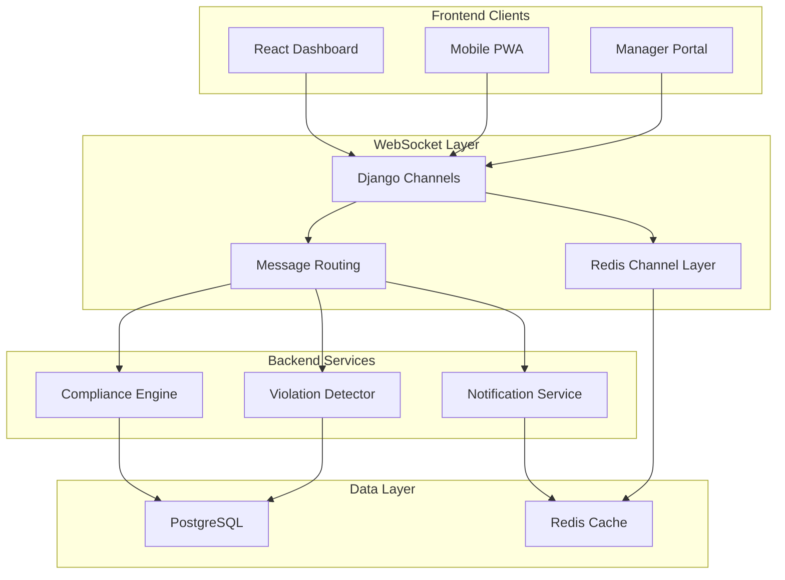

# WebSocket Architecture Documentation
## Real-time Compliance Monitoring System

This document provides comprehensive documentation for implementing real-time compliance monitoring using WebSocket connections. It covers connection management, message routing, scalable deployment, and frontend integration patterns for live compliance updates.

## Table of Contents

1. [Architecture Overview](#architecture-overview)
2. [Backend WebSocket Implementation](#backend-websocket-implementation)
3. [Frontend WebSocket Client](#frontend-websocket-client)
4. [Message Types and Routing](#message-types-and-routing)
5. [Connection Management](#connection-management)
6. [Scalability and Load Balancing](#scalability-and-load-balancing)
7. [Security and Authentication](#security-and-authentication)
8. [Error Handling and Reconnection](#error-handling-and-reconnection)
9. [Performance Optimization](#performance-optimization)
10. [Deployment and Monitoring](#deployment-and-monitoring)

---

## Architecture Overview

### System Components



### Real-time Events Flow

```python
# Event flow patterns for compliance system
REALTIME_EVENT_TYPES = {
    # Violation Events
    'violation_created': {
        'source': 'compliance_engine',
        'targets': ['user_channel', 'manager_channel', 'admin_channel'],
        'priority': 'high'
    },
    'violation_resolved': {
        'source': 'manual_action',
        'targets': ['user_channel', 'dashboard_channel'],
        'priority': 'medium'
    },

    # Compliance Status Events
    'compliance_status_changed': {
        'source': 'metrics_calculator',
        'targets': ['user_channel', 'dashboard_channel'],
        'priority': 'medium'
    },
    'compliance_score_updated': {
        'source': 'metrics_calculator',
        'targets': ['user_channel', 'analytics_channel'],
        'priority': 'low'
    },

    # System Events
    'user_online': {
        'source': 'websocket_connect',
        'targets': ['presence_channel'],
        'priority': 'low'
    },
    'user_offline': {
        'source': 'websocket_disconnect',
        'targets': ['presence_channel'],
        'priority': 'low'
    },

    # Alert Events
    'critical_alert': {
        'source': 'alert_system',
        'targets': ['admin_channel', 'manager_channel'],
        'priority': 'critical'
    }
}
```

---

## Backend WebSocket Implementation

### Django Channels Configuration

```python
# backend/compliance_websockets/routing.py
from django.urls import path
from channels.routing import ProtocolTypeRouter, URLRouter
from channels.auth import AuthMiddlewareStack
from .consumers import ComplianceConsumer
from .middleware import JWTAuthMiddleware

application = ProtocolTypeRouter({
    'websocket': JWTAuthMiddleware(
        URLRouter([
            path('ws/compliance/', ComplianceConsumer.as_asgi()),
            path('ws/compliance/<str:room_name>/', ComplianceConsumer.as_asgi()),
        ])
    ),
})

# backend/compliance_websockets/consumers.py
import json
import asyncio
import logging
from channels.generic.websocket import AsyncWebsocketConsumer
from channels.db import database_sync_to_async
from django.contrib.auth.models import User
from .message_handlers import ComplianceMessageHandler
from .connection_manager import ConnectionManager
from .rate_limiter import WebSocketRateLimiter

logger = logging.getLogger('compliance.websockets')

class ComplianceConsumer(AsyncWebsocketConsumer):
    def __init__(self, *args, **kwargs):
        super().__init__(*args, **kwargs)
        self.user = None
        self.user_group = None
        self.room_groups = set()
        self.connection_manager = ConnectionManager()
        self.message_handler = ComplianceMessageHandler()
        self.rate_limiter = WebSocketRateLimiter()
        self.last_activity = None

    async def connect(self):
        """Handle WebSocket connection"""
        try:
            # Get authenticated user from middleware
            self.user = self.scope['user']

            if not self.user or not self.user.is_authenticated:
                logger.warning('Unauthenticated WebSocket connection attempt')
                await self.close(code=4001)
                return

            # Set up user-specific group
            self.user_group = f"user_{self.user.id}"

            # Join user-specific group
            await self.channel_layer.group_add(self.user_group, self.channel_name)

            # Join role-based groups
            await self._join_role_groups()

            # Join room-specific groups if specified
            room_name = self.scope['url_route']['kwargs'].get('room_name')
            if room_name:
                await self._join_room_group(room_name)

            # Register connection
            await self.connection_manager.register_connection(
                user=self.user,
                channel_name=self.channel_name,
                connection_info={
                    'user_agent': self.scope.get('headers', {}).get('user-agent', ''),
                    'ip_address': self.scope.get('client', ['', ''])[0]
                }
            )

            # Accept connection
            await self.accept()

            # Send initial data
            await self._send_initial_data()

            # Broadcast user online status
            await self._broadcast_user_status('online')

            logger.info(f'WebSocket connected: user={self.user.id}, channel={self.channel_name}')

        except Exception as e:
            logger.error(f'WebSocket connection error: {e}')
            await self.close(code=4000)

    async def disconnect(self, close_code):
        """Handle WebSocket disconnection"""
        try:
            # Leave all groups
            if self.user_group:
                await self.channel_layer.group_discard(self.user_group, self.channel_name)

            for group_name in self.room_groups:
                await self.channel_layer.group_discard(group_name, self.channel_name)

            # Unregister connection
            if self.user:
                await self.connection_manager.unregister_connection(
                    user=self.user,
                    channel_name=self.channel_name
                )

                # Broadcast user offline status
                await self._broadcast_user_status('offline')

                logger.info(f'WebSocket disconnected: user={self.user.id}, code={close_code}')

        except Exception as e:
            logger.error(f'WebSocket disconnection error: {e}')

    async def receive(self, text_data):
        """Handle incoming WebSocket messages"""
        try:
            # Rate limiting check
            if not await self.rate_limiter.allow_message(self.user.id):
                await self.send_error('rate_limit_exceeded', 'Too many messages')
                return

            # Parse message
            try:
                message = json.loads(text_data)
            except json.JSONDecodeError:
                await self.send_error('invalid_json', 'Invalid JSON format')
                return

            # Validate message structure
            if not isinstance(message, dict) or 'type' not in message:
                await self.send_error('invalid_message', 'Message must have a type field')
                return

            # Update last activity
            self.last_activity = asyncio.get_event_loop().time()

            # Route message to appropriate handler
            await self.message_handler.handle_message(
                consumer=self,
                user=self.user,
                message=message
            )

        except Exception as e:
            logger.error(f'WebSocket message handling error: {e}')
            await self.send_error('internal_error', 'Message processing failed')

    # Message type handlers
    async def compliance_event(self, event):
        """Handle compliance-related events"""
        await self.send(text_data=json.dumps({
            'type': 'compliance_event',
            'event_type': event['event_type'],
            'data': event['data'],
            'timestamp': event['timestamp']
        }))

    async def violation_alert(self, event):
        """Handle violation alert events"""
        await self.send(text_data=json.dumps({
            'type': 'violation_alert',
            'violation': event['violation_data'],
            'severity': event['severity'],
            'requires_action': event['requires_action'],
            'timestamp': event['timestamp']
        }))

    async def user_status_update(self, event):
        """Handle user status updates"""
        await self.send(text_data=json.dumps({
            'type': 'user_status_update',
            'user_id': event['user_id'],
            'status': event['status'],
            'timestamp': event['timestamp']
        }))

    async def dashboard_update(self, event):
        """Handle dashboard data updates"""
        await self.send(text_data=json.dumps({
            'type': 'dashboard_update',
            'section': event['section'],
            'data': event['data'],
            'timestamp': event['timestamp']
        }))

    async def system_notification(self, event):
        """Handle system-wide notifications"""
        await self.send(text_data=json.dumps({
            'type': 'system_notification',
            'title': event['title'],
            'message': event['message'],
            'priority': event['priority'],
            'action_url': event.get('action_url'),
            'timestamp': event['timestamp']
        }))

    # Helper methods
    async def _join_role_groups(self):
        """Join groups based on user role"""
        user_role = await self._get_user_role()

        role_groups = {
            'staff': ['staff_updates'],
            'manager': ['staff_updates', 'manager_updates', 'team_violations'],
            'admin': ['staff_updates', 'manager_updates', 'admin_updates', 'system_alerts']
        }

        groups = role_groups.get(user_role, [])
        for group_name in groups:
            await self.channel_layer.group_add(group_name, self.channel_name)
            self.room_groups.add(group_name)

    async def _join_room_group(self, room_name):
        """Join specific room group with validation"""
        # Validate room access permissions
        if await self._can_access_room(room_name):
            group_name = f"room_{room_name}"
            await self.channel_layer.group_add(group_name, self.channel_name)
            self.room_groups.add(group_name)

    async def _send_initial_data(self):
        """Send initial data after connection"""
        # Get user's current compliance status
        compliance_status = await self._get_user_compliance_status()

        # Get active alerts for user
        active_alerts = await self._get_active_alerts()

        # Send initial state
        await self.send(text_data=json.dumps({
            'type': 'connection_established',
            'user_id': self.user.id,
            'compliance_status': compliance_status,
            'active_alerts': active_alerts,
            'timestamp': self._get_timestamp()
        }))

    async def _broadcast_user_status(self, status):
        """Broadcast user online/offline status"""
        await self.channel_layer.group_send(
            'presence_channel',
            {
                'type': 'user_status_update',
                'user_id': self.user.id,
                'status': status,
                'timestamp': self._get_timestamp()
            }
        )

    async def send_error(self, error_code, message):
        """Send error message to client"""
        await self.send(text_data=json.dumps({
            'type': 'error',
            'error_code': error_code,
            'message': message,
            'timestamp': self._get_timestamp()
        }))

    @database_sync_to_async
    def _get_user_role(self):
        """Get user role from database"""
        if hasattr(self.user, 'staff_profile'):
            return self.user.staff_profile.role
        return 'staff'

    @database_sync_to_async
    def _can_access_room(self, room_name):
        """Check if user can access specific room"""
        # Implement room access logic based on your requirements
        return True  # Simplified for example

    @database_sync_to_async
    def _get_user_compliance_status(self):
        """Get current compliance status for user"""
        from api.models import ComplianceViolation

        violations = ComplianceViolation.objects.filter(
            user=self.user,
            resolution_status='open'
        ).count()

        return {
            'total_violations': violations,
            'compliance_status': 'compliant' if violations == 0 else 'violations',
            'last_updated': self._get_timestamp()
        }

    @database_sync_to_async
    def _get_active_alerts(self):
        """Get active alerts for user"""
        from api.models import ComplianceViolation

        critical_violations = ComplianceViolation.objects.filter(
            user=self.user,
            severity='critical',
            resolution_status='open'
        ).values('id', 'description', 'created_at')

        return list(critical_violations)

    def _get_timestamp(self):
        """Get current timestamp in ISO format"""
        from django.utils import timezone
        return timezone.now().isoformat()
```

### Message Handler System

```python
# backend/compliance_websockets/message_handlers.py
import logging
import asyncio
from typing import Dict, Any
from django.utils import timezone
from channels.db import database_sync_to_async

logger = logging.getLogger('compliance.websockets.handlers')

class ComplianceMessageHandler:
    """Route and handle WebSocket messages"""

    def __init__(self):
        self.handlers = {
            'ping': self.handle_ping,
            'subscribe_to_violations': self.handle_subscribe_violations,
            'unsubscribe_from_violations': self.handle_unsubscribe_violations,
            'request_compliance_status': self.handle_compliance_status_request,
            'mark_alert_read': self.handle_mark_alert_read,
            'request_team_status': self.handle_team_status_request,
            'update_user_preferences': self.handle_update_preferences
        }

    async def handle_message(self, consumer, user, message: Dict[str, Any]):
        """Route message to appropriate handler"""
        message_type = message.get('type')
        handler = self.handlers.get(message_type)

        if not handler:
            await consumer.send_error('unknown_message_type', f'Unknown message type: {message_type}')
            return

        try:
            await handler(consumer, user, message)
        except Exception as e:
            logger.error(f'Message handler error for {message_type}: {e}')
            await consumer.send_error('handler_error', 'Message processing failed')

    async def handle_ping(self, consumer, user, message):
        """Handle ping messages for keep-alive"""
        await consumer.send(text_data=json.dumps({
            'type': 'pong',
            'timestamp': timezone.now().isoformat()
        }))

    async def handle_subscribe_violations(self, consumer, user, message):
        """Subscribe user to violation updates"""
        violation_types = message.get('violation_types', ['all'])
        severity_levels = message.get('severity_levels', ['all'])

        # Join specific violation channels
        for violation_type in violation_types:
            for severity in severity_levels:
                channel_name = f"violations_{violation_type}_{severity}"
                await consumer.channel_layer.group_add(channel_name, consumer.channel_name)

        await consumer.send(text_data=json.dumps({
            'type': 'subscription_confirmed',
            'subscription_type': 'violations',
            'filters': {
                'violation_types': violation_types,
                'severity_levels': severity_levels
            },
            'timestamp': timezone.now().isoformat()
        }))

    async def handle_compliance_status_request(self, consumer, user, message):
        """Handle request for current compliance status"""
        # Get fresh compliance data
        compliance_data = await self._get_detailed_compliance_status(user.id)

        await consumer.send(text_data=json.dumps({
            'type': 'compliance_status_response',
            'data': compliance_data,
            'timestamp': timezone.now().isoformat()
        }))

    async def handle_team_status_request(self, consumer, user, message):
        """Handle request for team compliance status (managers only)"""
        user_role = await self._get_user_role(user)

        if user_role not in ['manager', 'admin']:
            await consumer.send_error('permission_denied', 'Insufficient permissions')
            return

        team_data = await self._get_team_compliance_status(user)

        await consumer.send(text_data=json.dumps({
            'type': 'team_status_response',
            'data': team_data,
            'timestamp': timezone.now().isoformat()
        }))

    async def handle_mark_alert_read(self, consumer, user, message):
        """Mark alert as read"""
        alert_id = message.get('alert_id')

        if not alert_id:
            await consumer.send_error('missing_parameter', 'alert_id is required')
            return

        success = await self._mark_alert_as_read(user.id, alert_id)

        await consumer.send(text_data=json.dumps({
            'type': 'alert_marked_read',
            'alert_id': alert_id,
            'success': success,
            'timestamp': timezone.now().isoformat()
        }))

    async def handle_update_preferences(self, consumer, user, message):
        """Update user WebSocket preferences"""
        preferences = message.get('preferences', {})

        await self._update_user_websocket_preferences(user.id, preferences)

        await consumer.send(text_data=json.dumps({
            'type': 'preferences_updated',
            'preferences': preferences,
            'timestamp': timezone.now().isoformat()
        }))

    # Helper methods with database access
    @database_sync_to_async
    def _get_detailed_compliance_status(self, user_id):
        """Get detailed compliance status from database"""
        from api.models import ComplianceViolation, WorkingHoursMetrics

        # Get violations summary
        violations = ComplianceViolation.objects.filter(user_id=user_id, resolution_status='open')
        violation_summary = {
            'total': violations.count(),
            'critical': violations.filter(severity='critical').count(),
            'major': violations.filter(severity='major').count(),
            'minor': violations.filter(severity='minor').count()
        }

        # Get latest metrics
        latest_metrics = WorkingHoursMetrics.objects.filter(
            user_id=user_id
        ).order_by('-created_at').first()

        compliance_score = float(latest_metrics.compliance_score) if latest_metrics else 0.0

        return {
            'violations': violation_summary,
            'compliance_score': compliance_score,
            'current_week_hours': float(latest_metrics.total_hours_worked) if latest_metrics else 0.0,
            'status': 'compliant' if violation_summary['total'] == 0 else 'violations'
        }

    @database_sync_to_async
    def _get_team_compliance_status(self, manager_user):
        """Get team compliance status for manager"""
        from api.models import ComplianceViolation
        from django.db.models import Count, Avg

        # Get team members (simplified - implement based on your user management)
        team_members = manager_user.managed_users.all() if hasattr(manager_user, 'managed_users') else []

        team_violations = ComplianceViolation.objects.filter(
            user__in=team_members,
            resolution_status='open'
        ).aggregate(
            total_violations=Count('id'),
            critical_violations=Count('id', filter=Q(severity='critical')),
            avg_resolution_time=Avg('resolution_time_hours')
        )

        return {
            'team_size': len(team_members),
            'violations': team_violations,
            'team_members_with_violations': team_members.filter(
                compliance_violations__resolution_status='open'
            ).distinct().count()
        }

    @database_sync_to_async
    def _mark_alert_as_read(self, user_id, alert_id):
        """Mark alert as read in database"""
        try:
            # Implement based on your alert model
            from api.models import ComplianceAlert
            ComplianceAlert.objects.filter(
                id=alert_id,
                user_id=user_id
            ).update(read_at=timezone.now())
            return True
        except:
            return False

    @database_sync_to_async
    def _update_user_websocket_preferences(self, user_id, preferences):
        """Update user WebSocket preferences"""
        from api.models import UserWebSocketPreferences

        UserWebSocketPreferences.objects.update_or_create(
            user_id=user_id,
            defaults={
                'notification_preferences': preferences.get('notifications', {}),
                'update_frequency': preferences.get('update_frequency', 'normal'),
                'auto_subscribe_violations': preferences.get('auto_subscribe_violations', True)
            }
        )

    @database_sync_to_async
    def _get_user_role(self, user):
        """Get user role"""
        if hasattr(user, 'staff_profile'):
            return user.staff_profile.role
        return 'staff'
```

### Event Broadcasting System

```python
# backend/compliance_websockets/broadcasters.py
import json
import asyncio
import logging
from channels.layers import get_channel_layer
from django.utils import timezone
from typing import Dict, List, Any, Optional

logger = logging.getLogger('compliance.websockets.broadcast')

class ComplianceBroadcaster:
    """Handle broadcasting compliance events to WebSocket clients"""

    def __init__(self):
        self.channel_layer = get_channel_layer()

    async def broadcast_violation_created(self, violation):
        """Broadcast new violation to relevant channels"""

        # Prepare violation data
        violation_data = {
            'id': violation.id,
            'user_id': violation.user_id,
            'user_name': violation.user.get_full_name(),
            'violation_type': violation.violation_type,
            'severity': violation.severity,
            'description': violation.description,
            'created_at': violation.created_at.isoformat(),
            'requires_action': violation.severity in ['critical', 'major']
        }

        # Broadcast to user
        await self._send_to_user(
            user_id=violation.user_id,
            event_type='violation_alert',
            data={
                'violation_data': violation_data,
                'severity': violation.severity,
                'requires_action': violation_data['requires_action']
            }
        )

        # Broadcast to managers if critical/major
        if violation.severity in ['critical', 'major']:
            await self._send_to_group(
                group_name='manager_updates',
                event_type='violation_alert',
                data={
                    'violation_data': violation_data,
                    'severity': violation.severity,
                    'requires_action': True
                }
            )

        # Broadcast to admins for all violations
        await self._send_to_group(
            group_name='admin_updates',
            event_type='violation_alert',
            data={
                'violation_data': violation_data,
                'severity': violation.severity,
                'requires_action': violation_data['requires_action']
            }
        )

        # Update dashboard metrics
        await self._broadcast_dashboard_update('violations')

    async def broadcast_violation_resolved(self, violation, resolved_by):
        """Broadcast violation resolution"""

        resolution_data = {
            'violation_id': violation.id,
            'user_id': violation.user_id,
            'user_name': violation.user.get_full_name(),
            'resolved_by': resolved_by.get_full_name(),
            'resolution_notes': violation.resolution_notes,
            'resolved_at': violation.resolved_at.isoformat()
        }

        # Notify the user
        await self._send_to_user(
            user_id=violation.user_id,
            event_type='violation_resolved',
            data=resolution_data
        )

        # Notify managers and admins
        await self._send_to_group(
            group_name='manager_updates',
            event_type='violation_resolved',
            data=resolution_data
        )

        # Update dashboard
        await self._broadcast_dashboard_update('violations')

    async def broadcast_compliance_score_update(self, user_id, old_score, new_score):
        """Broadcast compliance score changes"""

        score_data = {
            'user_id': user_id,
            'old_score': old_score,
            'new_score': new_score,
            'change': new_score - old_score,
            'updated_at': timezone.now().isoformat()
        }

        # Send to user
        await self._send_to_user(
            user_id=user_id,
            event_type='compliance_score_updated',
            data=score_data
        )

        # Send to analytics channel for dashboard updates
        await self._send_to_group(
            group_name='analytics_channel',
            event_type='compliance_score_updated',
            data=score_data
        )

    async def broadcast_system_alert(self, alert_type, message, priority='medium', target_roles=None):
        """Broadcast system-wide alerts"""

        alert_data = {
            'alert_type': alert_type,
            'message': message,
            'priority': priority,
            'timestamp': timezone.now().isoformat()
        }

        # Default to all roles if not specified
        if target_roles is None:
            target_roles = ['staff', 'manager', 'admin']

        # Send to appropriate role groups
        for role in target_roles:
            group_name = f'{role}_updates'
            await self._send_to_group(
                group_name=group_name,
                event_type='system_alert',
                data=alert_data
            )

    async def broadcast_user_status_change(self, user_id, status, additional_data=None):
        """Broadcast user status changes (online/offline, etc.)"""

        status_data = {
            'user_id': user_id,
            'status': status,
            'timestamp': timezone.now().isoformat()
        }

        if additional_data:
            status_data.update(additional_data)

        # Send to presence channel
        await self._send_to_group(
            group_name='presence_channel',
            event_type='user_status_change',
            data=status_data
        )

    async def broadcast_bulk_notification(self, user_ids: List[int], event_type: str, data: Dict[str, Any]):
        """Send notification to multiple users efficiently"""

        message_data = {
            'type': event_type.replace('_', ''),  # Convert to channel layer format
            'event_type': event_type,
            'data': data,
            'timestamp': timezone.now().isoformat()
        }

        # Send to all users in parallel
        tasks = []
        for user_id in user_ids:
            tasks.append(
                self.channel_layer.group_send(f'user_{user_id}', message_data)
            )

        # Execute all sends concurrently
        await asyncio.gather(*tasks, return_exceptions=True)

    # Private helper methods
    async def _send_to_user(self, user_id: int, event_type: str, data: Dict[str, Any]):
        """Send message to specific user"""
        await self.channel_layer.group_send(
            f'user_{user_id}',
            {
                'type': event_type.replace('_', ''),  # Convert snake_case to channel format
                'event_type': event_type,
                'data': data,
                'timestamp': timezone.now().isoformat()
            }
        )

    async def _send_to_group(self, group_name: str, event_type: str, data: Dict[str, Any]):
        """Send message to group"""
        await self.channel_layer.group_send(
            group_name,
            {
                'type': event_type.replace('_', ''),  # Convert snake_case to channel format
                'event_type': event_type,
                'data': data,
                'timestamp': timezone.now().isoformat()
            }
        )

    async def _broadcast_dashboard_update(self, section: str):
        """Trigger dashboard update for specific section"""
        await self.channel_layer.group_send(
            'dashboard_channel',
            {
                'type': 'dashboard_update',
                'section': section,
                'data': {'refresh': True},
                'timestamp': timezone.now().isoformat()
            }
        )

# Global broadcaster instance
compliance_broadcaster = ComplianceBroadcaster()

# Signal handlers for automatic broadcasting
from django.db.models.signals import post_save, pre_save
from django.dispatch import receiver
from api.models import ComplianceViolation, WorkingHoursMetrics

@receiver(post_save, sender=ComplianceViolation)
def handle_violation_change(sender, instance, created, **kwargs):
    """Handle violation creation and updates"""
    if created:
        # New violation created
        asyncio.create_task(
            compliance_broadcaster.broadcast_violation_created(instance)
        )
    elif instance.resolution_status == 'resolved' and hasattr(instance, '_resolver'):
        # Violation resolved
        asyncio.create_task(
            compliance_broadcaster.broadcast_violation_resolved(
                instance,
                instance._resolver
            )
        )

@receiver(post_save, sender=WorkingHoursMetrics)
def handle_metrics_update(sender, instance, created, **kwargs):
    """Handle compliance score updates"""
    if not created and hasattr(instance, '_previous_score'):
        old_score = instance._previous_score
        new_score = float(instance.compliance_score)

        if abs(new_score - old_score) >= 1.0:  # Only broadcast significant changes
            asyncio.create_task(
                compliance_broadcaster.broadcast_compliance_score_update(
                    instance.user_id,
                    old_score,
                    new_score
                )
            )
```

---

## Frontend WebSocket Client

### React WebSocket Hook

```typescript
// src/hooks/useComplianceWebSocket.ts
import { useEffect, useRef, useState, useCallback } from 'react';
import { useQueryClient } from 'react-query';

interface WebSocketMessage {
  type: string;
  event_type?: string;
  data?: any;
  timestamp?: string;
  error_code?: string;
  message?: string;
}

interface WebSocketConfig {
  url: string;
  reconnectInterval?: number;
  maxReconnectAttempts?: number;
  heartbeatInterval?: number;
  debug?: boolean;
}

export const useComplianceWebSocket = (config: WebSocketConfig) => {
  const [connectionStatus, setConnectionStatus] = useState<'connecting' | 'connected' | 'disconnected' | 'error'>('disconnected');
  const [lastMessage, setLastMessage] = useState<WebSocketMessage | null>(null);
  const [lastError, setLastError] = useState<string | null>(null);

  const ws = useRef<WebSocket | null>(null);
  const reconnectTimeoutId = useRef<NodeJS.Timeout>();
  const heartbeatIntervalId = useRef<NodeJS.Timeout>();
  const reconnectAttempts = useRef<number>(0);
  const messageHandlers = useRef<Map<string, Set<(data: any) => void>>>(new Map());
  const queryClient = useQueryClient();

  const {
    url,
    reconnectInterval = 3000,
    maxReconnectAttempts = 5,
    heartbeatInterval = 30000,
    debug = false
  } = config;

  const log = useCallback((message: string, data?: any) => {
    if (debug) {
      console.log(`[ComplianceWebSocket] ${message}`, data);
    }
  }, [debug]);

  const connect = useCallback(() => {
    if (ws.current?.readyState === WebSocket.OPEN) {
      return;
    }

    setConnectionStatus('connecting');
    log('Connecting to WebSocket', { url });

    try {
      const token = localStorage.getItem('accessToken');
      const wsUrl = `${url}?token=${token}`;

      ws.current = new WebSocket(wsUrl);

      ws.current.onopen = () => {
        log('WebSocket connected');
        setConnectionStatus('connected');
        setLastError(null);
        reconnectAttempts.current = 0;

        // Start heartbeat
        startHeartbeat();
      };

      ws.current.onmessage = (event) => {
        try {
          const message: WebSocketMessage = JSON.parse(event.data);
          log('Received message', message);

          setLastMessage(message);

          // Handle different message types
          handleMessage(message);

        } catch (error) {
          log('Error parsing message', error);
        }
      };

      ws.current.onclose = (event) => {
        log('WebSocket closed', { code: event.code, reason: event.reason });
        setConnectionStatus('disconnected');
        stopHeartbeat();

        // Attempt reconnection if not intentional close
        if (event.code !== 1000 && reconnectAttempts.current < maxReconnectAttempts) {
          scheduleReconnect();
        }
      };

      ws.current.onerror = (error) => {
        log('WebSocket error', error);
        setConnectionStatus('error');
        setLastError('Connection error occurred');
      };

    } catch (error) {
      log('Error creating WebSocket', error);
      setConnectionStatus('error');
      setLastError('Failed to create WebSocket connection');
    }
  }, [url, maxReconnectAttempts, log]);

  const disconnect = useCallback(() => {
    log('Disconnecting WebSocket');

    // Clear reconnection attempts
    reconnectAttempts.current = maxReconnectAttempts;

    // Clear timeouts
    if (reconnectTimeoutId.current) {
      clearTimeout(reconnectTimeoutId.current);
    }

    stopHeartbeat();

    if (ws.current) {
      ws.current.close(1000, 'Intentional disconnect');
      ws.current = null;
    }

    setConnectionStatus('disconnected');
  }, [maxReconnectAttempts, log]);

  const scheduleReconnect = useCallback(() => {
    reconnectAttempts.current += 1;

    const delay = Math.min(reconnectInterval * Math.pow(2, reconnectAttempts.current - 1), 30000);

    log(`Scheduling reconnect attempt ${reconnectAttempts.current} in ${delay}ms`);

    reconnectTimeoutId.current = setTimeout(() => {
      connect();
    }, delay);
  }, [reconnectInterval, connect, log]);

  const startHeartbeat = useCallback(() => {
    heartbeatIntervalId.current = setInterval(() => {
      if (ws.current?.readyState === WebSocket.OPEN) {
        sendMessage('ping', {});
      }
    }, heartbeatInterval);
  }, [heartbeatInterval]);

  const stopHeartbeat = useCallback(() => {
    if (heartbeatIntervalId.current) {
      clearInterval(heartbeatIntervalId.current);
      heartbeatIntervalId.current = undefined;
    }
  }, []);

  const sendMessage = useCallback((type: string, data: any = {}) => {
    if (ws.current?.readyState === WebSocket.OPEN) {
      const message = {
        type,
        ...data,
        timestamp: new Date().toISOString()
      };

      log('Sending message', message);
      ws.current.send(JSON.stringify(message));
      return true;
    } else {
      log('Cannot send message - WebSocket not connected');
      return false;
    }
  }, [log]);

  const handleMessage = useCallback((message: WebSocketMessage) => {
    const { type, event_type, data } = message;

    // Handle specific message types
    switch (type) {
      case 'violation_alert':
        handleViolationAlert(data);
        break;

      case 'compliance_event':
        handleComplianceEvent(event_type, data);
        break;

      case 'dashboard_update':
        handleDashboardUpdate(data);
        break;

      case 'user_status_update':
        handleUserStatusUpdate(data);
        break;

      case 'system_notification':
        handleSystemNotification(data);
        break;

      case 'error':
        handleError(message);
        break;

      default:
        log('Unhandled message type', { type, message });
    }

    // Call registered handlers for this message type
    const handlers = messageHandlers.current.get(type);
    if (handlers) {
      handlers.forEach(handler => {
        try {
          handler(data);
        } catch (error) {
          log('Error in message handler', error);
        }
      });
    }
  }, [queryClient, log]);

  const handleViolationAlert = useCallback((data: any) => {
    log('Handling violation alert', data);

    // Show notification to user
    if ('Notification' in window && Notification.permission === 'granted') {
      new Notification(`${data.severity} Compliance Violation`, {
        body: data.violation_data.description,
        icon: '/assets/icons/icon-192x192.png',
        tag: `violation-${data.violation_data.id}`
      });
    }

    // Invalidate related queries
    queryClient.invalidateQueries(['compliance-violations']);
    queryClient.invalidateQueries(['compliance-summary']);

    // Show in-app notification
    // Implementation depends on your notification system

  }, [queryClient, log]);

  const handleComplianceEvent = useCallback((eventType: string, data: any) => {
    log('Handling compliance event', { eventType, data });

    switch (eventType) {
      case 'violation_resolved':
        queryClient.invalidateQueries(['compliance-violations']);
        queryClient.invalidateQueries(['compliance-summary']);
        // Show success notification
        break;

      case 'compliance_score_updated':
        queryClient.invalidateQueries(['compliance-metrics']);
        // Update score display
        break;
    }
  }, [queryClient, log]);

  const handleDashboardUpdate = useCallback((data: any) => {
    log('Handling dashboard update', data);

    // Invalidate dashboard queries
    queryClient.invalidateQueries(['compliance-summary']);
    queryClient.invalidateQueries(['compliance-trends']);
  }, [queryClient, log]);

  const handleUserStatusUpdate = useCallback((data: any) => {
    log('Handling user status update', data);
    // Update user presence indicators
  }, [log]);

  const handleSystemNotification = useCallback((data: any) => {
    log('Handling system notification', data);

    // Show system-wide notification
    // Implementation depends on your notification system

  }, [log]);

  const handleError = useCallback((message: WebSocketMessage) => {
    const errorMessage = `${message.error_code}: ${message.message}`;
    log('WebSocket error', errorMessage);
    setLastError(errorMessage);
  }, [log]);

  // Message handler registration
  const subscribe = useCallback((messageType: string, handler: (data: any) => void) => {
    if (!messageHandlers.current.has(messageType)) {
      messageHandlers.current.set(messageType, new Set());
    }
    messageHandlers.current.get(messageType)!.add(handler);

    // Return unsubscribe function
    return () => {
      const handlers = messageHandlers.current.get(messageType);
      if (handlers) {
        handlers.delete(handler);
        if (handlers.size === 0) {
          messageHandlers.current.delete(messageType);
        }
      }
    };
  }, []);

  // Auto-connect on mount
  useEffect(() => {
    connect();

    return () => {
      disconnect();
    };
  }, [connect, disconnect]);

  // Cleanup on unmount
  useEffect(() => {
    return () => {
      if (reconnectTimeoutId.current) {
        clearTimeout(reconnectTimeoutId.current);
      }
      stopHeartbeat();
    };
  }, [stopHeartbeat]);

  return {
    connectionStatus,
    lastMessage,
    lastError,
    connect,
    disconnect,
    sendMessage,
    subscribe,
    isConnected: connectionStatus === 'connected',
    isConnecting: connectionStatus === 'connecting',
    isDisconnected: connectionStatus === 'disconnected',
    hasError: connectionStatus === 'error'
  };
};
```

### WebSocket Context Provider

```typescript
// src/contexts/WebSocketContext.tsx
import React, { createContext, useContext, useEffect, useState } from 'react';
import { useComplianceWebSocket } from '../hooks/useComplianceWebSocket';
import { useAuth } from './AuthContext';

interface WebSocketContextType {
  connectionStatus: string;
  sendMessage: (type: string, data?: any) => boolean;
  subscribe: (messageType: string, handler: (data: any) => void) => (() => void);
  isConnected: boolean;
  lastError: string | null;
}

const WebSocketContext = createContext<WebSocketContextType | null>(null);

export const useWebSocket = () => {
  const context = useContext(WebSocketContext);
  if (!context) {
    throw new Error('useWebSocket must be used within a WebSocketProvider');
  }
  return context;
};

export const WebSocketProvider: React.FC<{ children: React.ReactNode }> = ({ children }) => {
  const { user, isAuthenticated } = useAuth();
  const [wsUrl, setWsUrl] = useState<string>('');

  // Configure WebSocket URL based on environment
  useEffect(() => {
    const protocol = window.location.protocol === 'https:' ? 'wss:' : 'ws:';
    const host = process.env.REACT_APP_WS_HOST || window.location.host;
    const url = `${protocol}//${host}/ws/compliance/`;
    setWsUrl(url);
  }, []);

  const {
    connectionStatus,
    sendMessage,
    subscribe,
    isConnected,
    lastError,
    connect,
    disconnect
  } = useComplianceWebSocket({
    url: wsUrl,
    reconnectInterval: 3000,
    maxReconnectAttempts: 5,
    heartbeatInterval: 30000,
    debug: process.env.NODE_ENV === 'development'
  });

  // Connect/disconnect based on authentication status
  useEffect(() => {
    if (isAuthenticated && user && wsUrl) {
      connect();
    } else {
      disconnect();
    }
  }, [isAuthenticated, user, wsUrl, connect, disconnect]);

  const value: WebSocketContextType = {
    connectionStatus,
    sendMessage,
    subscribe,
    isConnected,
    lastError
  };

  return (
    <WebSocketContext.Provider value={value}>
      {children}
    </WebSocketContext.Provider>
  );
};
```

### Real-time Components

```typescript
// src/components/RealTimeViolationList.tsx
import React, { useState, useEffect } from 'react';
import { useQuery, useQueryClient } from 'react-query';
import { useWebSocket } from '../contexts/WebSocketContext';
import { ComplianceClient } from '../services/complianceClient';

export const RealTimeViolationList: React.FC = () => {
  const [realtimeViolations, setRealtimeViolations] = useState<any[]>([]);
  const [notifications, setNotifications] = useState<any[]>([]);
  const { subscribe, isConnected } = useWebSocket();
  const queryClient = useQueryClient();

  // Fetch initial violations
  const { data: violationsData, isLoading } = useQuery(
    ['compliance-violations'],
    () => ComplianceClient.getViolations(),
    {
      refetchOnWindowFocus: false,
    }
  );

  // Subscribe to real-time violation updates
  useEffect(() => {
    const unsubscribeViolationAlert = subscribe('violation_alert', (data) => {
      const violation = data.violation_data;

      // Add to real-time violations list
      setRealtimeViolations(prev => {
        // Avoid duplicates
        const exists = prev.find(v => v.id === violation.id);
        if (!exists) {
          return [violation, ...prev.slice(0, 4)]; // Keep last 5
        }
        return prev;
      });

      // Add notification
      const notification = {
        id: Date.now(),
        type: 'violation',
        severity: data.severity,
        message: `New ${data.severity} violation: ${violation.description}`,
        timestamp: new Date().toISOString(),
        data: violation
      };

      setNotifications(prev => [notification, ...prev.slice(0, 9)]);

      // Auto-remove notification after 5 seconds
      setTimeout(() => {
        setNotifications(prev => prev.filter(n => n.id !== notification.id));
      }, 5000);

      // Invalidate queries to refresh data
      queryClient.invalidateQueries(['compliance-violations']);
      queryClient.invalidateQueries(['compliance-summary']);
    });

    const unsubscribeViolationResolved = subscribe('compliance_event', (data) => {
      if (data.event_type === 'violation_resolved') {
        // Remove from real-time list
        setRealtimeViolations(prev =>
          prev.filter(v => v.id !== data.violation_id)
        );

        // Add success notification
        const notification = {
          id: Date.now(),
          type: 'success',
          severity: 'info',
          message: `Violation resolved: ${data.violation_id}`,
          timestamp: new Date().toISOString(),
          data: data
        };

        setNotifications(prev => [notification, ...prev.slice(0, 9)]);

        // Auto-remove after 3 seconds
        setTimeout(() => {
          setNotifications(prev => prev.filter(n => n.id !== notification.id));
        }, 3000);

        // Refresh data
        queryClient.invalidateQueries(['compliance-violations']);
      }
    });

    return () => {
      unsubscribeViolationAlert();
      unsubscribeViolationResolved();
    };
  }, [subscribe, queryClient]);

  const dismissNotification = (notificationId: number) => {
    setNotifications(prev => prev.filter(n => n.id !== notificationId));
  };

  if (isLoading) {
    return <div className="animate-pulse">Loading violations...</div>;
  }

  return (
    <div className="space-y-4">
      {/* Connection Status */}
      <div className="flex items-center justify-between">
        <h2 className="text-lg font-semibold">Compliance Violations</h2>
        <div className="flex items-center space-x-2">
          <div className={`w-2 h-2 rounded-full ${
            isConnected ? 'bg-green-500' : 'bg-red-500'
          }`} />
          <span className="text-sm text-gray-500">
            {isConnected ? 'Connected' : 'Disconnected'}
          </span>
        </div>
      </div>

      {/* Notifications */}
      {notifications.length > 0 && (
        <div className="space-y-2">
          {notifications.map(notification => (
            <div
              key={notification.id}
              className={`p-3 rounded-lg border-l-4 ${
                notification.severity === 'critical' ? 'border-red-500 bg-red-50' :
                notification.severity === 'major' ? 'border-orange-500 bg-orange-50' :
                notification.severity === 'info' ? 'border-green-500 bg-green-50' :
                'border-yellow-500 bg-yellow-50'
              } transition-all duration-300`}
            >
              <div className="flex items-start justify-between">
                <div className="flex-1">
                  <p className="text-sm font-medium">{notification.message}</p>
                  <p className="text-xs text-gray-500">
                    {new Date(notification.timestamp).toLocaleTimeString()}
                  </p>
                </div>
                <button
                  onClick={() => dismissNotification(notification.id)}
                  className="text-gray-400 hover:text-gray-600 ml-2"
                >
                  ✕
                </button>
              </div>
            </div>
          ))}
        </div>
      )}

      {/* Real-time Violations */}
      {realtimeViolations.length > 0 && (
        <div className="bg-blue-50 border border-blue-200 rounded-lg p-4">
          <h3 className="text-sm font-medium text-blue-900 mb-2">
            🔴 Live Updates ({realtimeViolations.length})
          </h3>
          <div className="space-y-2">
            {realtimeViolations.map(violation => (
              <div key={violation.id} className="p-2 bg-white rounded border">
                <div className="flex items-center justify-between">
                  <div className="flex-1">
                    <p className="text-sm font-medium">{violation.user_name}</p>
                    <p className="text-xs text-gray-600">{violation.description}</p>
                  </div>
                  <span className={`px-2 py-1 text-xs rounded-full ${
                    violation.severity === 'critical' ? 'bg-red-100 text-red-800' :
                    violation.severity === 'major' ? 'bg-orange-100 text-orange-800' :
                    'bg-yellow-100 text-yellow-800'
                  }`}>
                    {violation.severity}
                  </span>
                </div>
              </div>
            ))}
          </div>
        </div>
      )}

      {/* Regular Violations List */}
      <div className="bg-white rounded-lg shadow">
        {violationsData?.results?.length > 0 ? (
          <div className="divide-y divide-gray-200">
            {violationsData.results.map((violation: any) => (
              <div key={violation.id} className="p-4 hover:bg-gray-50">
                <div className="flex items-center justify-between">
                  <div className="flex-1">
                    <h4 className="text-sm font-medium text-gray-900">
                      {violation.user_data.full_name}
                    </h4>
                    <p className="text-sm text-gray-600 mt-1">
                      {violation.description}
                    </p>
                    <p className="text-xs text-gray-500 mt-1">
                      {new Date(violation.created_at).toLocaleString()}
                    </p>
                  </div>
                  <div className="ml-4 flex-shrink-0">
                    <span className={`inline-flex px-2 py-1 text-xs font-semibold rounded-full ${
                      violation.severity === 'critical' ? 'bg-red-100 text-red-800' :
                      violation.severity === 'major' ? 'bg-orange-100 text-orange-800' :
                      violation.severity === 'minor' ? 'bg-yellow-100 text-yellow-800' :
                      'bg-blue-100 text-blue-800'
                    }`}>
                      {violation.severity_display}
                    </span>
                  </div>
                </div>
              </div>
            ))}
          </div>
        ) : (
          <div className="p-8 text-center">
            <div className="text-gray-400 mb-2">
              <svg className="w-12 h-12 mx-auto" fill="none" stroke="currentColor" viewBox="0 0 24 24">
                <path strokeLinecap="round" strokeLinejoin="round" strokeWidth={2} d="M9 12l2 2 4-4m6 2a9 9 0 11-18 0 9 9 0 0118 0z" />
              </svg>
            </div>
            <h3 className="text-lg font-medium text-gray-900">No Violations</h3>
            <p className="text-gray-500">All compliance requirements are currently being met.</p>
          </div>
        )}
      </div>
    </div>
  );
};
```

---

This WebSocket Architecture documentation provides a comprehensive foundation for implementing real-time compliance monitoring. The system supports scalable message routing, efficient connection management, and robust error handling while maintaining security and performance standards.

The next step is to create the API Gateway Configuration guide and Export & Reporting Architecture documentation, followed by the comprehensive handoff specifications for the react-component-architect.