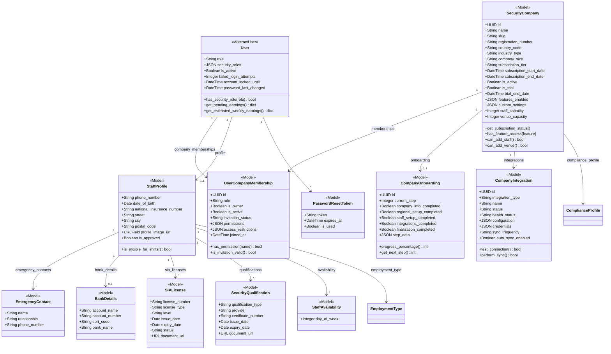
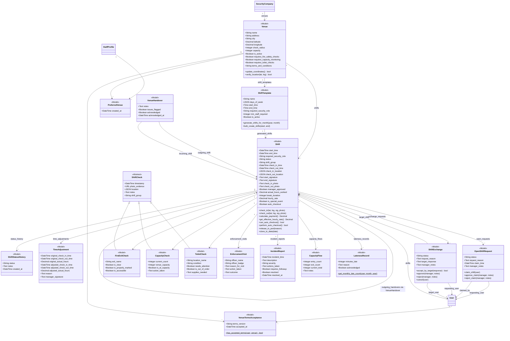
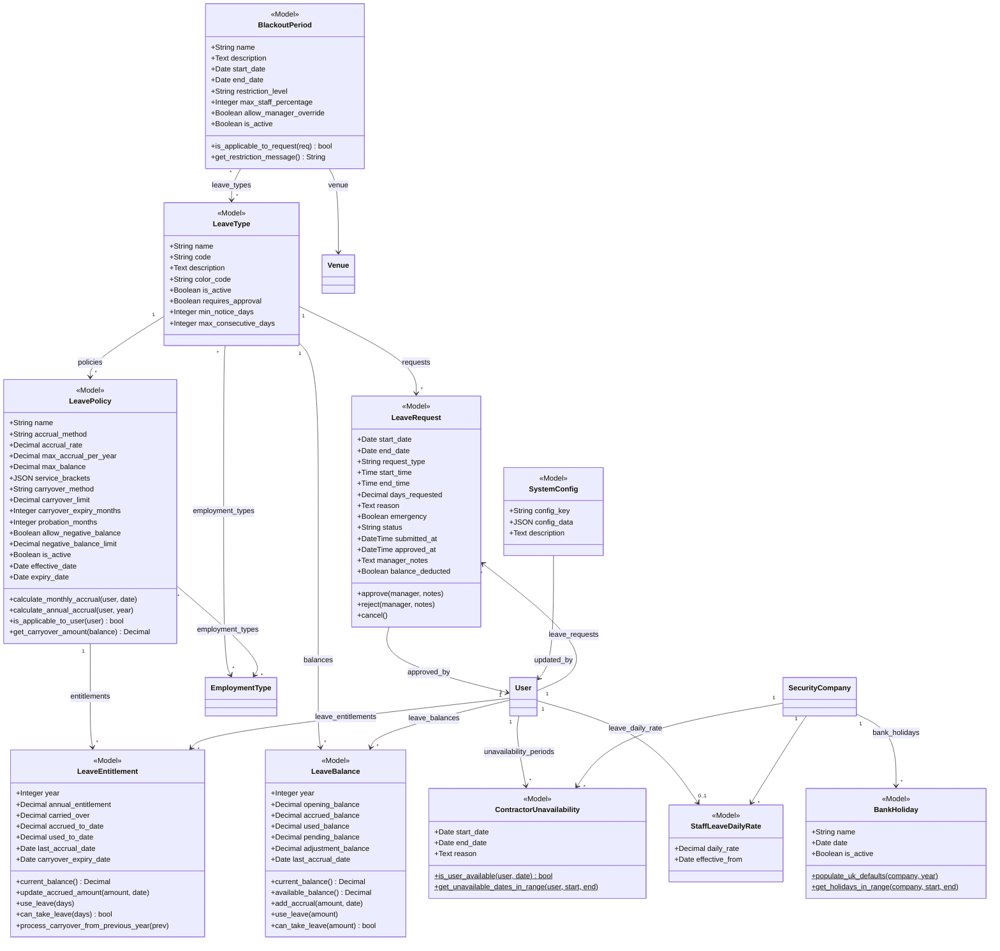
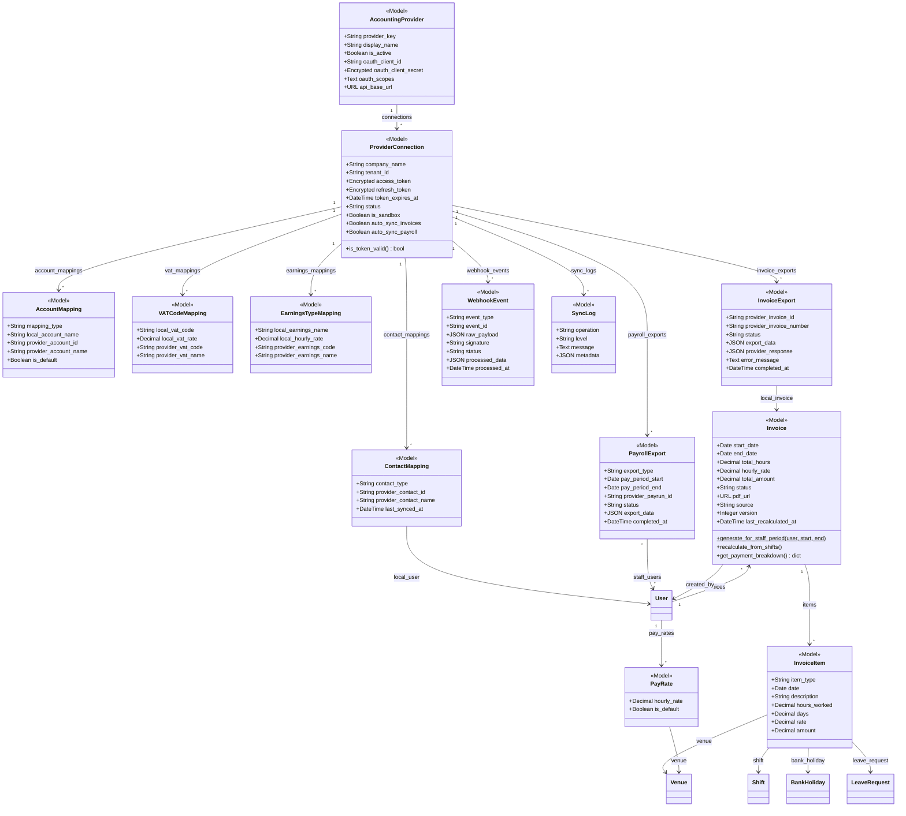
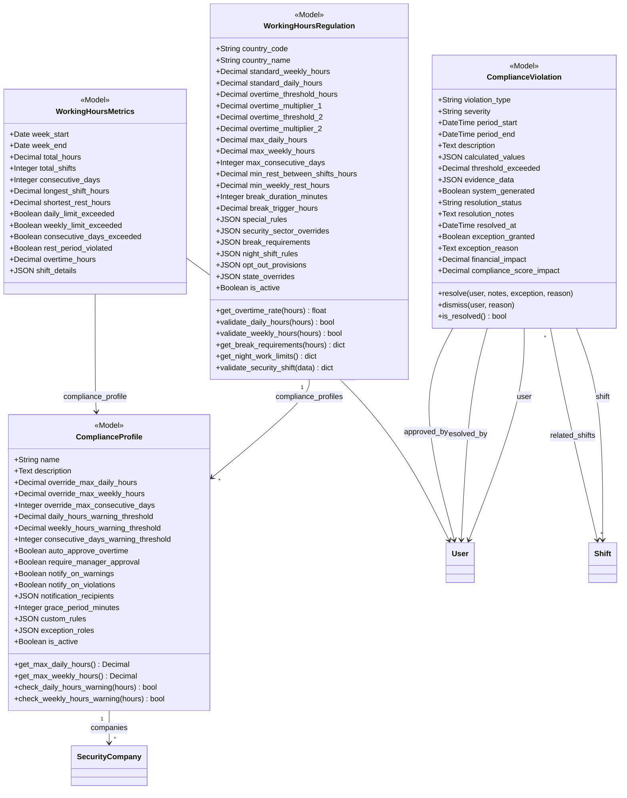
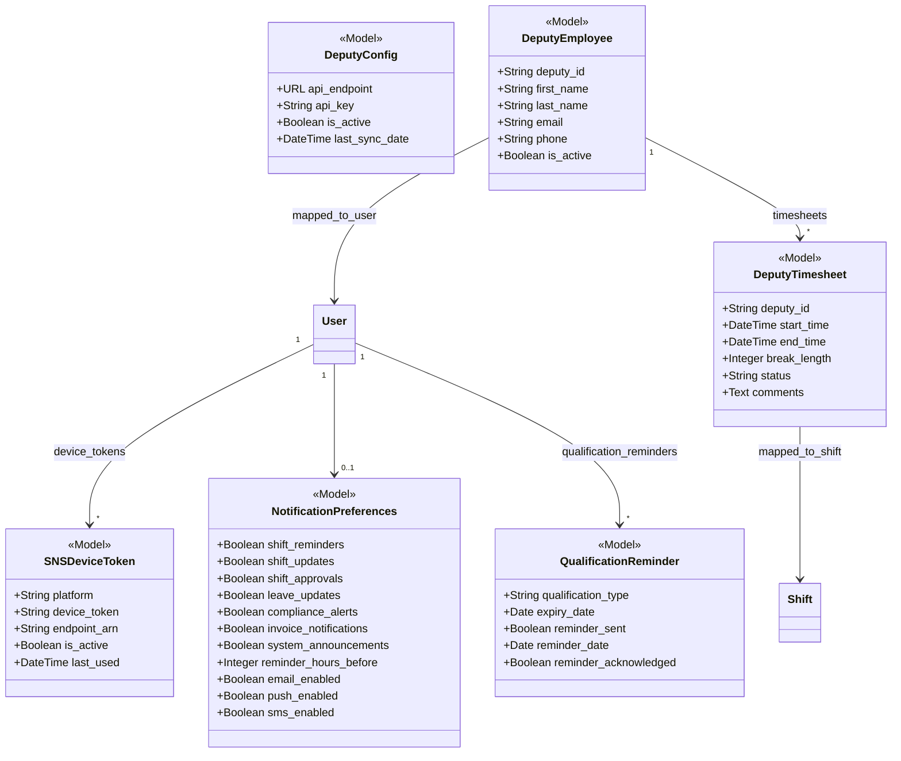
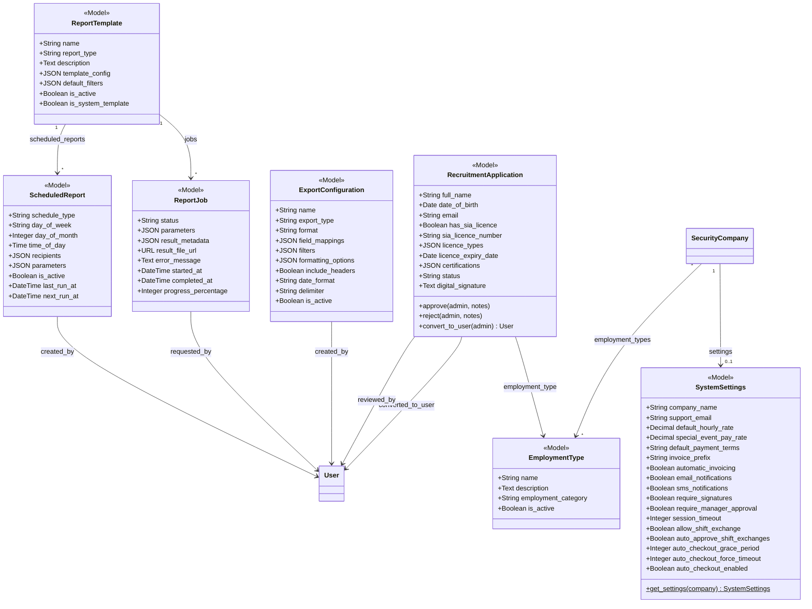

# Class Diagram - Security Staff Management System

## Overview

This document contains Mermaid class diagrams covering all 60+ Django models across 4 apps (`api`, `leave_management`, `finance_integrations`, `shifts`). The models are organized into 7 domain subdiagrams for readability:

1. **Core User & Multi-Tenant** - User, StaffProfile, SecurityCompany, Membership
2. **Shift Management** - Shift, ShiftTemplate, ShiftExchange, OpenShiftRequest, checks
3. **Leave Management** - LeaveType, LeavePolicy, LeaveRequest, LeaveBalance, BlackoutPeriod
4. **Finance & Invoicing** - Invoice, InvoiceItem, PayRate, accounting integrations
5. **Compliance & Regulation** - WorkingHoursRegulation, ComplianceProfile, ComplianceViolation
6. **Deputy Integration & Notifications** - DeputyConfig, DeputyEmployee, SNSDeviceToken
7. **Reporting & System Config** - ReportTemplate, ReportJob, SystemSettings, EmploymentType

**Audience**: Developers, architects, and technical stakeholders needing to understand model relationships, key fields, and domain boundaries.

---

## 1. Core User & Multi-Tenant Domain

---

## 2. Shift Management Domain

---

## 3. Leave Management Domain

---

## 4. Finance & Invoicing Domain

---

## 5. Compliance & Regulation Domain

---

## 6. Deputy Integration & Notifications Domain

---

## 7. Reporting & System Configuration Domain

---

## Legend

| Symbol | Meaning |
|--------|---------|
| `<<Model>>` | Django Model class |
| `<<AbstractUser>>` | Extends Django AbstractUser |
| `<<Abstract>>` | Abstract base class (no DB table) |
| `+` | Public field or method |
| `$` | Static/class method |
| `"1" --> "*"` | One-to-many relationship (ForeignKey) |
| `"1" --> "0..1"` | One-to-one relationship (OneToOneField) |
| `"*" --> "*"` | Many-to-many relationship (ManyToManyField) |
| `<\|--` | Inheritance (subclass) |
| `UUID` | UUID primary key |
| `JSON` | JSONField |
| `Encrypted` | EncryptedJSONField (encrypted at rest) |

### Status/Choice Enumerations

| Model | Field | Choices |
|-------|-------|---------|
| User | role | admin, manager, staff |
| UserCompanyMembership | role | owner, admin, manager, staff, viewer |
| Shift | status | open, scheduled, active, in_progress, completed, pending_approval, approved, rejected, cancelled, no_show |
| Invoice | status | pending, paid, rejected |
| LeaveRequest | status | draft, pending, approved, rejected, cancelled, withdrawn |
| OpenShiftRequest | status | open, claimed, approved, rejected, cancelled |
| ShiftExchange | status | pending, accepted_by_target, approved, rejected, cancelled |
| ComplianceViolation | severity | info, warning, minor, major, critical |
| ComplianceViolation | resolution_status | open, investigating, pending_approval, approved_exception, resolved, false_positive, dismissed |
| SIALicense | status | valid, expired, pending |
| ProviderConnection | status | pending, connected, expired, error, disabled |
| InvoiceExport | status | pending, processing, completed, failed, cancelled |
| SecurityCompany | subscription_tier | starter, professional, enterprise, custom |
| EmploymentType | employment_category | permanent, contractor, temporary |
| RecruitmentApplication | status | pending, approved, rejected |
| InvoiceItem | item_type | shift, bank_holiday, annual_leave |

---

## Notes

- **Cross-reference**: See `01_ERD_Complete.md` for the full entity-relationship diagram with all field types.
- **Cross-reference**: See `07_State_Diagrams.md` for state machine diagrams of Shift, LeaveRequest, Invoice, OpenShiftRequest, ShiftExchange, and ComplianceViolation.
- **Cross-reference**: See `09_DFD_Context.md` and `10_DFD_Level1.md` for data flow diagrams showing how these models interact at the process level.
- The `shifts` app (`backend/shifts/models.py`) re-exports `Shift` and `ShiftStatusHistory` from `api.models`.
- `ShiftCheck` is an abstract model; `FireExitCheck`, `CapacityCheck`, and `ToiletCheck` inherit from it and have their own DB tables.
- Multi-tenancy is achieved via `SecurityCompany` + `UserCompanyMembership` -- users can belong to multiple companies.
- Accounting integration uses `EncryptedJSONField` for OAuth tokens and secrets.

---

## Source Files

| File | Models Covered |
|------|---------------|
| `backend/api/models.py` | SecurityCompany, UserCompanyMembership, CompanyOnboarding, CompanyIntegration, User, StaffProfile, EmergencyContact, BankDetails, SIALicense, SecurityQualification, StaffAvailability, Venue, VenueTermsAcceptance, PreferredVenue, ShiftStatusHistory, ShiftTemplate, OpenShiftRequest, Shift, TimeAdjustment, ShiftCheck, FireExitCheck, CapacityCheck, ToiletCheck, ShiftExchange, Invoice, InvoiceItem, PayRate, DeputyConfig, DeputyEmployee, DeputyTimesheet, LatenessRecord, IncidentReport, CapacityFlow, VenueHandover, QualificationReminder, SystemSettings, EmploymentType, ContractorUnavailability, BankHoliday, StaffLeaveDailyRate, RecruitmentApplication, EnforcementVisit, WorkingHoursRegulation, ComplianceProfile, ComplianceViolation, WorkingHoursMetrics, ReportTemplate, ReportJob, ScheduledReport, ExportConfiguration, SNSDeviceToken, NotificationPreferences, PasswordResetToken |
| `backend/leave_management/models.py` | LeaveType, LeavePolicy, LeaveRequest, LeaveBalance, BlackoutPeriod, LeaveEntitlement, SystemConfig |
| `backend/finance_integrations/models.py` | AccountingProvider, ProviderConnection, AccountMapping, VATCodeMapping, EarningsTypeMapping, ContactMapping, InvoiceExport, PayrollExport, WebhookEvent, SyncLog |
| `backend/shifts/models.py` | Re-exports Shift, ShiftStatusHistory from api.models |
