# Component Diagram

## Overview
High-level component diagram showing all major system components, their groupings, and inter-component communication paths. Intended for developers, architects, and DevOps engineers to understand the full system topology.

## Diagram

```mermaid
flowchart TB
    subgraph Frontend["Frontend Clients"]
        direction TB
        WebApp["React 18 Web App<br/>(TypeScript + Vite + Tailwind + Fluent UI)<br/>Hosted on Vercel"]
        MobileApp["React Native Mobile App<br/>(Expo + Redux)<br/>iOS & Android"]
    end

    subgraph APIGateway["API Gateway Layer"]
        direction TB
        Daphne["Daphne ASGI Server"]
        DRF["Django REST Framework<br/>API v1 Endpoints"]
        Swagger["drf-yasg<br/>Swagger / ReDoc"]
        WSRouter["Django Channels<br/>WebSocket Router"]
    end

    subgraph AuthService["Authentication & Authorization"]
        direction TB
        CookieJWT["CookieJWTAuthentication<br/>(httpOnly cookies primary)"]
        BearerJWT["Bearer Token Fallback<br/>(Authorization header)"]
        SimpleJWT["SimpleJWT<br/>(HS256, token blacklist)"]
        SocialAuth["Social Auth<br/>(Google OAuth2 + Apple Sign-In)"]
        RBAC["Role-Based Access Control<br/>(Staff / Manager / Admin)"]
    end

    subgraph Middleware["Middleware Stack"]
        direction TB
        SecurityMW["SecurityMiddleware<br/>(HSTS, SSL redirect)"]
        WhiteNoise["WhiteNoise<br/>(static file serving)"]
        CORS["CorsMiddleware<br/>(cross-origin policy)"]
        TenantMW["TenantMiddleware<br/>(multi-company isolation)"]
        RateLimit["django-ratelimit<br/>(API rate limiting)"]
    end

    subgraph BusinessLogic["Business Logic Services"]
        direction TB
        subgraph CoreApps["Core Django Apps"]
            APIApp["api app<br/>(Users, Profiles, Venues,<br/>Shifts, Invoices, Compliance)"]
            ShiftsApp["shifts app<br/>(Shift scheduling,<br/>check-in/out, GPS verify)"]
            LeaveApp["leave_management app<br/>(Leave requests,<br/>balances, policies)"]
            FinanceApp["finance_integrations app<br/>(Xero, QuickBooks, Sage<br/>OAuth + sync)"]
        end
        subgraph Services["Service Layer"]
            PushService["PushNotificationService<br/>(Expo SDK)"]
            EmailService["EmailNotificationService<br/>(Brevo SMTP)"]
            ReportGen["ReportGenerator<br/>(PDF/CSV/Excel export)"]
            ComplianceGuide["CompliancePerformanceGuide<br/>(SIA license validation)"]
        end
    end

    subgraph BackgroundTasks["Background Processing"]
        direction TB
        CeleryWorker["Celery Worker<br/>(prefetch=1, acks_late)"]
        CeleryBeat["Celery Beat Scheduler<br/>(periodic tasks)"]
        subgraph Queues["Task Queues"]
            DefaultQ["celery queue<br/>(default tasks)"]
            ReportsQ["reports queue<br/>(report generation)"]
            CleanupQ["cleanup queue<br/>(file/data cleanup)"]
            NotifyQ["notifications queue<br/>(push/email sends)"]
        end
    end

    subgraph DataLayer["Data Layer"]
        direction TB
        PostgreSQL[("PostgreSQL<br/>(managed, conn pooling<br/>max_age=600)")]
        Redis[("Redis<br/>(cache + broker + channels)")]
        S3["AWS S3<br/>(media, reports,<br/>profile photos, invoices)"]
        CloudFront["CloudFront CDN<br/>(media delivery)"]
    end

    subgraph RealTime["Real-Time Communication"]
        direction TB
        ReportsWS["ws/reports/<br/>ReportsConsumer"]
        NotifyWS["ws/notifications/<br/>NotificationConsumer"]
        ChannelsRedis["channels_redis<br/>(encrypted channel layer)"]
    end

    subgraph ExternalIntegrations["External Integrations"]
        direction TB
        Deputy["Deputy API<br/>(employee + timesheet sync)"]
        Xero["Xero API<br/>(accounting + payroll)"]
        QuickBooks["QuickBooks API<br/>(accounting)"]
        Sage["Sage API<br/>(accounting)"]
        GoogleMaps["Google Maps API<br/>(venue geocoding + GPS verify)"]
        GoogleOAuth["Google OAuth2<br/>(social sign-in)"]
        AppleAuth["Apple Sign-In<br/>(identity token verify)"]
        ExpoPush["Expo Push Service<br/>(mobile notifications)"]
        BrevoSMTP["Brevo SMTP<br/>(transactional email)"]
    end

    %% Client connections
    WebApp -->|"HTTPS REST API"| Daphne
    WebApp -->|"WSS WebSocket"| WSRouter
    MobileApp -->|"HTTPS REST API"| Daphne
    MobileApp -->|"Expo Push Token"| ExpoPush

    %% API Gateway routing
    Daphne --> DRF
    Daphne --> Swagger
    WSRouter --> ReportsWS
    WSRouter --> NotifyWS

    %% Auth flow
    DRF --> CookieJWT
    DRF --> BearerJWT
    CookieJWT --> SimpleJWT
    BearerJWT --> SimpleJWT
    SocialAuth --> GoogleOAuth
    SocialAuth --> AppleAuth
    SocialAuth --> SimpleJWT
    DRF --> RBAC

    %% Middleware processing
    Daphne --> SecurityMW
    SecurityMW --> WhiteNoise
    WhiteNoise --> CORS
    CORS --> TenantMW
    DRF -.->|"per-view"| RateLimit

    %% Business logic
    DRF --> APIApp
    DRF --> ShiftsApp
    DRF --> LeaveApp
    DRF --> FinanceApp
    APIApp --> PushService
    APIApp --> EmailService
    APIApp --> ReportGen
    APIApp --> ComplianceGuide

    %% Background tasks
    APIApp -->|"task dispatch"| CeleryWorker
    CeleryBeat -->|"scheduled tasks"| CeleryWorker
    CeleryWorker --> DefaultQ
    CeleryWorker --> ReportsQ
    CeleryWorker --> CleanupQ
    CeleryWorker --> NotifyQ

    %% Data layer connections
    APIApp --> PostgreSQL
    ShiftsApp --> PostgreSQL
    LeaveApp --> PostgreSQL
    FinanceApp --> PostgreSQL
    CeleryWorker -->|"broker + results"| Redis
    CeleryBeat --> Redis
    APIApp -->|"cache"| Redis
    ReportGen --> S3
    S3 --> CloudFront

    %% Real-time
    ReportsWS --> ChannelsRedis
    NotifyWS --> ChannelsRedis
    ChannelsRedis --> Redis

    %% External integrations
    APIApp --> Deputy
    FinanceApp --> Xero
    FinanceApp --> QuickBooks
    FinanceApp --> Sage
    ShiftsApp --> GoogleMaps
    PushService --> ExpoPush
    EmailService --> BrevoSMTP

    %% Styling
    classDef frontend fill:#e8f5e9,stroke:#2e7d32,stroke-width:2px,color:#1b5e20
    classDef gateway fill:#e3f2fd,stroke:#1565c0,stroke-width:2px,color:#0d47a1
    classDef auth fill:#fce4ec,stroke:#c62828,stroke-width:2px,color:#b71c1c
    classDef middleware fill:#fff3e0,stroke:#e65100,stroke-width:2px,color:#bf360c
    classDef business fill:#f3e5f5,stroke:#6a1b9a,stroke-width:2px,color:#4a148c
    classDef background fill:#e0f2f1,stroke:#00695c,stroke-width:2px,color:#004d40
    classDef data fill:#fff9c4,stroke:#f57f17,stroke-width:2px,color:#e65100
    classDef realtime fill:#e8eaf6,stroke:#283593,stroke-width:2px,color:#1a237e
    classDef external fill:#efebe9,stroke:#4e342e,stroke-width:2px,color:#3e2723

    class WebApp,MobileApp frontend
    class Daphne,DRF,Swagger,WSRouter gateway
    class CookieJWT,BearerJWT,SimpleJWT,SocialAuth,RBAC auth
    class SecurityMW,WhiteNoise,CORS,TenantMW,RateLimit middleware
    class APIApp,ShiftsApp,LeaveApp,FinanceApp,PushService,EmailService,ReportGen,ComplianceGuide business
    class CeleryWorker,CeleryBeat,DefaultQ,ReportsQ,CleanupQ,NotifyQ background
    class PostgreSQL,Redis,S3,CloudFront data
    class ReportsWS,NotifyWS,ChannelsRedis realtime
    class Deputy,Xero,QuickBooks,Sage,GoogleMaps,GoogleOAuth,AppleAuth,ExpoPush,BrevoSMTP external
```

## Legend

| Color | Component Group | Description |
|-------|----------------|-------------|
| Green | Frontend Clients | User-facing applications (web + mobile) |
| Blue | API Gateway | ASGI server, REST framework, WebSocket router |
| Red/Pink | Auth Service | JWT authentication, social auth, RBAC |
| Orange | Middleware | Request processing pipeline |
| Purple | Business Logic | Django apps and service layer |
| Teal | Background Tasks | Celery workers, beat scheduler, task queues |
| Yellow | Data Layer | PostgreSQL, Redis, S3, CloudFront |
| Indigo | Real-Time | WebSocket consumers and channel layer |
| Brown | External | Third-party API integrations |

### Arrow Types
- **Solid arrows** (`-->`) indicate direct synchronous communication
- **Dotted arrows** (`-.->`) indicate optional or conditional connections
- **Labels** describe the protocol or purpose of the connection

## Notes
- The middleware stack processes requests in the order shown (top to bottom), matching `settings.MIDDLEWARE`
- CookieJWTAuthentication tries httpOnly cookies first, then falls back to Bearer header for mobile/API clients
- TenantMiddleware sets company context via `X-Company-ID` header, URL param, or user default
- Celery uses 4 named queues with task routing defined in `celery_app.py`
- Redis serves triple duty: Celery broker/results, Django cache, and Channels layer (with symmetric encryption)
- See `04_Deployment_Diagram.md` for cloud provider mapping
- See `14_Security_Architecture.md` for detailed auth flows and RBAC matrix

## Source Files
- `backend/core/settings.py` - INSTALLED_APPS, MIDDLEWARE, REST_FRAMEWORK, SIMPLE_JWT, CELERY config, CHANNEL_LAYERS
- `backend/core/asgi.py` - ASGI application with ProtocolTypeRouter for HTTP + WebSocket
- `backend/core/celery_app.py` - Celery app config, task routing, queue definitions, beat schedule
- `backend/core/urls.py` - URL routing: api/v1/, shifts/, finance/, leave/, health/
- `backend/api/authentication.py` - CookieJWTAuthentication (httpOnly cookie + Bearer fallback)
- `backend/api/social_auth.py` - Google OAuth2 and Apple Sign-In token verification
- `backend/api/routing.py` - WebSocket URL patterns (ws/reports/, ws/notifications/)
- `backend/api/middleware/tenant_middleware.py` - Multi-tenant company isolation
- `backend/api/services/notification_service.py` - Expo push notification service
- `backend/api/services/email_notification_service.py` - Brevo SMTP email service
- `backend/api/tasks.py` - Celery tasks with progress tracking via WebSocket
- `backend/finance_integrations/` - Xero, QuickBooks, Sage provider integrations
