# Deployment Diagram

## Overview
Cloud deployment architecture showing all services, their hosting providers, network connections, and infrastructure dependencies. Intended for DevOps engineers, SREs, and architects planning capacity, monitoring, and incident response.

## Diagram

```mermaid
flowchart TB
    subgraph Users["End Users"]
        Browser["Web Browser<br/>(Chrome, Safari, Firefox)"]
        iOS["iOS Device<br/>(React Native + Expo)"]
        Android["Android Device<br/>(React Native + Expo)"]
    end

    subgraph Vercel["Vercel (Frontend Hosting)"]
        direction TB
        VercelEdge["Vercel Edge Network<br/>(Global CDN)"]
        ReactApp["React 18 SPA<br/>TypeScript + Vite build<br/>Tailwind CSS + Fluent UI"]
        VercelRewrites["SPA Rewrites<br/>(/* → /index.html)"]
        VercelDomain["admin.meadsecurity.co.uk<br/>guard-ten.vercel.app"]
    end

    subgraph Render["Render (Backend Hosting) — Oregon Region"]
        direction TB
        subgraph WebService["Web Service: mead-security-api (Starter Plan)"]
            Daphne["Daphne ASGI Server<br/>-b 0.0.0.0 -p $PORT"]
            Django["Django 5.2<br/>DRF + Channels"]
            WhiteNoise["WhiteNoise<br/>(compressed static files)"]
            HealthCheck["/api/v1/health/<br/>(health check endpoint)"]
        end
        subgraph WorkerService["Worker: mead-security-worker (Starter Plan)"]
            CeleryWorker["Celery Worker<br/>--concurrency=2<br/>-A core.celery_app"]
        end
        subgraph BeatService["Worker: mead-security-beat (Starter Plan)"]
            CeleryBeat["Celery Beat<br/>DatabaseScheduler<br/>-A core.celery_app"]
        end
        subgraph RenderRedis["Redis: mead-security-redis (Starter Plan)"]
            Redis[("Redis Instance<br/>Broker + Cache + Channels<br/>Encrypted channel layer")]
        end
        subgraph RenderDB["Database: mead-security-db (Free Plan)"]
            PostgreSQL[("PostgreSQL<br/>DB: mead_security<br/>User: mead_admin<br/>conn_max_age=600")]
        end
    end

    subgraph AWS["Amazon Web Services"]
        direction TB
        S3["S3 Bucket<br/>(media files, reports,<br/>profile photos, invoices)"]
        CloudFront["CloudFront CDN<br/>(media delivery,<br/>CacheControl: max-age=86400)"]
    end

    subgraph ExternalAPIs["External API Services"]
        direction TB
        subgraph AuthProviders["Authentication Providers"]
            GoogleOAuth["Google OAuth2<br/>(accounts.google.com)"]
            AppleAuth["Apple Sign-In<br/>(appleid.apple.com/auth/keys)"]
        end
        subgraph FinanceProviders["Finance Integrations"]
            XeroAPI["Xero API<br/>(accounting + payroll)"]
            QuickBooksAPI["QuickBooks API<br/>(accounting)"]
            SageAPI["Sage API<br/>(accounting)"]
        end
        subgraph NotificationServices["Notification Services"]
            BrevoSMTP["Brevo SMTP<br/>(smtp-relay.brevo.com:587<br/>TLS, transactional email)"]
            ExpoPush["Expo Push Service<br/>(mobile push notifications)"]
        end
        subgraph LocationServices["Location Services"]
            GoogleMaps["Google Maps API<br/>(geocoding, GPS verification)"]
        end
        subgraph WorkforceServices["Workforce Management"]
            DeputyAPI["Deputy API<br/>(employee + timesheet sync)"]
        end
    end

    %% User connections
    Browser -->|"HTTPS"| VercelEdge
    Browser -->|"HTTPS / WSS"| Daphne
    iOS -->|"HTTPS"| Daphne
    Android -->|"HTTPS"| Daphne

    %% Vercel internal
    VercelEdge --> ReactApp
    ReactApp --> VercelRewrites
    VercelEdge --> VercelDomain

    %% Render internal connections
    Daphne --> Django
    Django --> WhiteNoise
    Django --> HealthCheck
    Django -->|"ORM"| PostgreSQL
    Django -->|"cache get/set"| Redis
    Django -->|"channel_layer"| Redis
    CeleryWorker -->|"broker consume"| Redis
    CeleryWorker -->|"result store"| Redis
    CeleryWorker -->|"DB queries"| PostgreSQL
    CeleryBeat -->|"schedule publish"| Redis
    CeleryBeat -->|"beat schedule DB"| PostgreSQL

    %% AWS connections
    Django -->|"boto3 upload"| S3
    CeleryWorker -->|"report files"| S3
    S3 -->|"origin"| CloudFront
    Browser -->|"media fetch"| CloudFront
    iOS -->|"media fetch"| CloudFront
    Android -->|"media fetch"| CloudFront

    %% External API connections
    Django -->|"id_token verify"| GoogleOAuth
    Django -->|"identity_token verify"| AppleAuth
    Django -->|"OAuth2 + REST"| XeroAPI
    Django -->|"OAuth2 + REST"| QuickBooksAPI
    Django -->|"OAuth2 + REST"| SageAPI
    Django -->|"geocoding"| GoogleMaps
    Django -->|"employee/timesheet sync"| DeputyAPI
    CeleryWorker -->|"SMTP :587 TLS"| BrevoSMTP
    CeleryWorker -->|"push send"| ExpoPush

    %% Mobile push path
    ExpoPush -.->|"APNs / FCM"| iOS
    ExpoPush -.->|"APNs / FCM"| Android

    %% Cross-origin
    ReactApp -.->|"CORS: HTTPS REST"| Daphne
    ReactApp -.->|"WSS"| Daphne

    %% Styling
    classDef users fill:#e8f5e9,stroke:#2e7d32,stroke-width:2px,color:#1b5e20
    classDef vercel fill:#000000,stroke:#ffffff,stroke-width:2px,color:#ffffff
    classDef render fill:#e3f2fd,stroke:#1565c0,stroke-width:2px,color:#0d47a1
    classDef renderService fill:#bbdefb,stroke:#1565c0,stroke-width:1px,color:#0d47a1
    classDef aws fill:#fff3e0,stroke:#e65100,stroke-width:2px,color:#bf360c
    classDef external fill:#f3e5f5,stroke:#6a1b9a,stroke-width:2px,color:#4a148c
    classDef database fill:#fff9c4,stroke:#f57f17,stroke-width:2px,color:#e65100
    classDef redis fill:#ffcdd2,stroke:#c62828,stroke-width:2px,color:#b71c1c

    class Browser,iOS,Android users
    class VercelEdge,ReactApp,VercelRewrites,VercelDomain vercel
    class Daphne,Django,WhiteNoise,HealthCheck,CeleryWorker,CeleryBeat renderService
    class S3,CloudFront aws
    class GoogleOAuth,AppleAuth,XeroAPI,QuickBooksAPI,SageAPI,BrevoSMTP,ExpoPush,GoogleMaps,DeputyAPI external
    class PostgreSQL database
    class Redis redis
```

## Service Inventory

| Service | Provider | Plan | Region | Start Command |
|---------|----------|------|--------|---------------|
| **Frontend SPA** | Vercel | Free/Pro | Global CDN | Vite build + static serve |
| **API Server** | Render (Web) | Starter | Oregon | `daphne -b 0.0.0.0 -p $PORT core.asgi:application` |
| **Celery Worker** | Render (Worker) | Starter | Oregon | `celery -A core.celery_app worker -l info --concurrency=2` |
| **Celery Beat** | Render (Worker) | Starter | Oregon | `celery -A core.celery_app beat -l info --scheduler django_celery_beat.schedulers:DatabaseScheduler` |
| **PostgreSQL** | Render (DB) | Free | Oregon | Managed (mead_security / mead_admin) |
| **Redis** | Render (Redis) | Starter | Oregon | Managed (broker + cache + channels) |
| **Media Storage** | AWS S3 | Standard | Configurable | boto3 / django-storages |
| **Media CDN** | AWS CloudFront | Standard | Global | S3 origin, 1-day cache |

## Environment Variables

Key environment variables injected via Render dashboard (secrets marked `sync: false`):

| Variable | Source | Used By |
|----------|--------|---------|
| `DATABASE_URL` | Render DB connection string | API, Worker, Beat |
| `REDIS_URL` | Render Redis connection string | API, Worker, Beat |
| `DJANGO_SECRET_KEY` | Manual secret | All backend services |
| `DJANGO_ALLOWED_HOSTS` | Manual config | API |
| `CORS_ALLOWED_ORIGINS` | Manual config | API |
| `FRONTEND_URL` | Manual config | API (email links) |
| `AWS_ACCESS_KEY_ID` | Manual secret | API, Worker (S3) |
| `AWS_SECRET_ACCESS_KEY` | Manual secret | API, Worker (S3) |
| `EMAIL_HOST_USER` | Manual secret | Worker (Brevo SMTP) |
| `EMAIL_HOST_PASSWORD` | Manual secret | Worker (Brevo SMTP) |

## Legend

| Symbol | Meaning |
|--------|---------|
| Solid arrow (`-->`) | Synchronous network call or direct connection |
| Dotted arrow (`-.->`) | Asynchronous or push-based delivery |
| Cylinder shape | Database or persistent data store |
| Rectangle | Application service or API |

### Color Coding
| Color | Component |
|-------|-----------|
| Green | End user clients |
| Black | Vercel (frontend CDN) |
| Blue | Render platform services |
| Orange | AWS infrastructure |
| Purple | External third-party APIs |
| Yellow | Database (PostgreSQL) |
| Red | Redis (cache/broker/channels) |

## Notes
- All Render services are co-located in the **Oregon** region for low-latency inter-service communication
- Redis serves three roles: Celery broker/results, Django cache (django-redis), and Channels layer (with symmetric encryption using SECRET_KEY)
- PostgreSQL connections use `conn_max_age=600` and health checks via `dj_database_url`
- Daphne serves both HTTP and WebSocket traffic via ProtocolTypeRouter in `core.asgi`
- Frontend uses SPA rewrite (`/* → /index.html`) on Vercel with custom domain `admin.meadsecurity.co.uk`
- Production security: HSTS (1yr), SSL redirect, secure cookies, CSRF protection, X-Frame-Options: DENY
- S3/CloudFront usage is conditional on `USE_S3_CDN=true` environment flag
- See `03_Component_Diagram.md` for internal component architecture
- See `12_System_Architecture.md` for layered architecture view
- See `14_Security_Architecture.md` for authentication and security details

## Source Files
- `render.yaml` - Render Blueprint: all services, plans, regions, env vars, build/start commands
- `frontend/vercel.json` - Vercel SPA rewrite configuration
- `backend/core/settings.py` - Django settings: DATABASE, REDIS, CELERY, CHANNELS, CORS, security
- `backend/core/settings/production.py` - Production overrides: S3/CloudFront, throttling, monitoring
- `backend/core/asgi.py` - ASGI application (Daphne + Channels ProtocolTypeRouter)
- `backend/core/celery_app.py` - Celery app, task routing, queue definitions, beat schedule
