# Use Case Diagram

## Overview
This diagram maps every actor in the Mead Security system to their available use cases, derived directly from the API endpoints and backend logic. It serves as a quick reference for product, QA, and development teams to understand "who can do what."

## Diagram

```mermaid
flowchart LR
    %% ───────────────── Actors ─────────────────
    Staff((Staff))
    Manager((Manager))
    Admin((Admin))
    System((System / Celery))

    %% ───────────────── Staff Use Cases ─────────────────
    subgraph UC_Staff ["Staff Use Cases"]
        S1[View My Shifts]
        S2[Check In to Shift\nGPS + Signature]
        S3[Check Out of Shift\nGPS + Signature]
        S4[Submit Venue Checks\nFire / Capacity / Toilet]
        S5[Request Shift Exchange]
        S6[Claim Open Shift]
        S7[View & Submit Leave Requests]
        S8[View Leave Balances]
        S9[View Earnings & Invoices]
        S10[Update My Profile\nPhoto / Bank / Emergency]
        S11[Manage SIA Licenses]
        S12[Set Availability Preferences]
        S13[Set Preferred Venues]
        S14[Accept Venue Terms]
        S15[Register Device for Push Notifications]
        S16[Set Notification Preferences]
        S17[Change Password]
        S18[Set Contractor Unavailability]
        S19[Cancel Own Leave Request]
        S20[View Leave Calendar]
    end

    Staff --> S1
    Staff --> S2
    Staff --> S3
    Staff --> S4
    Staff --> S5
    Staff --> S6
    Staff --> S7
    Staff --> S8
    Staff --> S9
    Staff --> S10
    Staff --> S11
    Staff --> S12
    Staff --> S13
    Staff --> S14
    Staff --> S15
    Staff --> S16
    Staff --> S17
    Staff --> S18
    Staff --> S19
    Staff --> S20

    %% ───────────────── Manager Use Cases ─────────────────
    subgraph UC_Manager ["Manager Use Cases"]
        M1[View All Company Shifts]
        M2[Approve / Reject Shifts]
        M3[Approve / Reject Shift Exchanges]
        M4[Approve / Reject Open Shift Claims]
        M5[Manage Shift Schedules\nCreate / Edit / Delete]
        M6[Create Multi-Staff Shifts]
        M7[View Compliance Reports\nVenue Safety]
        M8[Approve / Reject Leave Requests]
        M9[View Team Leave Overview]
        M10[View Team Leave Balances]
        M11[View Leave Analytics]
        M12[View Leave Reports & Export]
        M13[Review Attendance & Checks]
    end

    Manager --> M1
    Manager --> M2
    Manager --> M3
    Manager --> M4
    Manager --> M5
    Manager --> M6
    Manager --> M7
    Manager --> M8
    Manager --> M9
    Manager --> M10
    Manager --> M11
    Manager --> M12
    Manager --> M13

    %% Managers also inherit staff use cases
    Manager -.->|inherits| UC_Staff

    %% ───────────────── Admin Use Cases ─────────────────
    subgraph UC_Admin ["Admin Use Cases"]
        A1[Manage Users\nCRUD / Roles]
        A2[Manage Venues\nCRUD / GPS / Capacity]
        A3[Manage Pay Rates]
        A4[Generate & Manage Invoices\nPDF / Status]
        A5[Payroll Preview & Generation]
        A6[Configure Deputy Integration]
        A7[Manage Deputy Employees & Timesheets]
        A8[Configure System Settings]
        A9[Configure Finance Integrations\nXero OAuth / Mappings]
        A10[Export Invoices & Payroll to Xero]
        A11[Manage Leave Types & Policies]
        A12[Manage Blackout Periods]
        A13[Configure Leave System Settings]
        A14[Recalculate Leave Balances]
        A15[Manage Compliance Regulations\nWorking Hours / Regional]
        A16[View Compliance Violations & Alerts]
        A17[Manage Report Templates & Jobs]
        A18[Manage Data Exports]
        A19[Company Onboarding Workflow]
        A20[Manage Employment Types]
        A21[Manage Recruitment Applications]
        A22[Manage Shift Templates]
        A23[Manage Staff Leave Daily Rates]
        A24[Manage Bank Holidays]
    end

    Admin --> A1
    Admin --> A2
    Admin --> A3
    Admin --> A4
    Admin --> A5
    Admin --> A6
    Admin --> A7
    Admin --> A8
    Admin --> A9
    Admin --> A10
    Admin --> A11
    Admin --> A12
    Admin --> A13
    Admin --> A14
    Admin --> A15
    Admin --> A16
    Admin --> A17
    Admin --> A18
    Admin --> A19
    Admin --> A20
    Admin --> A21
    Admin --> A22
    Admin --> A23
    Admin --> A24

    %% Admins inherit manager use cases
    Admin -.->|inherits| UC_Manager

    %% ───────────────── System / Celery Use Cases ─────────────────
    subgraph UC_System ["System / Celery Use Cases"]
        SY1[Send Shift Assignment Notifications\nPush + Email]
        SY2[Send Shift Removal Notifications]
        SY3[Send Shift Reassignment Notifications]
        SY4[Send Shift Reminder Notifications\n24h + 1h before]
        SY5[Send Open Shift Notifications\nBatched to Qualified Staff]
        SY6[Send Exchange Status Notifications]
        SY7[Send Shift Approval Emails]
        SY8[Send Claim Approval Emails]
        SY9[Auto-Create OpenShiftRequest\nfor Admin-Created Open Shifts]
        SY10[Auto-Update Invoice\non Time Adjustment]
        SY11[Setup Trial Period\nfor New Companies]
        SY12[Cleanup Old Report Files\nDaily]
        SY13[Cleanup Expired Report Jobs\nEvery 6 Hours]
        SY14[Notify Co-Workers\nof New Shift Assignment]
        SY15[Process Report Generation\nAsync with Progress Tracking]
        SY16[Handle Finance Webhooks\nXero Provider Events]
    end

    System --> SY1
    System --> SY2
    System --> SY3
    System --> SY4
    System --> SY5
    System --> SY6
    System --> SY7
    System --> SY8
    System --> SY9
    System --> SY10
    System --> SY11
    System --> SY12
    System --> SY13
    System --> SY14
    System --> SY15
    System --> SY16

    %% ───────────────── Public / Unauthenticated ─────────────────
    Public((Public\nUnauthenticated))

    subgraph UC_Public ["Public Use Cases"]
        P1[Submit Recruitment Application]
        P2[View Company Recruitment Info]
        P3[Password Reset Flow\nRequest / Validate / Confirm]
        P4[Email Unsubscribe]
        P5[Social Auth Login\nApple / Google]
        P6[Health Check Endpoint]
    end

    Public --> P1
    Public --> P2
    Public --> P3
    Public --> P4
    Public --> P5
    Public --> P6
```

## Legend

| Symbol | Meaning |
|--------|---------|
| `((Actor))` | Human actor or automated system |
| `[Use Case]` | A discrete capability available to the actor |
| `-->` | Actor can perform this use case |
| `-.->` | Role inheritance (higher role inherits lower role use cases) |
| Subgraph | Logical grouping of use cases by actor scope |

### Actor Descriptions

| Actor | Description |
|-------|-------------|
| **Staff** | Security guards who work shifts, complete venue checks, and manage their own profiles |
| **Manager** | Supervisors who approve shifts/leave, manage schedules, and view team analytics |
| **Admin** | System administrators with full CRUD access, integrations, compliance, and onboarding |
| **System / Celery** | Automated background processes triggered by signals and periodic Celery beat tasks |
| **Public** | Unauthenticated users accessing recruitment, password reset, and social auth endpoints |

## Notes

- Role inheritance is cumulative: Admin inherits Manager use cases, Manager inherits Staff use cases
- Multi-tenant isolation ensures all data access is scoped to the user's company via `X-Company-ID` header
- GPS verification and digital signatures are required at both check-in and check-out
- Push notifications are sent via AWS SNS; emails are queued as Celery tasks
- See `06_Sequence_Diagrams.md` for detailed workflow interactions
- See `08_Activity_Diagrams.md` for business process decision flows
- See `13_API_Architecture.md` for endpoint-level detail and routing
- See `14_Security_Architecture.md` for RBAC permission matrix

## Source Files

- `backend/api/urls.py` - Main API URL router registration (125 lines)
- `backend/shifts/urls.py` - Shift endpoint routing with frontend variants
- `backend/leave_management/urls.py` - Leave management endpoint routing
- `backend/finance_integrations/urls.py` - Finance/Xero integration routing
- `backend/core/urls.py` - Root URL configuration and health check
- `backend/api/views.py` - View implementations with permission classes
- `backend/shifts/views.py` - Shift ViewSet with check-in/out, approve, multi-staff actions
- `backend/api/signals.py` - Django signals for automated workflows (notifications, trial setup, invoice updates)
- `backend/api/tasks.py` - Celery async tasks (notifications, reports, cleanup)
- `backend/core/celery_app.py` - Celery beat schedule for periodic tasks
