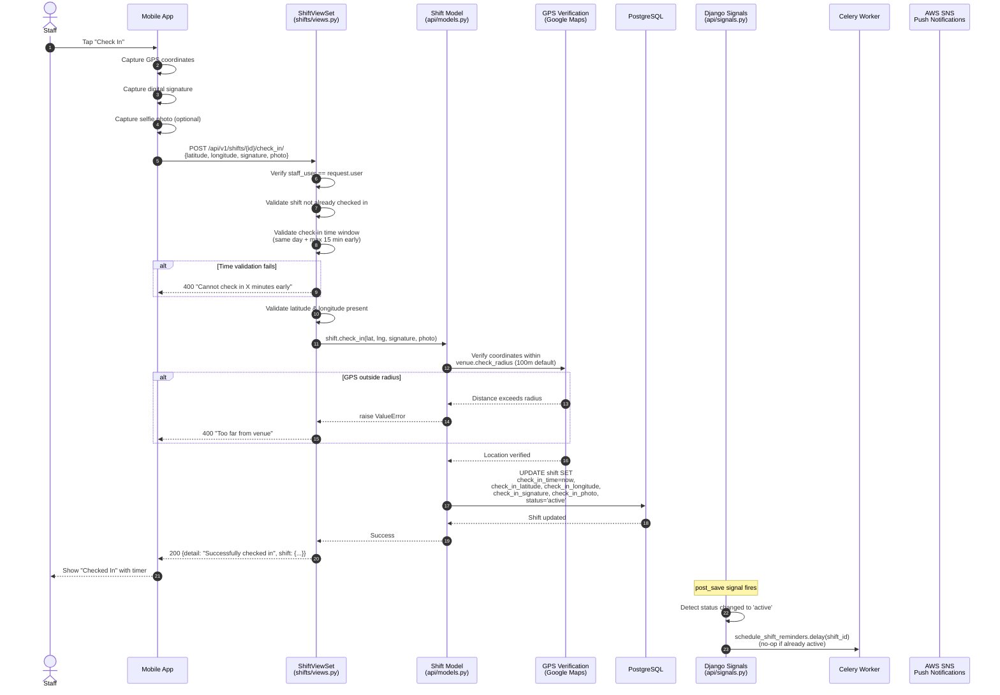
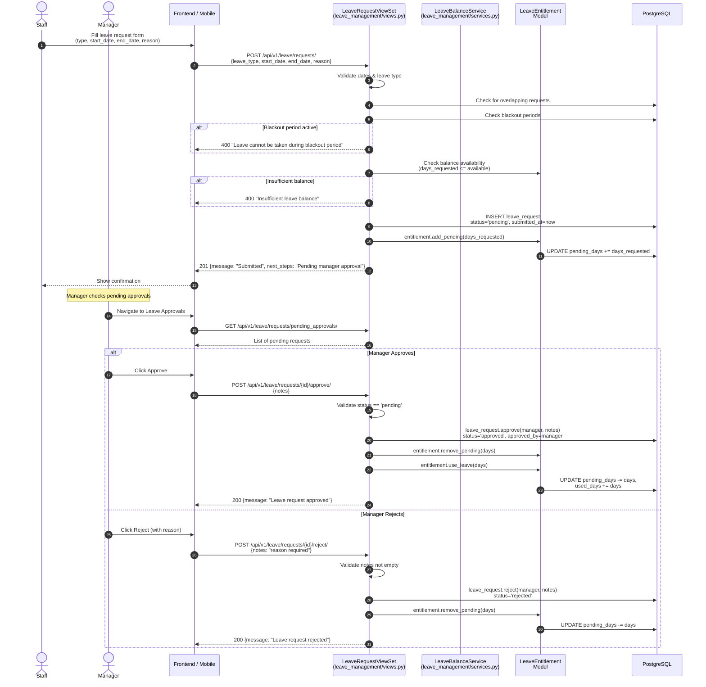
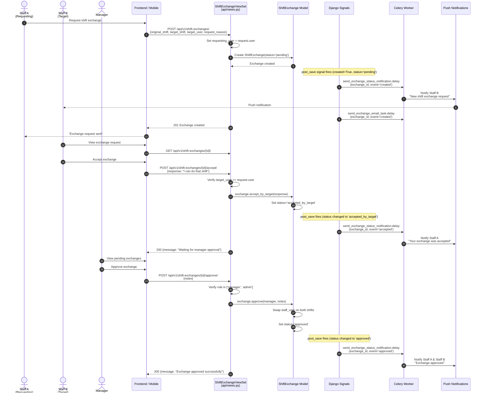
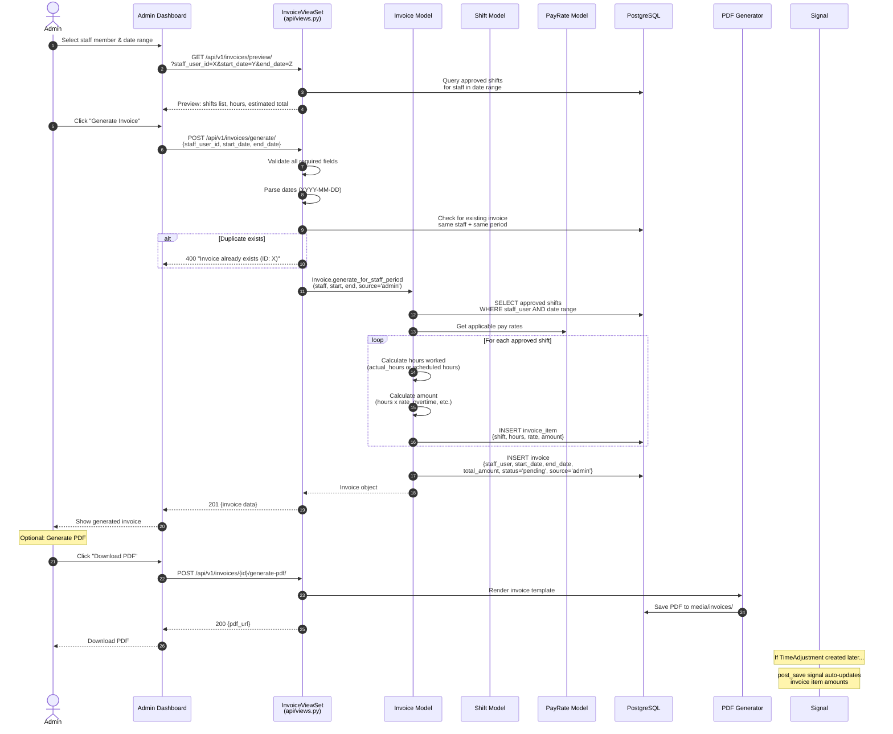
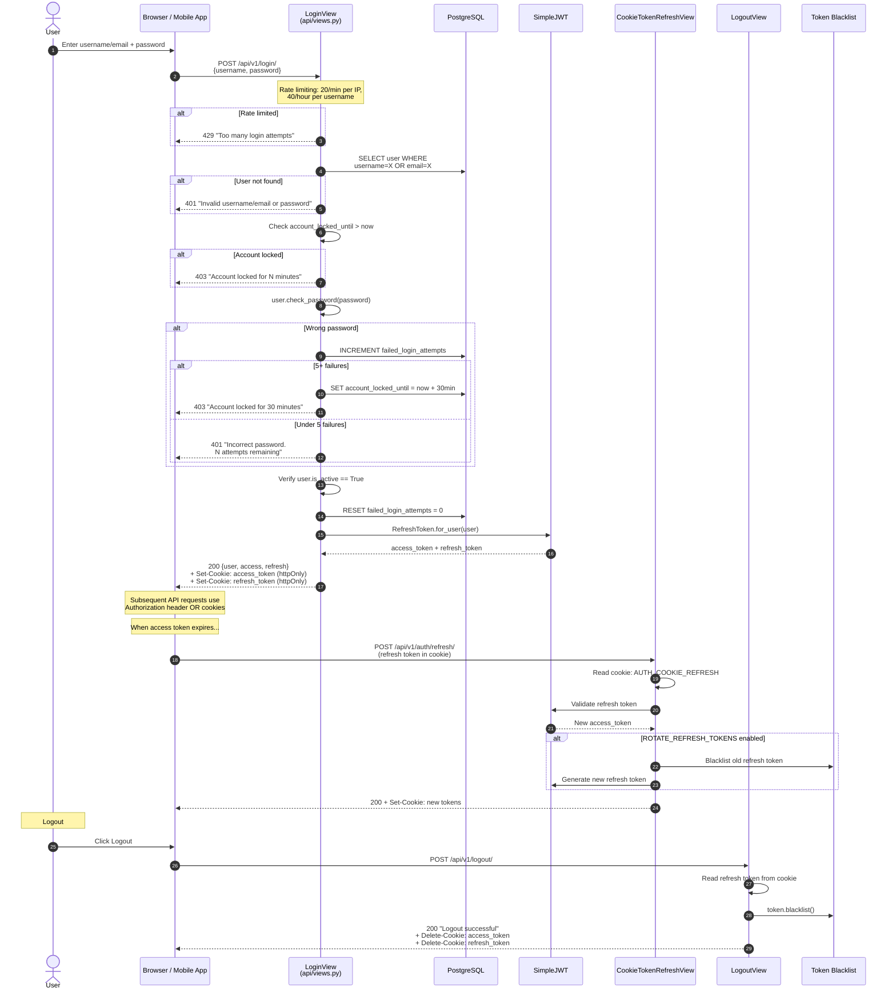
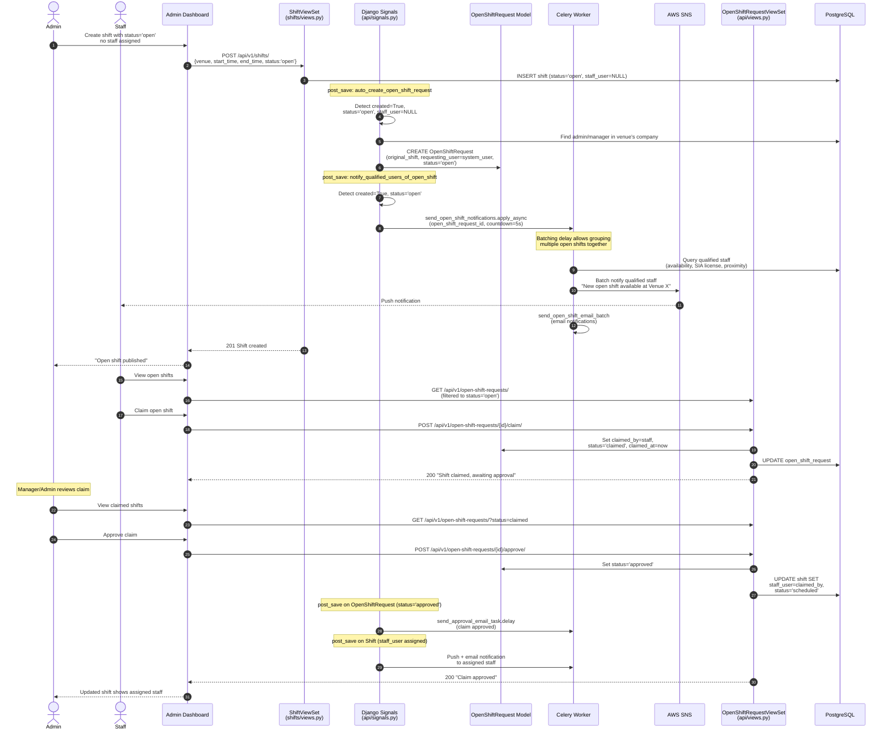

# Sequence Diagrams

## Overview
These six sequence diagrams capture the key end-to-end workflows in the Mead Security system. Each diagram traces the exact request/response path through the codebase, including middleware, views, models, signals, Celery tasks, and external services. These are intended for developers, QA engineers, and system architects.

## 1. Shift Check-In Flow

The check-in process enforces time windows, GPS verification, and digital signature capture before recording the attendance event.

## 2. Leave Request & Approval Flow

Staff submit leave requests which are validated against balances and blackout periods, then routed to managers for approval.

## 3. Shift Exchange Flow

Staff A requests to swap a shift with Staff B. After B accepts, a manager must approve before shifts are actually swapped.

## 4. Invoice Generation Flow

Admins generate invoices by selecting a staff member and date range. The system aggregates approved shifts, calculates pay, and can generate a PDF.

## 5. User Authentication Flow

Login uses JWT with httpOnly cookies for XSS protection. Includes rate limiting, account lockout, and cookie-based token refresh.

## 6. Open Shift Claim & Notification Flow

When a shift is created as "open" (no staff assigned), the system automatically creates an OpenShiftRequest, notifies qualified staff, and processes claims.

## Legend

| Symbol | Meaning |
|--------|---------|
| Solid arrow (`->>`) | Synchronous request or direct call |
| Dashed arrow (`-->>`) | Response or return value |
| `alt` block | Conditional branch (if/else) |
| `loop` block | Iteration over collection |
| `Note over` | Explanatory annotation |
| `autonumber` | Steps numbered sequentially |

### Participant Types

| Participant | Description |
|-------------|-------------|
| Actor (stick figure) | Human user interacting with the system |
| API ViewSet | Django REST Framework view handling HTTP requests |
| Model | Django ORM model with business logic methods |
| Signal | Django signal handler triggered by model save/delete |
| Celery Worker | Async task processor for notifications and background jobs |
| AWS SNS | Amazon Simple Notification Service for push notifications |
| PostgreSQL | Primary database |
| JWT / SimpleJWT | Token generation and validation library |

## Notes

- All API endpoints require JWT authentication except Login, Password Reset, Recruitment Apply, and Health Check
- Signals use `pre_save` to capture previous state and `post_save` to detect state changes
- Celery tasks are queued to the `notifications` queue for push/email delivery
- Open shift notifications use a configurable batching delay (`OPEN_SHIFT_NOTIFICATION_DELAY`, default 5s) to group notifications
- The `CookieTokenRefreshView` reads refresh tokens from httpOnly cookies, not request body, for XSS protection
- Account lockout triggers after 5 failed login attempts, locking for 30 minutes
- See `05_Use_Case_Diagram.md` for actor capabilities overview
- See `08_Activity_Diagrams.md` for detailed decision flows within these processes
- See `14_Security_Architecture.md` for auth and RBAC details

## Source Files

- `backend/shifts/views.py` - ShiftViewSet: check_in (line 932), check_out (line 1051), cancel (line 1116), create_multi_staff (line 1248)
- `backend/api/views.py` - LoginView (line 196), LogoutView (line 350), CookieTokenRefreshView (line 424), ShiftExchangeViewSet (line 1491), OpenShiftRequestViewSet (line 1624), InvoiceViewSet (line 1825)
- `backend/leave_management/views.py` - LeaveRequestViewSet: submit (line 820), approve (line 858), reject (line 893)
- `backend/api/signals.py` - shift assignment notifications (line 80), auto-create OpenShiftRequest (line 288), exchange notifications (line 405), invoice auto-update (line 535), shift approval emails (line 601)
- `backend/api/tasks.py` - schedule_shift_reminders (line 616), send_open_shift_notifications (line 819), send_shift_assignment_email_task (line 1402), send_shift_removal_email_task (line 1462), send_open_shift_email_batch (line 1626)
- `backend/core/celery_app.py` - Beat schedule (line 68): cleanup-old-reports (daily), cleanup-expired-report-jobs (6h)
