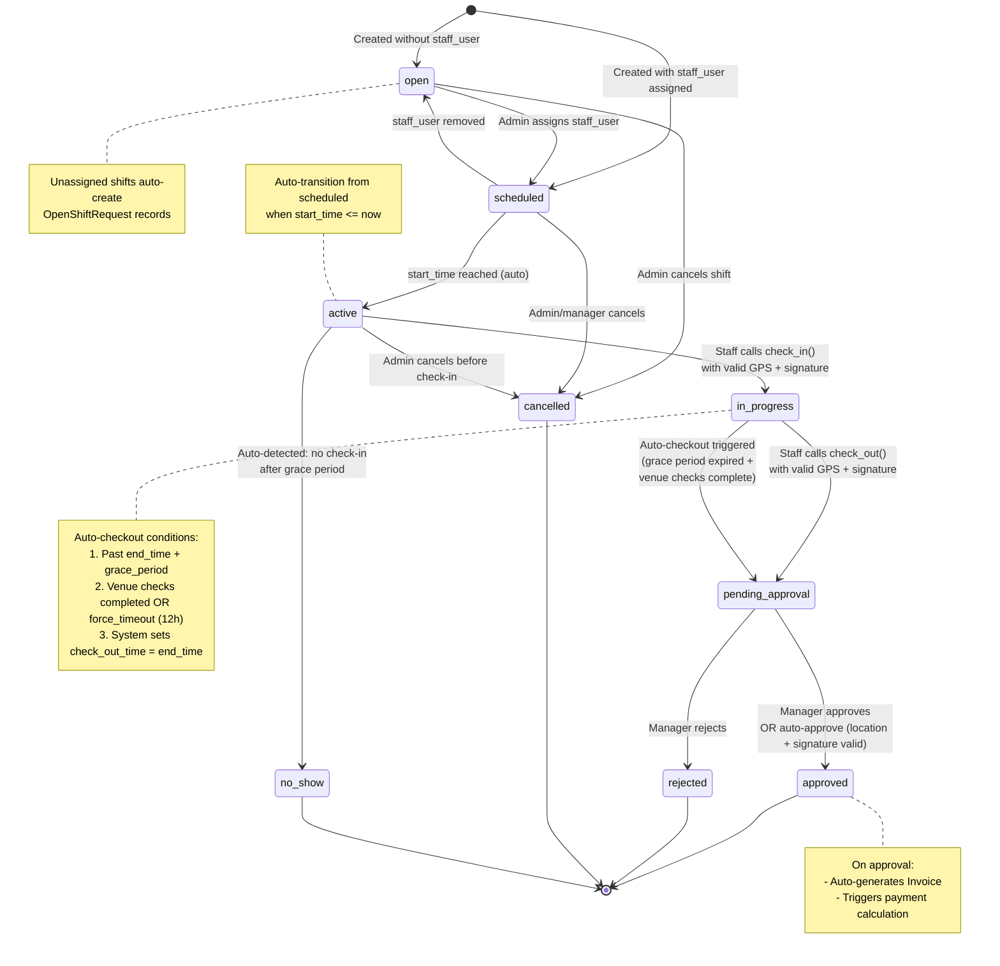
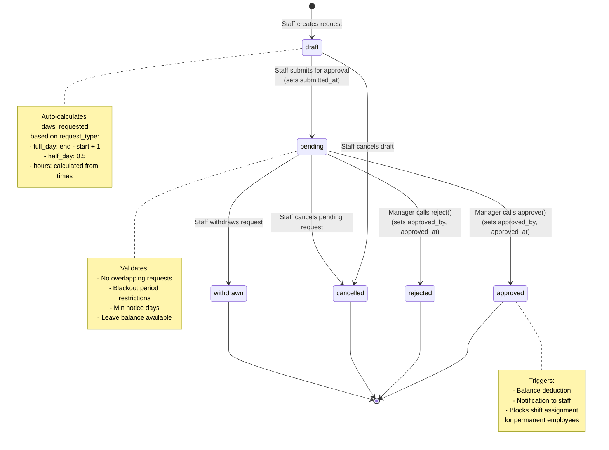
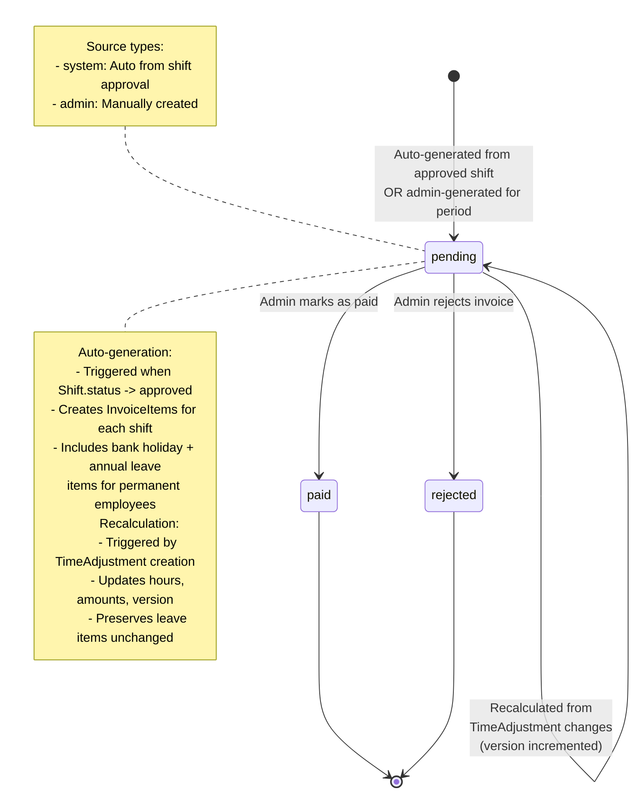
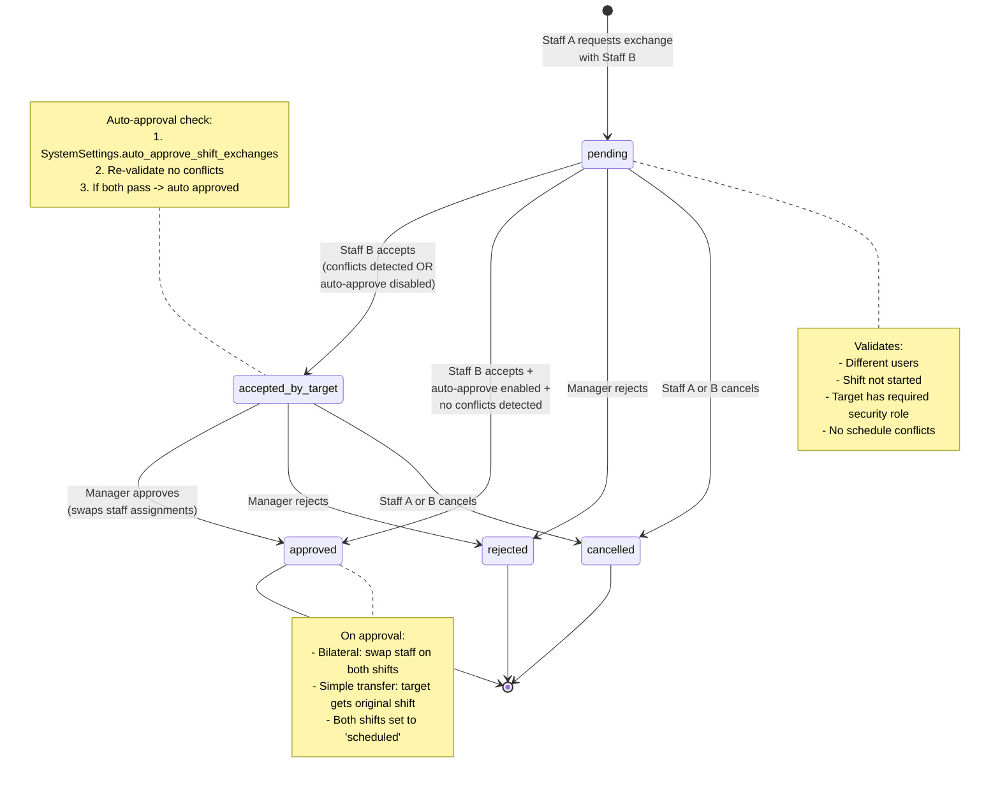
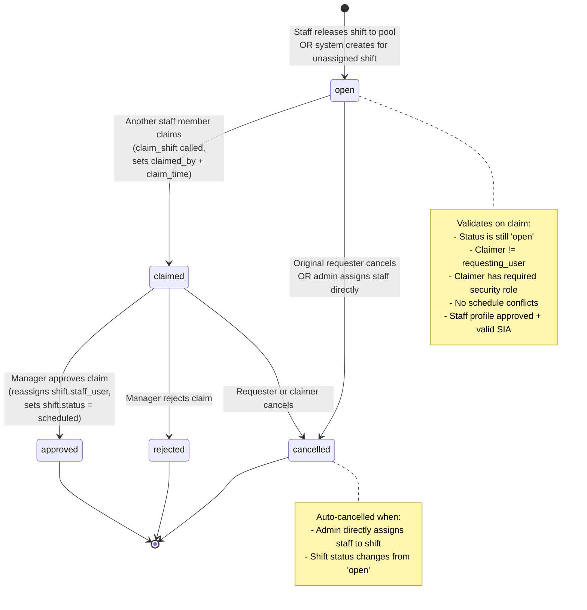
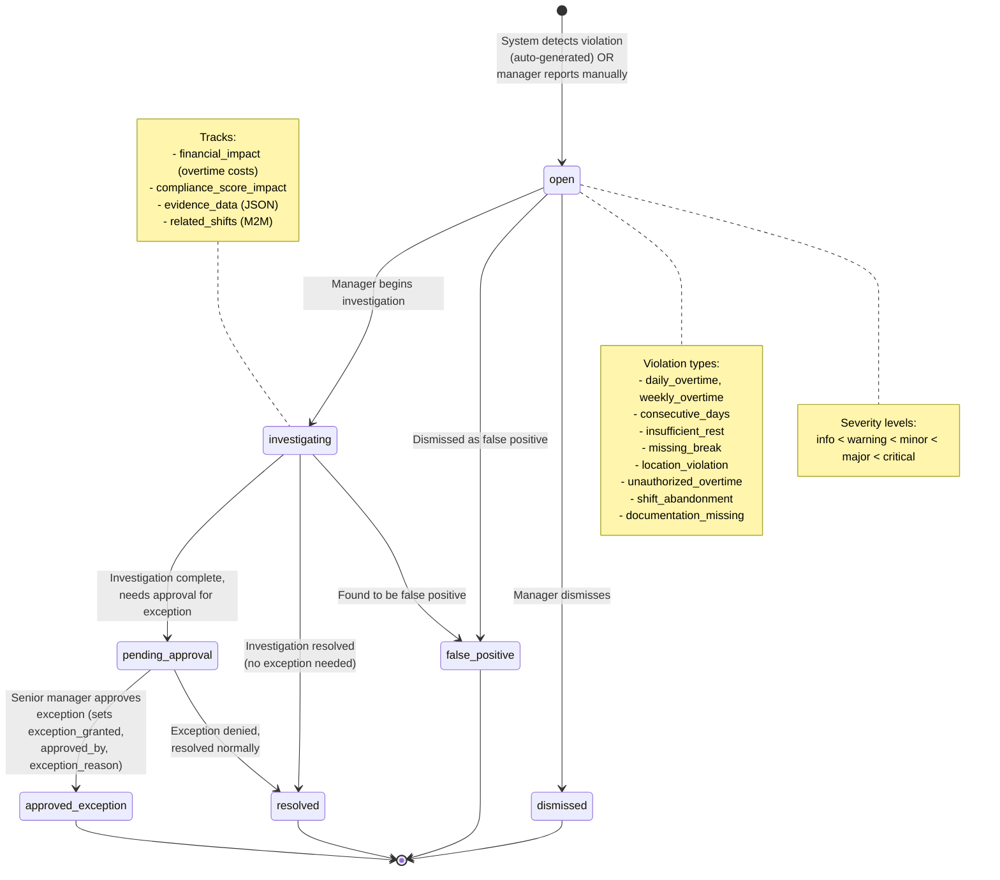
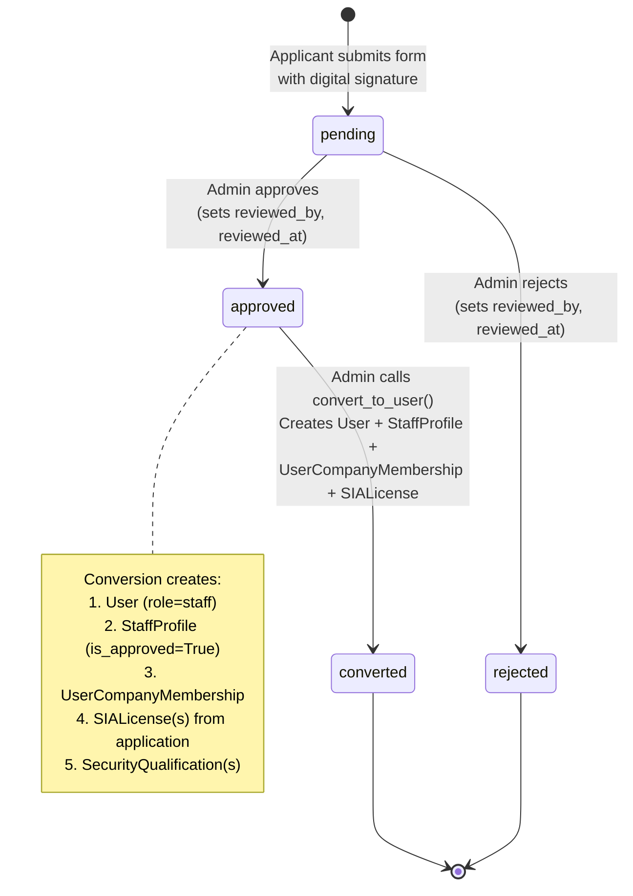
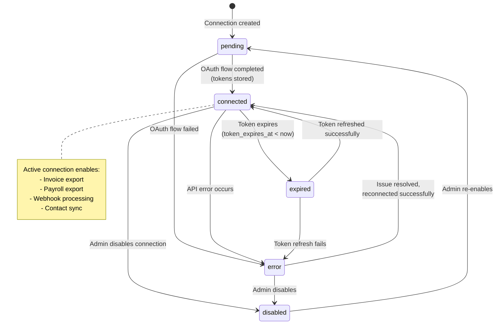

# State Diagrams - Security Staff Management System

## Overview

This document contains Mermaid `stateDiagram-v2` diagrams for the 6 key state machines in the system. Each diagram shows all valid states, transitions, triggers, and guard conditions derived from the actual Django model code.

**Audience**: Developers implementing state transitions, QA engineers writing test cases, and business analysts validating workflow correctness.

---

## 1. Shift Lifecycle

The Shift model has the most complex state machine with 10 states. Transitions are driven by staff actions (check-in/out), time-based auto-transitions, and manager approvals.

### Shift Status Choices (from code)

| Status | Display | Description |
|--------|---------|-------------|
| `open` | Open | Unassigned shift, available for claiming |
| `scheduled` | Scheduled | Staff assigned, awaiting start time |
| `active` | Active | Start time reached, awaiting check-in |
| `in_progress` | In Progress | Staff checked in, working |
| `completed` | Completed | Legacy status (not actively used in transitions) |
| `pending_approval` | Pending Approval | Staff checked out, awaiting manager review |
| `approved` | Approved | Manager approved, triggers invoicing |
| `rejected` | Rejected | Manager rejected the shift |
| `cancelled` | Cancelled | Shift cancelled by admin/manager |
| `no_show` | No Show | Staff failed to check in |

---

## 2. Leave Request Lifecycle

Leave requests flow through a standard approval workflow with draft, submission, and manager review stages.

### Leave Request Status Choices

| Status | Display | Can Cancel? |
|--------|---------|-------------|
| `draft` | Draft | Yes |
| `pending` | Pending Approval | Yes |
| `approved` | Approved | No |
| `rejected` | Rejected | No |
| `cancelled` | Cancelled | N/A (terminal) |
| `withdrawn` | Withdrawn | N/A (terminal) |

---

## 3. Invoice Lifecycle

Invoices have a simple 3-state lifecycle, with recalculation possible while pending.

### Invoice Status Choices

| Status | Display | Description |
|--------|---------|-------------|
| `pending` | Pending | Awaiting payment processing |
| `paid` | Paid | Payment completed |
| `rejected` | Rejected | Invoice rejected |

---

## 4. Shift Exchange Lifecycle

Shift exchanges involve a 3-party workflow: requesting staff, target staff, and manager. Supports optional auto-approval.

### Shift Exchange Status Choices

| Status | Display |
|--------|---------|
| `pending` | Pending |
| `accepted_by_target` | Accepted by Target User |
| `approved` | Approved |
| `rejected` | Rejected |
| `cancelled` | Cancelled |

---

## 5. Open Shift Request Lifecycle

Open shift requests manage the flow of releasing and claiming unassigned shifts.

### Open Shift Request Status Choices

| Status | Display |
|--------|---------|
| `open` | Open |
| `claimed` | Claimed |
| `approved` | Approved |
| `rejected` | Rejected |
| `cancelled` | Cancelled |

---

## 6. Compliance Violation Resolution Lifecycle

Compliance violations track the investigation and resolution of regulatory breaches.

### Compliance Violation Resolution Status Choices

| Status | Display | Is Resolved? |
|--------|---------|-------------|
| `open` | Open | No |
| `investigating` | Under Investigation | No |
| `pending_approval` | Pending Manager Approval | No |
| `approved_exception` | Approved as Exception | Yes |
| `resolved` | Resolved | Yes |
| `false_positive` | False Positive | Yes |
| `dismissed` | Dismissed | Yes |

---

## Supplementary: Recruitment Application States

---

## Supplementary: Provider Connection States

---

## Legend

| Symbol | Meaning |
|--------|---------|
| `[*]` | Initial or final state |
| Solid arrow | Valid state transition |
| Text on arrow | Trigger / guard condition |
| Note blocks | Additional context, validation rules, side effects |
| ` ` | Line break within label |

### Transition Triggers Summary

| Trigger Type | Examples |
|-------------|----------|
| **User Action** | check_in(), check_out(), approve(), reject(), cancel() |
| **Time-Based** | Auto-transition when start_time reached, auto-checkout after grace period |
| **System Auto** | Auto-approve on location + signature match, auto-generate invoice on approval |
| **Manager Action** | Approve/reject shifts, leave requests, exchanges, violations |

---

## Notes

- **Cross-reference**: See `02_Class_Diagram.md` for full model field details and relationships.
- **Cross-reference**: See `06_Sequence_Diagrams.md` for the complete interaction flows that drive these state transitions.
- **Cross-reference**: See `08_Activity_Diagrams.md` for business process flows incorporating these states.
- The Shift state machine is the most complex, with auto-transitions driven by `Shift.save()` method logic.
- Auto-checkout is controlled by `SystemSettings.auto_checkout_enabled` and `auto_checkout_grace_period`.
- Shift exchange auto-approval is controlled by `SystemSettings.auto_approve_shift_exchanges`.
- The `completed` status exists in Shift STATUS_CHOICES but is not actively used in current transition logic.

---

## Source Files

| File | State Machines Derived From |
|------|---------------------------|
| `backend/api/models.py` | Shift (lines 1610-2349), ShiftExchange (lines 2526-2695), OpenShiftRequest (lines 1480-1608), Invoice (lines 2697-2948), RecruitmentApplication (lines 3812-4051), ComplianceViolation (lines 4683-4900) |
| `backend/leave_management/models.py` | LeaveRequest (lines 430-676) |
| `backend/finance_integrations/models.py` | ProviderConnection (lines 76-122) |
