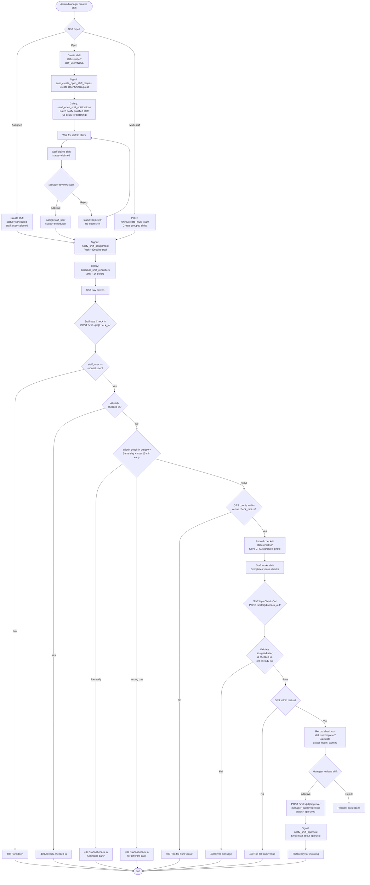
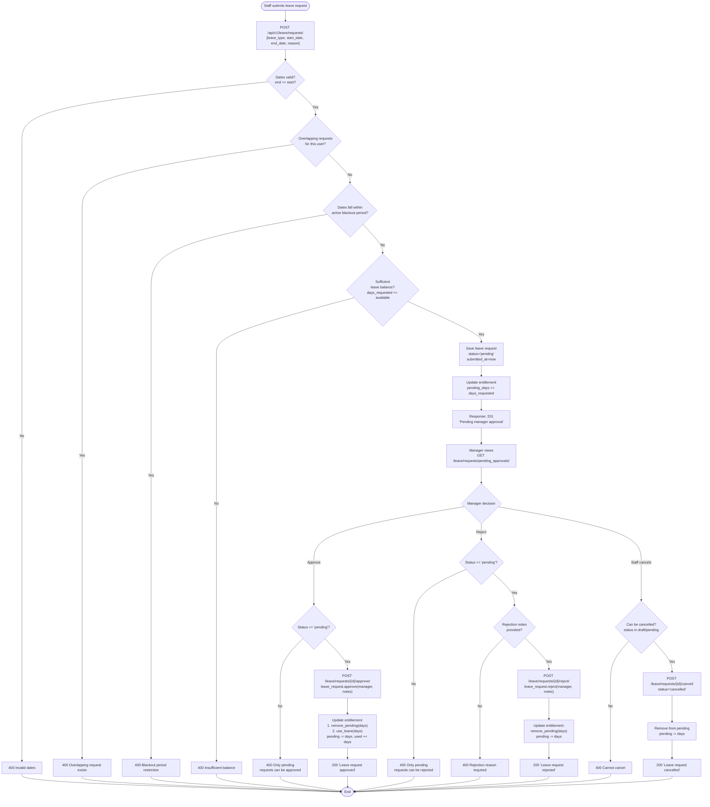
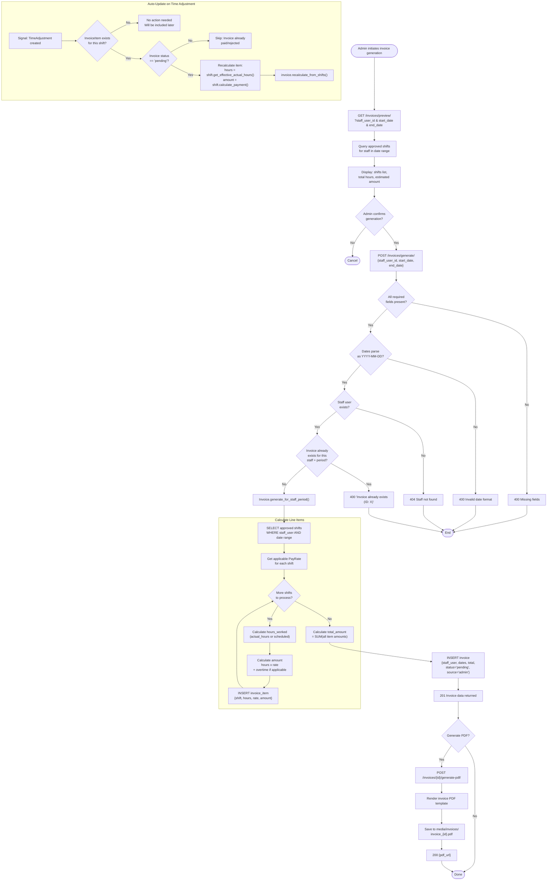
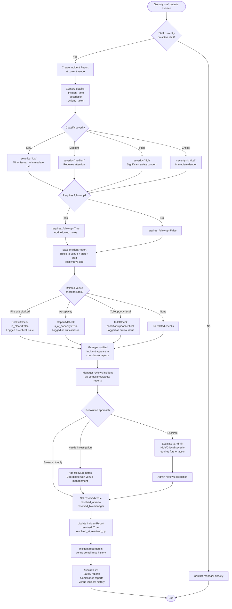

# Activity Diagrams

## Overview
These five activity diagrams model the decision flows and branching logic within the key business processes of the Mead Security system. Each diagram is derived from the actual view logic, model methods, and signal handlers in the codebase. They are intended for developers, product managers, and QA engineers to understand the exact conditions that govern each process.

## 1. Company Onboarding Process

The multi-step onboarding wizard that creates a new company, sets up configuration, and activates a 14-day trial.

```mermaid
flowchart TD
    Start([User clicks "Get Started"])

    Start --> CheckExisting{User has existing<br/>company membership?}

    CheckExisting -->|Yes, incomplete| ResumeOnboarding[Resume existing<br/>onboarding session]
    CheckExisting -->|Yes, completed| RedirectDash[Redirect to Dashboard<br/>400 Error]
    CheckExisting -->|No| InitiateStep

    subgraph Step1 ["Step 1: Company Info"]
        InitiateStep[POST /onboarding/initiate/<br/>Submit company name & data]
        InitiateStep --> ValidateCompany{Company data valid?}
        ValidateCompany -->|No| ShowErrors1[Show validation errors]
        ShowErrors1 --> InitiateStep
        ValidateCompany -->|Yes| CreateCompany[Create SecurityCompany]
        CreateCompany --> TrialSignal["Signal: setup_trial_period<br/>is_trial=True<br/>trial_end_date = now + 14 days"]
        TrialSignal --> CreateMembership[Create UserCompanyMembership<br/>role='owner', is_owner=True]
        CreateMembership --> CreateOnboarding[Create CompanyOnboarding record<br/>Mark step 1 complete]
    end

    ResumeOnboarding --> CheckStep{Which step<br/>was last completed?}
    CheckStep -->|Step 1| Step2Start
    CheckStep -->|Step 2| Step3Start
    CheckStep -->|Step 3| Step4Start

    CreateOnboarding --> Step2Start

    subgraph Step2 ["Step 2: Regional Setup"]
        Step2Start[PUT /onboarding/regional-setup/<br/>Country, timezone, currency]
        Step2Start --> ValidateRegion{Regional data valid?}
        ValidateRegion -->|No| ShowErrors2[Show validation errors]
        ShowErrors2 --> Step2Start
        ValidateRegion -->|Yes| SaveRegion[Update company regional settings<br/>Mark step 2 complete]
    end

    SaveRegion --> Step3Start

    subgraph Step3 ["Step 3: Staff Configuration"]
        Step3Start[PUT /onboarding/staff-config/<br/>Employment types, roles, SIA requirements]
        Step3Start --> ValidateStaff{Config valid?}
        ValidateStaff -->|No| ShowErrors3[Show validation errors]
        ShowErrors3 --> Step3Start
        ValidateStaff -->|Yes| SaveStaff[Save staff configuration<br/>Create employment types<br/>Mark step 3 complete]
    end

    SaveStaff --> Step4Start

    subgraph Step4 ["Step 4: Integrations"]
        Step4Start[PUT /onboarding/integrations/<br/>Deputy, Xero, notifications]
        Step4Start --> SaveIntegrations[Save integration preferences<br/>Mark step 4 complete]
    end

    SaveIntegrations --> Complete

    subgraph Completion ["Complete Onboarding"]
        Complete[POST /onboarding/complete/]
        Complete --> ValidateAllSteps{All 4 steps<br/>completed?}
        ValidateAllSteps -->|No| Error400[400: Complete previous steps first]
        ValidateAllSteps -->|Yes| MarkComplete[Set is_completed=True<br/>completed_at=now]
        MarkComplete --> RedirectDashboard[Redirect to Company Dashboard]
    end

    RedirectDash --> End([End])
    RedirectDashboard --> End
```

## 2. Shift Lifecycle & Scheduling

The full lifecycle of a shift from creation through scheduling, check-in/out, approval, and invoicing.



## 3. Leave Approval Process

Detailed decision flow from leave request submission through balance checks, blackout validation, and manager approval.



## 4. Invoice Generation Process

The process of generating invoices from approved shifts, including pay rate calculations, PDF generation, and auto-update on time adjustments.



## 5. Incident Response Process

The workflow for reporting, classifying, and resolving security incidents at venues.



## Legend

| Symbol | Meaning |
|--------|---------|
| `([text])` | Start / End terminal |
| `[text]` | Action / Process step |
| `{text}` | Decision / Condition |
| `subgraph` | Grouped related steps |
| Solid arrow | Flow direction |

### Decision Outcomes

| Pattern | Meaning |
|---------|---------|
| `-->` with label `|Yes|` or `|No|` | Binary decision branch |
| `-->` with label `|condition|` | Named condition branch |
| Multiple outputs from decision | Multi-way branching |

## Notes

- **Onboarding** triggers the `setup_trial_period` signal automatically, giving all new companies 14 days of full-feature access regardless of subscription tier
- **Shift check-in** enforces a strict 15-minute early window; overnight shifts have special date handling logic
- **Leave approval** maintains three balance counters: `total_days`, `pending_days`, and `used_days` to track real-time availability
- **Invoice auto-update** is triggered by Django signals when a `TimeAdjustment` is created, ensuring payment accuracy after manager corrections
- **Incident severity** levels (low/medium/high/critical) are tied to venue compliance reports and appear in the admin safety dashboard
- See `05_Use_Case_Diagram.md` for actor capabilities that trigger these processes
- See `06_Sequence_Diagrams.md` for detailed message flow in the check-in and leave workflows
- See `07_State_Diagrams.md` for state machine transitions referenced in these flows
- See `13_API_Architecture.md` for the specific API endpoints called at each step

## Source Files

- `backend/api/views.py` - OnboardingViewSet (line 5976): initiate (line 6015), regional-setup (line 6190), staff-config (line 6226), integrations (line 6263), complete (line 6336); InvoiceViewSet (line 1825): generate (line 1948), preview (line 2021), generate-pdf (line 2083)
- `backend/shifts/views.py` - ShiftViewSet: check_in (line 932), check_out (line 1051), cancel (line 1116), create_multi_staff (line 1248), approve (line 1290)
- `backend/leave_management/views.py` - LeaveRequestViewSet: create (line 780), submit (line 820), approve (line 858), reject (line 893), cancel (line 929)
- `backend/api/signals.py` - setup_trial_period (line 17), notify_shift_assignment (line 80), auto_create_open_shift_request (line 288), auto_update_invoice_on_time_adjustment (line 535)
- `backend/api/models.py` - IncidentReport (line 3281), CapacityFlow (line 3315)
- `backend/api/tasks.py` - schedule_shift_reminders (line 616), send_open_shift_notifications (line 819)
