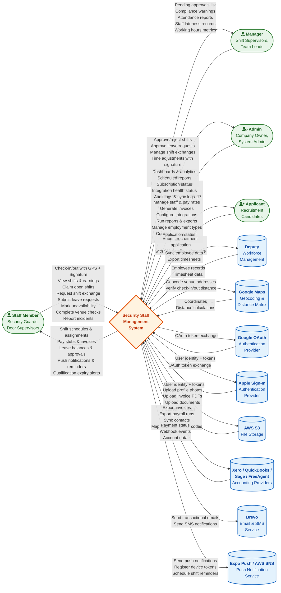

# DFD Context Diagram - Security Staff Management System

## Overview

This Level 0 (Context) Data Flow Diagram shows the **Security Staff Management System** as a single process, surrounded by all external entities that interact with it. Data flows between the system boundary and each external actor are labeled with the types of data exchanged.

**Audience**: Business analysts, architects, and stakeholders needing a high-level view of system boundaries and external integrations.

---

## Context Diagram

---

## Data Flow Summary

### Human Actors

| Actor | Inbound Data (to System) | Outbound Data (from System) |
|-------|--------------------------|----------------------------|
| **Staff Member** | GPS coordinates, digital signatures, check-in/out photos, shift claims, exchange requests, leave requests, unavailability periods, venue check data, incident reports | Shift schedules, earnings estimates, invoices/pay stubs, leave balances, push notifications, qualification alerts |
| **Manager** | Shift approvals/rejections, leave approvals, time adjustments with digital signatures, exchange approvals, compliance violation resolutions, incident report reviews | Pending approval queues, compliance warnings/violations, attendance reports, working hours metrics, lateness summaries |
| **Admin** | Company configuration, venue management, staff management, pay rate configuration, system settings, integration setup, report parameters, employment types, compliance profiles, bank holidays | Dashboards, analytics, scheduled reports, subscription status, integration health, audit trails, sync logs |
| **Applicant** | Personal details, SIA license info, employment preferences, certifications, digital signature | Application status (pending/approved/rejected) |

### External Systems

| System | Data Sent | Data Received | Protocol |
|--------|-----------|---------------|----------|
| **Deputy** | Employee sync requests, timesheet queries | Employee records, timesheet data | REST API |
| **Google Maps** | Venue addresses (geocoding), staff GPS coordinates (distance matrix) | Latitude/longitude coordinates, walking distance in meters | REST API |
| **Google OAuth** | Authorization code, client credentials | Access tokens, user profile (email, name) | OAuth 2.0 |
| **Apple Sign-In** | Authorization code, client credentials | Identity token, user profile | OAuth 2.0 / JWT |
| **AWS S3** | Profile photos, invoice PDFs, license documents | Signed URLs for stored files | AWS SDK |
| **Xero / QuickBooks / Sage / FreeAgent** | Invoices, payroll runs, contact mappings, account mappings, VAT code mappings | Payment statuses, webhook events, account lists | OAuth 2.0 + REST API |
| **Brevo** | Transactional emails, SMS messages | Delivery status, bounce events | REST API |
| **Expo Push / AWS SNS** | Push notification payloads, device token registration, scheduled reminders | Delivery receipts, endpoint ARNs | REST API / AWS SDK |

---

## System Boundary

The **Security Staff Management System** boundary encompasses:

- **Django Backend** (REST API server)
- **React Frontend** (Web application)
- **React Native Mobile App** (iOS/Android)
- **PostgreSQL Database** (Primary data store)
- **Celery Workers** (Background task processing)
- **Redis** (Message broker for Celery)

Everything outside this boundary is an external entity shown in the diagram.

---

## Legend

| Shape | Meaning |
|-------|---------|
| Rounded rectangle `([...])` | External human actor |
| Cylinder `[(...)]` | External system / service |
| Diamond `{...}` | The system under analysis (process) |
| Arrow with label | Data flow with description |
| Green fill | Human actors |
| Blue fill | External systems |
| Orange fill | System boundary |

---

## Notes

- **Cross-reference**: See `10_DFD_Level1.md` for the decomposed Level 1 diagram showing internal processes and data stores.
- **Cross-reference**: See `02_Class_Diagram.md` for the data models that store and process these flows.
- **Cross-reference**: See `18_Integration_Map.md` for detailed integration specifications with each external system.
- **Cross-reference**: See `14_Security_Architecture.md` for authentication flows with Google OAuth and Apple Sign-In.
- All accounting provider integrations use encrypted OAuth tokens (`EncryptedJSONField`) stored in `ProviderConnection`.
- Push notifications are sent via both Expo Push (mobile) and AWS SNS (device token management).
- Google Maps is used for both venue geocoding (on venue save) and real-time location verification (on check-in/out).

---

## Source Files

| File | Integration Details Derived From |
|------|--------------------------------|
| `backend/api/models.py` | DeputyConfig, DeputyEmployee, DeputyTimesheet (Deputy), Venue.verify_location/update_coordinates (Google Maps), SNSDeviceToken (AWS SNS), CompanyIntegration (all integrations) |
| `backend/finance_integrations/models.py` | AccountingProvider, ProviderConnection, InvoiceExport, PayrollExport, WebhookEvent (Xero/QuickBooks/Sage/FreeAgent) |
| `backend/api/signals.py` | Push notification triggers on shift assignment/exchange/open shift |
| `backend/api/services/notification_service.py` | Push notification service (Expo Push, AWS SNS) |
| `backend/api/social_auth.py` | Google OAuth, Apple Sign-In authentication flows |
