# DFD Level 1 - Security Staff Management System

## Overview

This Level 1 Data Flow Diagram decomposes the single system process from the Context Diagram (`09_DFD_Context.md`) into 8 major internal processes, showing data stores (PostgreSQL tables, Redis, S3) and the flows between processes, data stores, and external entities.

**Audience**: Developers, architects, and technical leads needing to understand internal process decomposition, data store usage, and inter-process data flows.

---

## Level 1 Diagram

```mermaid
flowchart TD
    %% External Entities
    Staff([Staff Member])
    Manager([Manager])
    Admin([Admin])
    Applicant([Applicant])
    Deputy[(Deputy API)]
    GoogleMaps[(Google Maps)]
    AuthProviders[(Google/Apple OAuth)]
    AWS[(AWS S3)]
    AccountingSystems[(Accounting<br/>Providers)]
    NotifServices[(Brevo /<br/>Expo Push /<br/>AWS SNS)]

    %% Data Stores
    DB_Users[(D1: Users &<br/>StaffProfiles)]
    DB_Companies[(D2: Companies &<br/>Memberships)]
    DB_Shifts[(D3: Shifts &<br/>Templates)]
    DB_Leave[(D4: Leave Types,<br/>Policies, Requests,<br/>Balances)]
    DB_Invoices[(D5: Invoices &<br/>InvoiceItems)]
    DB_Compliance[(D6: Regulations,<br/>Profiles, Violations,<br/>Metrics)]
    DB_Venues[(D7: Venues &<br/>Checks)]
    DB_Deputy[(D8: Deputy Employees<br/>& Timesheets)]
    DB_Finance[(D9: Provider<br/>Connections,<br/>Mappings, Exports)]
    DB_Notifications[(D10: Device Tokens<br/>& Preferences)]
    DB_Reports[(D11: Report Templates<br/>& Jobs)]
    DB_Recruitment[(D12: Recruitment<br/>Applications)]
    Redis[(Redis Cache<br/>& Message Broker)]
    S3[(AWS S3<br/>File Store)]

    %% Processes
    P1[["P1: Authentication<br/>& User Management"]]
    P2[["P2: Shift<br/>Management"]]
    P3[["P3: Leave<br/>Management"]]
    P4[["P4: Invoice<br/>Generation"]]
    P5[["P5: Compliance<br/>Monitoring"]]
    P6[["P6: Notification<br/>Engine"]]
    P7[["P7: Integration<br/>Sync Engine"]]
    P8[["P8: Reporting<br/>& Export"]]

    %% ===== P1: Authentication & User Management =====
    Staff -->|Login credentials,<br/>profile updates,<br/>device token| P1
    Manager -->|Login credentials| P1
    Admin -->|Login credentials,<br/>user/company CRUD,<br/>settings config| P1
    Applicant -->|Recruitment<br/>application| P1
    AuthProviders -->|Identity tokens| P1
    P1 -->|OAuth exchange| AuthProviders

    P1 -->|Read/write users,<br/>profiles, SIA licenses,<br/>qualifications| DB_Users
    P1 -->|Read/write companies,<br/>memberships, settings,<br/>employment types| DB_Companies
    P1 -->|Store device tokens,<br/>notification prefs| DB_Notifications
    P1 -->|Store/read<br/>applications| DB_Recruitment
    P1 -->|Upload profile photos,<br/>license docs| S3
    S3 -->|File URLs| P1
    P1 -->|JWT tokens,<br/>user data| Staff
    P1 -->|JWT tokens,<br/>user data| Manager
    P1 -->|JWT tokens,<br/>dashboard data,<br/>subscription status| Admin

    %% ===== P2: Shift Management =====
    Staff -->|Check-in/out with GPS,<br/>signature, photo,<br/>claim open shifts,<br/>request exchange,<br/>venue checks,<br/>incident reports| P2
    Manager -->|Approve/reject shifts,<br/>approve exchanges,<br/>time adjustments| P2
    Admin -->|Create shifts/templates,<br/>manage venues,<br/>assign staff| P2

    P2 -->|Read/write shifts,<br/>templates, exchanges,<br/>open requests,<br/>status history,<br/>time adjustments| DB_Shifts
    P2 -->|Read/write venues,<br/>fire/capacity/toilet checks,<br/>incidents, handovers,<br/>enforcement visits,<br/>terms acceptance| DB_Venues
    P2 -->|Read staff data,<br/>SIA licenses,<br/>availability| DB_Users
    P2 -->|Check leave conflicts| DB_Leave
    P2 -->|Verify GPS coordinates| GoogleMaps
    GoogleMaps -->|Distance result| P2
    P2 -->|Upload check-in/out photos| S3

    P2 -->|Shift approved event| P4
    P2 -->|Hours worked data| P5
    P2 -->|Assignment/exchange<br/>notifications| P6

    P2 -->|Shift assignments,<br/>schedules| Staff
    P2 -->|Pending approvals,<br/>lateness records| Manager

    %% ===== P3: Leave Management =====
    Staff -->|Leave requests,<br/>contractor unavailability| P3
    Manager -->|Approve/reject<br/>leave requests| P3
    Admin -->|Configure leave types,<br/>policies, blackout periods,<br/>bank holidays,<br/>daily rates| P3

    P3 -->|Read/write leave types,<br/>policies, requests,<br/>balances, entitlements,<br/>blackout periods| DB_Leave
    P3 -->|Read staff employment<br/>type, company| DB_Users
    P3 -->|Read/write contractor<br/>unavailability,<br/>bank holidays,<br/>leave daily rates| DB_Companies
    P3 -->|Check shift conflicts| DB_Shifts

    P3 -->|Approved leave data<br/>for invoice items| P4
    P3 -->|Leave approval<br/>notifications| P6

    P3 -->|Leave balances,<br/>request status| Staff
    P3 -->|Pending leave<br/>approvals| Manager

    %% ===== P4: Invoice Generation =====
    Admin -->|Generate invoices,<br/>mark paid/rejected| P4

    P4 -->|Read approved shifts<br/>with hours + rates| DB_Shifts
    P4 -->|Read leave requests,<br/>bank holidays| DB_Leave
    P4 -->|Read pay rates| DB_Users
    P4 -->|Read/write invoices,<br/>invoice items| DB_Invoices
    P4 -->|Generate invoice PDFs| S3
    S3 -->|PDF URLs| P4

    P4 -->|Invoice data for<br/>accounting export| P7
    P4 -->|Invoice notifications| P6

    P4 -->|Invoices, pay stubs,<br/>earnings breakdowns| Staff
    P4 -->|Invoice reports| Admin

    %% ===== P5: Compliance Monitoring =====
    Manager -->|Resolve violations,<br/>grant exceptions| P5
    Admin -->|Configure regulations,<br/>compliance profiles| P5

    P5 -->|Read shift hours,<br/>patterns| DB_Shifts
    P5 -->|Read/write regulations,<br/>profiles, violations,<br/>working hours metrics| DB_Compliance
    P5 -->|Read staff data,<br/>company profiles| DB_Users

    P5 -->|Compliance alerts| P6
    P5 -->|Compliance reports,<br/>violation summaries| Manager
    P5 -->|Compliance dashboards| Admin

    %% ===== P6: Notification Engine =====
    P6 -->|Read device tokens,<br/>preferences| DB_Notifications
    P6 -->|Read user contact info| DB_Users
    P6 -->|Queue async tasks| Redis
    Redis -->|Task execution| P6
    P6 -->|Push notifications| NotifServices
    P6 -->|Email & SMS| NotifServices
    P6 -->|Delivered notifications| Staff
    P6 -->|Delivered notifications| Manager

    %% ===== P7: Integration Sync Engine =====
    Admin -->|Configure connections,<br/>trigger sync| P7

    P7 -->|Read/write Deputy<br/>employee + timesheet data| DB_Deputy
    P7 -->|Read/write provider<br/>connections, mappings,<br/>exports, webhooks,<br/>sync logs| DB_Finance
    P7 -->|Read invoices<br/>for export| DB_Invoices
    P7 -->|Read staff for<br/>contact mapping| DB_Users

    P7 -->|Sync employees,<br/>timesheets| Deputy
    Deputy -->|Employee + timesheet<br/>records| P7
    P7 -->|Export invoices,<br/>payroll, contacts| AccountingSystems
    AccountingSystems -->|Payment status,<br/>webhook events| P7

    P7 -->|Queue sync tasks| Redis
    Redis -->|Task execution| P7
    P7 -->|Sync status,<br/>error reports| Admin

    %% ===== P8: Reporting & Export =====
    Admin -->|Request reports,<br/>configure schedules,<br/>configure exports| P8
    Manager -->|Request reports| P8

    P8 -->|Read/write report<br/>templates, jobs,<br/>schedules, export configs| DB_Reports
    P8 -->|Read shift data| DB_Shifts
    P8 -->|Read invoice data| DB_Invoices
    P8 -->|Read compliance data| DB_Compliance
    P8 -->|Read leave data| DB_Leave
    P8 -->|Read user data| DB_Users

    P8 -->|Upload report files| S3
    S3 -->|Report file URLs| P8
    P8 -->|Queue scheduled tasks| Redis
    Redis -->|Scheduled execution| P8
    P8 -->|Report delivery| P6

    P8 -->|Reports, exports| Admin
    P8 -->|Reports| Manager

    %% Styling
    classDef actor fill:#E8F5E9,stroke:#2E7D32,stroke-width:2px,color:#1B5E20
    classDef external fill:#E3F2FD,stroke:#1565C0,stroke-width:2px,color:#0D47A1
    classDef process fill:#FFF3E0,stroke:#E65100,stroke-width:2px,color:#BF360C
    classDef datastore fill:#F3E5F5,stroke:#6A1B9A,stroke-width:2px,color:#4A148C
    classDef infra fill:#ECEFF1,stroke:#455A64,stroke-width:2px,color:#263238

    class Staff,Manager,Admin,Applicant actor
    class Deputy,GoogleMaps,AuthProviders,AccountingSystems,NotifServices external
    class P1,P2,P3,P4,P5,P6,P7,P8 process
    class DB_Users,DB_Companies,DB_Shifts,DB_Leave,DB_Invoices,DB_Compliance,DB_Venues,DB_Deputy,DB_Finance,DB_Notifications,DB_Reports,DB_Recruitment datastore
    class Redis,S3,AWS infra
```

---

## Process Descriptions

### P1: Authentication & User Management
Handles user registration, JWT authentication (with Google/Apple OAuth social login), profile management, company/tenant setup, role-based access control, recruitment application processing, and device token registration.

**Key Data Stores**: D1 (Users), D2 (Companies), D10 (Notifications), D12 (Recruitment)

### P2: Shift Management
Core process managing the full shift lifecycle: creation from templates, staff assignment, GPS-verified check-in/out with digital signatures, venue checks (fire, capacity, toilet), incident reporting, shift exchanges, open shift pool, auto-checkout, and time adjustments.

**Key Data Stores**: D3 (Shifts), D7 (Venues), D1 (Users)

### P3: Leave Management
Manages leave types, policies with accrual rules, leave request workflows, balance tracking, blackout periods, contractor unavailability, bank holidays, and leave daily rates for permanent employees.

**Key Data Stores**: D4 (Leave), D1 (Users), D2 (Companies)

### P4: Invoice Generation
Generates invoices from approved shifts using shift-specific pay rates, includes bank holiday and annual leave line items for permanent employees, handles recalculation from time adjustments, and produces PDF invoices.

**Key Data Stores**: D5 (Invoices), D3 (Shifts), D4 (Leave), D1 (Users)

### P5: Compliance Monitoring
Monitors working hours against country-specific regulations, detects violations (daily/weekly overtime, consecutive days, insufficient rest), tracks compliance metrics, and manages violation resolution workflows.

**Key Data Stores**: D6 (Compliance), D3 (Shifts), D1 (Users)

### P6: Notification Engine
Centralized notification dispatch using Celery async tasks. Sends push notifications (Expo Push / AWS SNS), emails (Brevo), and SMS (Brevo) based on user preferences for shift assignments, approvals, leave updates, compliance alerts, and qualification reminders.

**Key Data Stores**: D10 (Notifications), D1 (Users), Redis (task queue)

### P7: Integration Sync Engine
Manages bidirectional data sync with external systems: Deputy (employees, timesheets), accounting providers (invoice/payroll export, contact mapping, webhook processing), and OAuth token lifecycle management.

**Key Data Stores**: D8 (Deputy), D9 (Finance), D5 (Invoices), D1 (Users), Redis (task queue)

### P8: Reporting & Export
Generates on-demand and scheduled reports from system data, supports configurable export formats (CSV, PDF, Excel) with custom field mappings, and delivers reports via the notification engine.

**Key Data Stores**: D11 (Reports), all other data stores (read-only), Redis (scheduled tasks)

---

## Data Store Catalog

| ID | Data Store | Primary Tables | Type |
|----|-----------|---------------|------|
| D1 | Users & StaffProfiles | `users`, `staff_profiles`, `sia_licenses`, `security_qualifications`, `staff_availability`, `emergency_contacts`, `bank_details`, `pay_rates`, `password_reset_tokens` | PostgreSQL |
| D2 | Companies & Memberships | `security_companies`, `user_company_memberships`, `company_onboarding`, `company_integrations`, `system_settings`, `employment_types`, `contractor_unavailability`, `bank_holidays`, `staff_leave_daily_rates` | PostgreSQL |
| D3 | Shifts & Templates | `shifts`, `shift_templates`, `shift_exchanges`, `open_shift_requests`, `shift_status_history`, `time_adjustments`, `lateness_records` | PostgreSQL |
| D4 | Leave Management | `leave_types`, `leave_policies`, `leave_requests`, `leave_balances`, `leave_entitlements`, `blackout_periods`, `leave_system_config` | PostgreSQL |
| D5 | Invoices | `invoices`, `invoice_items` | PostgreSQL |
| D6 | Compliance | `working_hours_regulations`, `compliance_profiles`, `compliance_violations`, `working_hours_metrics` | PostgreSQL |
| D7 | Venues & Checks | `venues`, `venue_terms_acceptance`, `preferred_venues`, `fire_exit_checks`, `capacity_checks`, `toilet_checks`, `incident_reports`, `capacity_flows`, `venue_handovers`, `enforcement_visits`, `qualification_reminders` | PostgreSQL |
| D8 | Deputy | `deputy_config`, `deputy_employees`, `deputy_timesheets` | PostgreSQL |
| D9 | Finance Integrations | `accounting_providers`, `provider_connections`, `account_mappings`, `vat_code_mappings`, `earnings_type_mappings`, `contact_mappings`, `invoice_exports`, `payroll_exports`, `webhook_events`, `sync_logs` | PostgreSQL |
| D10 | Notifications | `sns_device_tokens`, `notification_preferences` | PostgreSQL |
| D11 | Reports | `report_templates`, `report_jobs`, `scheduled_reports`, `export_configurations` | PostgreSQL |
| D12 | Recruitment | `recruitment_applications` | PostgreSQL |
| -- | Redis | Celery task queue, message broker, scheduled task queue | Redis |
| -- | AWS S3 | Profile photos, invoice PDFs, license documents, report files | Object Storage |

---

## Inter-Process Data Flows

| From | To | Data | Trigger |
|------|----|------|---------|
| P2 (Shifts) | P4 (Invoicing) | Approved shift with hours + rate | Shift status changes to `approved` |
| P2 (Shifts) | P5 (Compliance) | Staff working hours, shift patterns | Shift check-in/out completed |
| P2 (Shifts) | P6 (Notifications) | Assignment, exchange, open shift events | Shift assignment/exchange changes |
| P3 (Leave) | P4 (Invoicing) | Approved leave days + bank holidays | Invoice generation for period |
| P3 (Leave) | P6 (Notifications) | Leave approval/rejection events | Leave request status changes |
| P4 (Invoicing) | P6 (Notifications) | Invoice created/paid events | Invoice status changes |
| P4 (Invoicing) | P7 (Integrations) | Invoice data for accounting export | Admin triggers export |
| P5 (Compliance) | P6 (Notifications) | Compliance warning/violation alerts | Threshold exceeded |
| P8 (Reporting) | P6 (Notifications) | Scheduled report delivery | Report job completed |

---

## Legend

| Shape | Meaning |
|-------|---------|
| Rounded rectangle `([...])` | External human actor |
| Cylinder `[(...)]` | External system or data store |
| Double-bracketed rectangle `[[...]]` | Internal process |
| Arrow with label | Data flow with description |
| Green fill | Human actors |
| Blue fill | External systems |
| Orange fill | Internal processes |
| Purple fill | Data stores (PostgreSQL tables) |
| Gray fill | Infrastructure (Redis, S3) |

---

## Notes

- **Cross-reference**: See `09_DFD_Context.md` for the Level 0 context diagram showing the system as a single process.
- **Cross-reference**: See `11_DFD_Level2.md` for further decomposition of each process into sub-processes.
- **Cross-reference**: See `02_Class_Diagram.md` for detailed model definitions within each data store.
- **Cross-reference**: See `12_System_Architecture.md` for the layered architecture showing how these processes map to Django apps and services.
- Redis serves dual purpose: Celery message broker for async tasks and caching layer.
- All data stores except Redis and S3 are PostgreSQL tables within the same database.
- The Notification Engine (P6) is the only process that communicates directly with all three notification services (Brevo, Expo Push, AWS SNS).

---

## Source Files

| File | Processes Derived From |
|------|----------------------|
| `backend/api/models.py` | P1 (User, StaffProfile, SecurityCompany, UserCompanyMembership), P2 (Shift, ShiftTemplate, ShiftExchange, OpenShiftRequest, venue checks), P4 (Invoice, InvoiceItem, PayRate), P5 (ComplianceViolation, ComplianceProfile, WorkingHoursRegulation, WorkingHoursMetrics) |
| `backend/leave_management/models.py` | P3 (LeaveType, LeavePolicy, LeaveRequest, LeaveBalance, LeaveEntitlement, BlackoutPeriod) |
| `backend/finance_integrations/models.py` | P7 (AccountingProvider, ProviderConnection, InvoiceExport, PayrollExport, WebhookEvent, SyncLog) |
| `backend/api/signals.py` | P6 (push notification triggers on shift/exchange events) |
| `backend/api/services/notification_service.py` | P6 (push notification dispatch logic) |
| `backend/core/celery_app.py` | Redis message broker configuration |
