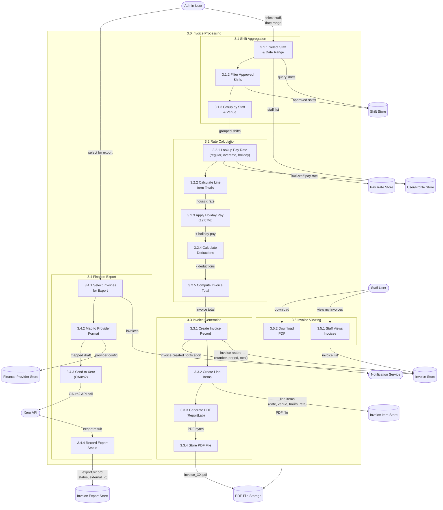

# DFD Level 2 - Detailed Data Flow Diagrams

## Overview

Detailed data flow diagrams decomposing each major subprocess from the DFD Level 1 into its internal processes, data stores, and data flows. Each subprocess shows how data moves between internal components, external entities, and persistent storage within the Mead Security system.

## 1. Shift Management Subprocess

Covers the full shift lifecycle: scheduling, assignment, GPS-verified check-in/out, approval, and auto-checkout handling.

```mermaid
flowchart TD
    %% External Entities
    Admin([Admin User])
    Manager([Manager User])
    Staff([Staff User])
    Mobile([Mobile App])
    GPS([GPS Service])
    Notify([Notification Service])

    %% Data Stores
    ShiftDB[(Shift Store)]
    VenueDB[(Venue Store)]
    UserDB[(User/Staff Store)]
    PhotoStore[(Photo Storage)]
    SignatureStore[(Signature Storage)]

    %% Processes
    subgraph ShiftMgmt["1.0 Shift Management"]

        subgraph Scheduling["1.1 Shift Scheduling"]
            P1_1["1.1.1 Create Shift<br/>(venue, times, staff)"]
            P1_2["1.1.2 Multi-Staff<br/>Assignment"]
            P1_3["1.1.3 Validate<br/>Shift Constraints"]
        end

        subgraph Exchange["1.2 Shift Exchange"]
            P2_1["1.2.1 Post Exchange<br/>Request"]
            P2_2["1.2.2 Claim Open<br/>Shift"]
            P2_3["1.2.3 Approve<br/>Exchange"]
        end

        subgraph CheckInOut["1.3 Check-In / Check-Out"]
            P3_1["1.3.1 Verify GPS<br/>Location"]
            P3_2["1.3.2 Capture Photo"]
            P3_3["1.3.3 Capture<br/>Digital Signature"]
            P3_4["1.3.4 Accept Venue<br/>Terms"]
            P3_5["1.3.5 Record<br/>Check-In Time"]
            P3_6["1.3.6 Record<br/>Check-Out Time"]
            P3_7["1.3.7 Calculate<br/>Hours Worked"]
        end

        subgraph Approval["1.4 Shift Approval"]
            P4_1["1.4.1 Review Shift<br/>Data"]
            P4_2["1.4.2 Adjust Times"]
            P4_3["1.4.3 Approve /<br/>Reject Shift"]
        end

        subgraph AutoCheckout["1.5 Auto-Checkout"]
            P5_1["1.5.1 Detect Overdue<br/>Shifts"]
            P5_2["1.5.2 Force Checkout<br/>(Celery Task)"]
            P5_3["1.5.3 Manual<br/>Resolution"]
        end
    end

    %% Scheduling flows
    Admin -->|"shift details<br/>(venue, times, staff)"| P1_1
    P1_1 -->|"validate"| P1_3
    P1_3 -->|"check venue"| VenueDB
    P1_3 -->|"check staff avail"| UserDB
    P1_3 -->|"valid shift"| ShiftDB
    P1_1 -->|"multi-assign"| P1_2
    P1_2 -->|"individual shifts"| ShiftDB
    P1_1 -->|"assignment notification"| Notify

    %% Exchange flows
    Staff -->|"exchange request"| P2_1
    P2_1 -->|"exchange record"| ShiftDB
    Staff -->|"claim request"| P2_2
    P2_2 -->|"claim record"| ShiftDB
    Manager -->|"approve/reject"| P2_3
    P2_3 -->|"update assignment"| ShiftDB
    P2_3 -->|"notify staff"| Notify

    %% Check-in flows
    Mobile -->|"GPS coordinates"| P3_1
    P3_1 -->|"venue coords"| VenueDB
    GPS -->|"device location"| P3_1
    P3_1 -->|"within 100m"| P3_4
    P3_4 -->|"terms accepted"| P3_2
    P3_2 -->|"photo data"| PhotoStore
    P3_2 -->|"proceed"| P3_3
    P3_3 -->|"signature data"| SignatureStore
    P3_3 -->|"complete"| P3_5
    P3_5 -->|"check_in_time,<br/>location, signature"| ShiftDB

    %% Check-out flows
    Mobile -->|"checkout request"| P3_6
    P3_6 -->|"GPS verify"| P3_1
    P3_6 -->|"check_out_time"| ShiftDB
    P3_6 -->|"trigger"| P3_7
    P3_7 -->|"actual_hours_worked,<br/>break_duration"| ShiftDB

    %% Approval flows
    Manager -->|"review shift"| P4_1
    P4_1 -->|"shift data"| ShiftDB
    P4_1 -->|"staff profile"| UserDB
    Manager -->|"time adjustment"| P4_2
    P4_2 -->|"adjusted times"| ShiftDB
    P4_3 -->|"status: approved/rejected"| ShiftDB
    P4_3 -->|"approval notification"| Notify

    %% Auto-checkout flows
    P5_1 -->|"scan for overdue<br/>(periodic task)"| ShiftDB
    P5_1 -->|"overdue shifts"| P5_2
    P5_2 -->|"force checkout time<br/>status: force_completed"| ShiftDB
    P5_2 -->|"overdue alert"| Notify
    Manager -->|"manual resolve"| P5_3
    P5_3 -->|"resolved shift"| ShiftDB
```

## 2. Leave Management Subprocess

Covers leave request submission, balance checking, approval workflow, and accrual calculations.

```mermaid
flowchart TD
    %% External Entities
    Staff([Staff User])
    Manager([Manager User])
    Admin([Admin User])
    Notify([Notification Service])
    Scheduler([Celery Scheduler])

    %% Data Stores
    LeaveTypeDB[(Leave Type Store)]
    LeaveBalanceDB[(Leave Balance Store)]
    LeaveRequestDB[(Leave Request Store)]
    LeaveAccrualDB[(Leave Accrual Store)]
    BlackoutDB[(Blackout Period Store)]
    UserDB[(User/Profile Store)]
    EmpTypeDB[(Employment Type Store)]

    %% Processes
    subgraph LeaveMgmt["2.0 Leave Management"]

        subgraph Request["2.1 Leave Request"]
            P1_1["2.1.1 Check Employment<br/>Type"]
            P1_2["2.1.2 Load Available<br/>Leave Types"]
            P1_3["2.1.3 Validate Request<br/>(dates, blackouts, notice)"]
            P1_4["2.1.4 Check Balance<br/>Sufficiency"]
            P1_5["2.1.5 Submit Request"]
        end

        subgraph Approval["2.2 Leave Approval"]
            P2_1["2.2.1 List Pending<br/>Requests"]
            P2_2["2.2.2 Check Team<br/>Coverage"]
            P2_3["2.2.3 Approve / Reject"]
            P2_4["2.2.4 Update Balance"]
        end

        subgraph Accrual["2.3 Leave Accrual"]
            P3_1["2.3.1 Calculate<br/>Accrual Rate"]
            P3_2["2.3.2 Run Periodic<br/>Accrual"]
            P3_3["2.3.3 Credit Balance"]
            P3_4["2.3.4 Handle Year-End<br/>Carry-Over"]
        end

        subgraph Policy["2.4 Policy Management"]
            P4_1["2.4.1 Configure<br/>Leave Types"]
            P4_2["2.4.2 Set Blackout<br/>Periods"]
            P4_3["2.4.3 Map Employment<br/>Types to Leave"]
        end

        subgraph Contractor["2.5 Contractor Unavailability"]
            P5_1["2.5.1 Mark Unavailable<br/>Dates"]
            P5_2["2.5.2 Update Scheduling<br/>Availability"]
        end
    end

    %% Request flows
    Staff -->|"leave request"| P1_1
    P1_1 -->|"employment type"| EmpTypeDB
    P1_1 -->|"permanent"| P1_2
    P1_1 -->|"contractor"| P5_1
    P1_2 -->|"available types"| LeaveTypeDB
    P1_2 -->|"types for role"| P1_3
    P1_3 -->|"check blackouts"| BlackoutDB
    P1_3 -->|"valid request"| P1_4
    P1_4 -->|"check balance"| LeaveBalanceDB
    P1_4 -->|"sufficient"| P1_5
    P1_5 -->|"request record<br/>status: pending"| LeaveRequestDB
    P1_5 -->|"approval notification"| Notify

    %% Approval flows
    Manager -->|"view requests"| P2_1
    P2_1 -->|"pending requests"| LeaveRequestDB
    P2_1 -->|"staff details"| UserDB
    Manager -->|"check coverage"| P2_2
    P2_2 -->|"team schedules"| LeaveRequestDB
    Manager -->|"decision"| P2_3
    P2_3 -->|"status: approved/rejected<br/>reviewer_notes"| LeaveRequestDB
    P2_3 -->|"approved"| P2_4
    P2_4 -->|"deduct days"| LeaveBalanceDB
    P2_3 -->|"result notification"| Notify

    %% Accrual flows
    Scheduler -->|"trigger accrual"| P3_1
    P3_1 -->|"policy rules"| LeaveTypeDB
    P3_1 -->|"employment type"| EmpTypeDB
    P3_1 -->|"rate"| P3_2
    P3_2 -->|"accrual record"| LeaveAccrualDB
    P3_2 -->|"credit"| P3_3
    P3_3 -->|"add days"| LeaveBalanceDB
    Scheduler -->|"year-end trigger"| P3_4
    P3_4 -->|"carry-over calc"| LeaveBalanceDB

    %% Policy flows
    Admin -->|"configure types"| P4_1
    P4_1 -->|"type definition"| LeaveTypeDB
    Admin -->|"set blackouts"| P4_2
    P4_2 -->|"blackout dates"| BlackoutDB
    Admin -->|"map types"| P4_3
    P4_3 -->|"type-employment mapping"| EmpTypeDB

    %% Contractor flows
    P5_1 -->|"unavailable dates"| LeaveRequestDB
    P5_1 -->|"block scheduling"| P5_2
```

## 3. Invoice Processing Subprocess

Covers shift aggregation, rate calculation, invoice generation, PDF creation, and export to accounting systems.

## 4. User Management Subprocess

Covers registration, profile management, SIA license tracking, qualifications, and multi-tenant membership.

```mermaid
flowchart TD
    %% External Entities
    NewUser([New User])
    Staff([Staff User])
    Admin([Admin User])
    Notify([Notification Service])

    %% Data Stores
    UserDB[(User Store)]
    ProfileDB[(Staff Profile Store)]
    SIADB[(SIA License Store)]
    QualDB[(Qualification Store)]
    CompanyDB[(Company Store)]
    MembershipDB[(Membership Store)]
    OnboardingDB[(Onboarding Store)]

    %% Processes
    subgraph UserMgmt["4.0 User Management"]

        subgraph Registration["4.1 Registration"]
            P1_1["4.1.1 Validate<br/>Registration Data"]
            P1_2["4.1.2 Create User<br/>Account"]
            P1_3["4.1.3 Issue JWT<br/>Tokens"]
            P1_4["4.1.4 Initialize<br/>Onboarding State"]
        end

        subgraph Onboarding["4.2 Company Onboarding"]
            P2_1["4.2.1 Company Info<br/>Step"]
            P2_2["4.2.2 Regional<br/>Compliance Step"]
            P2_3["4.2.3 Staff Operations<br/>Step"]
            P2_4["4.2.4 Integrations<br/>Setup Step"]
            P2_5["4.2.5 Account<br/>Finalization"]
            P2_6["4.2.6 Create Company<br/>& Membership"]
        end

        subgraph Profile["4.3 Profile Management"]
            P3_1["4.3.1 Update Personal<br/>Details"]
            P3_2["4.3.2 Upload Profile<br/>Photo"]
            P3_3["4.3.3 Set Bank<br/>Details"]
            P3_4["4.3.4 Update Emergency<br/>Contact"]
        end

        subgraph SIA["4.4 SIA License Management"]
            P4_1["4.4.1 Upload SIA<br/>License"]
            P4_2["4.4.2 Validate License<br/>Number"]
            P4_3["4.4.3 Track Expiry<br/>Dates"]
            P4_4["4.4.4 Expiry Alert<br/>Generation"]
        end

        subgraph Membership["4.5 Multi-Tenant Membership"]
            P5_1["4.5.1 Join Company<br/>(invite or create)"]
            P5_2["4.5.2 Set Role<br/>(staff/manager/admin)"]
            P5_3["4.5.3 Switch Active<br/>Company"]
        end
    end

    %% Registration flows
    NewUser -->|"username, email,<br/>name, password"| P1_1
    P1_1 -->|"validated data"| P1_2
    P1_2 -->|"user record"| UserDB
    P1_2 -->|"auto-create profile"| ProfileDB
    P1_2 --> P1_3
    P1_3 -->|"JWT access + refresh"| NewUser
    P1_2 --> P1_4
    P1_4 -->|"onboarding status<br/>(step 1, incomplete)"| OnboardingDB

    %% Onboarding flows
    NewUser -->|"company details"| P2_1
    P2_1 --> P2_2
    P2_2 --> P2_3
    P2_3 --> P2_4
    P2_4 --> P2_5
    P2_5 -->|"finalize"| P2_6
    P2_6 -->|"company record"| CompanyDB
    P2_6 -->|"membership<br/>(role: owner)"| MembershipDB
    P2_6 -->|"onboarding: complete"| OnboardingDB
    P2_6 -->|"trial setup<br/>(14 days)"| CompanyDB

    %% Profile flows
    Staff -->|"personal info"| P3_1
    P3_1 -->|"updated profile"| ProfileDB
    Staff -->|"photo upload"| P3_2
    P3_2 -->|"photo path"| ProfileDB
    Staff -->|"bank details"| P3_3
    P3_3 -->|"encrypted bank info"| ProfileDB
    Staff -->|"emergency contact"| P3_4
    P3_4 -->|"contact details"| ProfileDB

    %% SIA flows
    Staff -->|"license details"| P4_1
    P4_1 --> P4_2
    P4_2 -->|"validated license"| SIADB
    P4_3 -->|"check expiry dates"| SIADB
    P4_3 --> P4_4
    P4_4 -->|"expiry warning"| Notify

    %% Membership flows
    Admin -->|"invite staff"| P5_1
    P5_1 -->|"membership record"| MembershipDB
    Admin -->|"assign role"| P5_2
    P5_2 -->|"role update"| MembershipDB
    Staff -->|"switch company"| P5_3
    P5_3 -->|"active company"| MembershipDB
```

## 5. Integration Sync Subprocess

Covers Deputy workforce sync, Xero accounting export, push notification dispatch, and email notification delivery.

```mermaid
flowchart TD
    %% External Entities
    Admin([Admin User])
    DeputyAPI([Deputy API])
    XeroAPI([Xero API])
    FCM([Firebase Cloud<br/>Messaging])
    EmailSvc([Email Service<br/>SendGrid/SES])
    WebSocket([WebSocket<br/>Channels])

    %% Data Stores
    UserDB[(User Store)]
    ShiftDB[(Shift Store)]
    InvoiceDB[(Invoice Store)]
    DeputyDB[(Deputy Config Store)]
    FinanceDB[(Finance Provider Store)]
    ExportDB[(Export Record Store)]
    DeviceDB[(Device Token Store)]
    NotifDB[(Notification Log Store)]

    %% Processes
    subgraph Integrations["5.0 Integration Sync"]

        subgraph Deputy["5.1 Deputy Sync"]
            P1_1["5.1.1 Authenticate<br/>(OAuth2 Token)"]
            P1_2["5.1.2 Sync Employees<br/>(Deputy -> Local)"]
            P1_3["5.1.3 Sync Timesheets<br/>(Local -> Deputy)"]
            P1_4["5.1.4 Reconcile<br/>Discrepancies"]
            P1_5["5.1.5 Record Sync<br/>Status"]
        end

        subgraph Finance["5.2 Xero Export"]
            P2_1["5.2.1 OAuth2 Auth<br/>Flow"]
            P2_2["5.2.2 Map Invoice<br/>to Xero Draft"]
            P2_3["5.2.3 Create Invoice<br/>in Xero"]
            P2_4["5.2.4 Map Contact<br/>to Xero"]
            P2_5["5.2.5 Track Export<br/>Status"]
        end

        subgraph PushNotif["5.3 Push Notifications"]
            P3_1["5.3.1 Receive<br/>Notification Event"]
            P3_2["5.3.2 Lookup Device<br/>Tokens"]
            P3_3["5.3.3 Format FCM<br/>Payload"]
            P3_4["5.3.4 Send via<br/>Firebase"]
            P3_5["5.3.5 Log Delivery<br/>Status"]
        end

        subgraph EmailNotif["5.4 Email Notifications"]
            P4_1["5.4.1 Render Email<br/>Template"]
            P4_2["5.4.2 Send via<br/>Email Provider"]
            P4_3["5.4.3 Log Email<br/>Status"]
        end

        subgraph Realtime["5.5 Real-Time Updates"]
            P5_1["5.5.1 Detect Model<br/>Change (Signal)"]
            P5_2["5.5.2 Format WebSocket<br/>Message"]
            P5_3["5.5.3 Broadcast to<br/>Channel Group"]
        end
    end

    %% Deputy flows
    Admin -->|"trigger sync"| P1_1
    P1_1 -->|"credentials"| DeputyDB
    P1_1 -->|"access token"| DeputyAPI
    DeputyAPI -->|"employee list"| P1_2
    P1_2 -->|"create/update users"| UserDB
    P1_3 -->|"approved shifts"| ShiftDB
    P1_3 -->|"timesheet data"| DeputyAPI
    P1_4 -->|"compare records"| ShiftDB
    P1_4 -->|"compare records"| DeputyAPI
    P1_5 -->|"sync timestamp,<br/>counts, errors"| DeputyDB

    %% Xero flows
    Admin -->|"connect Xero"| P2_1
    P2_1 -->|"OAuth2 tokens"| FinanceDB
    P2_1 -->|"auth flow"| XeroAPI
    P2_2 -->|"invoice data"| InvoiceDB
    P2_2 -->|"line items"| P2_3
    P2_3 -->|"create invoice"| XeroAPI
    P2_4 -->|"staff details"| UserDB
    P2_4 -->|"create/find contact"| XeroAPI
    XeroAPI -->|"external invoice ID"| P2_5
    P2_5 -->|"export record<br/>(status, xero_id)"| ExportDB

    %% Push notification flows
    P3_1 -->|"event type,<br/>recipient, data"| P3_2
    P3_2 -->|"device tokens"| DeviceDB
    P3_2 --> P3_3
    P3_3 -->|"FCM payload"| P3_4
    P3_4 -->|"send"| FCM
    FCM -->|"delivery result"| P3_5
    P3_5 -->|"log entry"| NotifDB

    %% Email flows
    P4_1 -->|"template + context"| P4_2
    P4_2 -->|"send email"| EmailSvc
    EmailSvc -->|"delivery status"| P4_3
    P4_3 -->|"email log"| NotifDB

    %% Real-time flows
    P5_1 -->|"model change<br/>(Django signal)"| P5_2
    P5_2 -->|"formatted message"| P5_3
    P5_3 -->|"broadcast"| WebSocket
```

## Data Store Cross-Reference

| Data Store | Django Model(s) | Database Table | Used In Subprocesses |
|-----------|----------------|----------------|---------------------|
| Shift Store | `Shift` | `api_shift` | 1.0, 3.0, 5.1, 5.2 |
| Venue Store | `Venue` | `api_venue` | 1.0 |
| User Store | `User`, `StaffProfile` | `api_user`, `api_staffprofile` | 1.0, 2.0, 3.0, 4.0, 5.0 |
| Photo Storage | File system | `media/check_in_photos/` | 1.3 |
| Signature Storage | Base64 in DB | `api_shift.signature_*` | 1.3 |
| Leave Type Store | `LeaveType` | `leave_management_leavetype` | 2.0 |
| Leave Balance Store | `LeaveBalance` | `leave_management_leavebalance` | 2.0 |
| Leave Request Store | `LeaveRequest` | `leave_management_leaverequest` | 2.0 |
| Leave Accrual Store | `LeaveAccrual` | `leave_management_leaveaccrual` | 2.0 |
| Blackout Period Store | `BlackoutPeriod` | `leave_management_blackoutperiod` | 2.0 |
| Invoice Store | `Invoice` | `api_invoice` | 3.0, 5.2 |
| Invoice Item Store | `InvoiceItem` | `api_invoiceitem` | 3.0 |
| PDF File Storage | File system | `media/invoices/` | 3.0 |
| Invoice Export Store | `InvoiceExport` | `finance_integrations_invoiceexport` | 3.0, 5.2 |
| Finance Provider Store | `FinanceProvider` | `finance_integrations_financeprovider` | 3.0, 5.2 |
| Company Store | `SecurityCompany` | `api_securitycompany` | 4.0 |
| Membership Store | `UserCompanyMembership` | `api_usercompanymembership` | 4.0 |
| SIA License Store | `SIALicence` | `api_sialicence` | 4.0 |
| Qualification Store | `Qualification` | `api_qualification` | 4.0 |
| Employment Type Store | `EmploymentType` | `api_employmenttype` | 2.0, 4.0 |
| Deputy Config Store | `DeputyConfig` | (inline on company) | 5.1 |
| Device Token Store | Push notification tokens | `api_devicetoken` | 5.3 |
| Notification Log Store | Notification records | `api_notification` | 5.3, 5.4 |

## Legend

| Symbol | Meaning |
|--------|---------|
| Rounded rectangle `([text])` | External entity (user, API, service) |
| Cylinder `[(text)]` | Data store (database table or file storage) |
| Rectangle `[text]` | Process (numbered by subprocess.process.step) |
| Subgraph | Logical grouping of related processes |
| Arrow with label | Data flow with description |

## Process Numbering Convention

- **X.0**: Major subprocess
- **X.Y**: Sub-process within subprocess
- **X.Y.Z**: Individual processing step

## Notes

- Cross-reference with `10_DFD_Level1.md` for the parent-level data flows
- Cross-reference with `09_DFD_Context.md` for system boundary and external entity definitions
- Cross-reference with `06_Sequence_Diagrams.md` for temporal ordering of API calls
- Cross-reference with `02_Class_Diagram.md` for detailed model relationships

## Source Files

- `backend/api/models.py` - Core models: User, Shift, Venue, Invoice, StaffProfile, SecurityCompany
- `backend/api/views.py` - REST API views including InvoiceViewSet, shift management endpoints
- `backend/shifts/views.py` - ShiftViewSet with check_in/check_out actions
- `backend/api/signals.py` - Django signals for shift notifications, company trial setup
- `backend/api/tasks.py` - Celery tasks for report generation, async processing
- `backend/leave_management/models.py` - LeaveType, LeaveBalance, LeaveRequest, LeaveAccrual
- `backend/leave_management/views.py` - Leave management REST endpoints
- `backend/finance_integrations/models.py` - InvoiceExport, FinanceProvider
- `backend/finance_integrations/providers/xero.py` - Xero API integration
- `backend/api/services/notification_service.py` - Push notification dispatch
- `backend/api/services/email_notification_service.py` - Email notification templates
- `mobile/src/screens/shifts/CheckInFlowScreen.tsx` - Mobile check-in flow (GPS, photo, signature)
- `mobile/src/services/syncService.ts` - Offline sync queue for mobile
