# System Architecture (Layered View)

## Overview
Five-layer architecture diagram showing the complete system from presentation to integration. Each layer has clear responsibilities and communicates only with adjacent layers. Intended for developers and architects to understand separation of concerns and data flow direction.

## Diagram

```mermaid
flowchart TB
    subgraph PresentationLayer["Layer 1: Presentation"]
        direction TB
        subgraph WebApp["React Web Application"]
            direction LR
            AdminPages["Admin Panel<br/>Dashboard, Scheduling,<br/>Venues, Staff, Invoices,<br/>Compliance, Reports,<br/>Settings, Finance, Recruitment"]
            ManagerPages["Manager Panel<br/>Dashboard, Approvals,<br/>Staff Shifts, Team Overview"]
            StaffPages["Staff Portal<br/>Dashboard, My Shifts,<br/>Check-In/Out, Profile,<br/>Invoices, Shift Exchange"]
            LeavePg["Leave Module<br/>Dashboard, Management,<br/>Contractor Unavailability"]
            AuthPages["Auth Pages<br/>Login, Register,<br/>Password Reset, OAuth"]
            PublicPages["Public Pages<br/>Recruitment Application"]
        end
        subgraph MobileApp["React Native Mobile (Expo)"]
            direction LR
            MobileDash["Dashboard<br/>(Live Shift Timer)"]
            MobileShifts["Shift Details<br/>(Check-In/Out, GPS)"]
            MobileCards["Shift Cards<br/>(Status, Actions)"]
            ReduxStore["Redux Store<br/>(shiftsSlice)"]
        end
    end

    subgraph APILayer["Layer 2: API Gateway"]
        direction TB
        subgraph RestEndpoints["REST API Endpoints (/api/v1/)"]
            direction LR
            AuthAPI["Auth API<br/>/login, /logout,<br/>/token, /auth/refresh,<br/>/auth/google, /auth/apple,<br/>/password-reset/*"]
            CoreAPI["Core API<br/>/users, /staff-profiles,<br/>/venues, /venue-terms,<br/>/pay-rates, /settings,<br/>/employment-types"]
            ShiftAPI["Shifts API<br/>/shifts/*, /shifts/frontend/*,<br/>/shift-exchanges,<br/>/open-shift-requests,<br/>/shift-templates"]
            InvoiceAPI["Invoice API<br/>/invoices, /invoice-items,<br/>/admin/payroll/preview,<br/>/admin/payroll/generate"]
            LeaveAPI["Leave API<br/>/leave/types, /leave/policies,<br/>/leave/balances, /leave/requests,<br/>/leave/calendar, /leave/reports,<br/>/leave/settings, /leave/holidays"]
            ComplianceAPI["Compliance API<br/>/compliance/regulations,<br/>/compliance/profiles,<br/>/compliance/violations,<br/>/compliance/check,<br/>/compliance/alerts"]
            ReportAPI["Reports API<br/>/reports/templates,<br/>/reports/jobs,<br/>/reports/metrics,<br/>/exports"]
            FinanceAPI["Finance API<br/>/finance/*<br/>(Xero, QB, Sage OAuth)"]
            NotifyAPI["Notification API<br/>/notifications/devices,<br/>/notifications/preferences"]
            OnboardAPI["Onboarding API<br/>/onboarding,<br/>/companies,<br/>/company-recruitment"]
        end
        subgraph WebSocketEndpoints["WebSocket Endpoints (ws/)"]
            direction LR
            ReportWS["ws/reports/<br/>ReportsConsumer"]
            NotifyWS["ws/notifications/<br/>NotificationConsumer"]
        end
        subgraph MiddlewareStack["Middleware Pipeline"]
            direction LR
            MW1["SecurityMiddleware"]
            MW2["WhiteNoise"]
            MW3["CorsMiddleware"]
            MW4["SessionMiddleware"]
            MW5["CsrfViewMiddleware"]
            MW6["AuthenticationMiddleware"]
            MW7["TenantMiddleware"]
        end
    end

    subgraph BusinessLayer["Layer 3: Business Logic"]
        direction TB
        subgraph DjangoApps["Django Applications"]
            direction LR
            APIAppLogic["api app<br/>User lifecycle, profiles,<br/>SIA license validation,<br/>venue management,<br/>company onboarding,<br/>multi-tenant isolation"]
            ShiftLogic["shifts app<br/>Shift CRUD, scheduling,<br/>check-in/out with GPS,<br/>digital signatures,<br/>shift exchanges,<br/>auto-checkout"]
            LeaveLogic["leave_management app<br/>Leave types & policies,<br/>balance calculations,<br/>request workflows,<br/>blackout periods,<br/>holiday integration"]
            FinanceLogic["finance_integrations app<br/>OAuth2 token management,<br/>Xero/QB/Sage providers,<br/>invoice sync,<br/>payroll integration"]
        end
        subgraph ServiceLayer["Service Layer"]
            direction LR
            PushSvc["PushNotificationService<br/>(Expo SDK, device tokens,<br/>batch send, error handling)"]
            EmailSvc["EmailNotificationService<br/>(Brevo SMTP, templates,<br/>unsubscribe tokens)"]
            ReportSvc["ReportGenerator<br/>(PDF, CSV, Excel export,<br/>progress tracking)"]
            ComplianceSvc["CompliancePerformanceGuide<br/>(SIA validation, working<br/>hours regulation check)"]
        end
        subgraph BackgroundJobs["Background Processing (Celery)"]
            direction LR
            ReportTasks["Report Tasks<br/>generate_report_async<br/>(reports queue)"]
            CleanupTasks["Cleanup Tasks<br/>cleanup_old_report_files<br/>cleanup_expired_report_jobs<br/>(cleanup queue, daily/6hr)"]
            NotifyTasks["Notification Tasks<br/>send_report_notification<br/>schedule_shift_reminders<br/>(notifications queue)"]
        end
        subgraph Signals["Django Signals"]
            direction LR
            TrialSignal["pre_save: SecurityCompany<br/>(auto-enable 14-day trial)"]
            ShiftSignals["post_save: Shift<br/>(push notifications on<br/>assignment/update)"]
        end
    end

    subgraph DataLayer["Layer 4: Data Access"]
        direction TB
        subgraph ORM["Django ORM + QuerySets"]
            direction LR
            UserModels["User Domain<br/>User, StaffProfile,<br/>EmergencyContact,<br/>BankDetails, SIALicense,<br/>StaffAvailability"]
            VenueModels["Venue Domain<br/>Venue, VenueTermsAcceptance,<br/>PreferredVenue"]
            ShiftModels["Shift Domain<br/>Shift, ShiftTemplate,<br/>ShiftExchange, OpenShiftRequest,<br/>FireExitCheck, CapacityCheck,<br/>ToiletCheck"]
            InvoiceModels["Invoice Domain<br/>Invoice, InvoiceItem,<br/>PayRate,<br/>StaffLeaveDailyRate"]
            LeaveModels["Leave Domain<br/>LeaveType, LeavePolicy,<br/>LeaveBalance, LeaveRequest,<br/>Holiday, BlackoutPeriod"]
            ComplianceModels["Compliance Domain<br/>WorkingHoursRegulation,<br/>ComplianceProfile,<br/>ComplianceViolation,<br/>WorkingHoursMetrics"]
            CompanyModels["Company Domain<br/>SecurityCompany,<br/>CompanyOnboarding,<br/>CompanyIntegration,<br/>UserCompanyMembership"]
            DeputyModels["Deputy Domain<br/>DeputyConfig,<br/>DeputyEmployee,<br/>DeputyTimesheet"]
            ReportModels["Report Domain<br/>ReportTemplate,<br/>ReportJob"]
            NotifyModels["Notification Domain<br/>SNSDeviceToken,<br/>NotificationPreferences,<br/>PasswordResetToken"]
        end
        subgraph DataStores["Persistent Storage"]
            direction LR
            PG[("PostgreSQL<br/>Primary RDBMS<br/>conn_max_age=600")]
            RedisCache[("Redis<br/>Cache (django-redis)<br/>Broker (Celery)<br/>Channels Layer")]
            FileStorage["S3 / Local Media<br/>Profile photos, invoices,<br/>reports, signatures"]
        end
    end

    subgraph IntegrationLayer["Layer 5: External Integrations"]
        direction TB
        subgraph WorkforceMgmt["Workforce Management"]
            DeputyInt["Deputy API<br/>Employee sync,<br/>timesheet import"]
        end
        subgraph AccountingInt["Accounting Providers"]
            direction LR
            XeroInt["Xero<br/>OAuth2, invoices,<br/>contacts, payroll"]
            QBInt["QuickBooks<br/>OAuth2, accounting"]
            SageInt["Sage<br/>OAuth2, full access"]
        end
        subgraph AuthProviders["Identity Providers"]
            direction LR
            GoogleInt["Google OAuth2<br/>ID token verification"]
            AppleInt["Apple Sign-In<br/>RS256 JWT verification"]
        end
        subgraph NotificationInt["Notification Channels"]
            direction LR
            ExpoInt["Expo Push<br/>iOS (APNs) + Android (FCM)"]
            BrevoInt["Brevo SMTP<br/>Transactional email,<br/>TLS :587"]
        end
        subgraph LocationInt["Location Services"]
            GoogleMapsInt["Google Maps API<br/>Geocoding,<br/>GPS verification"]
        end
        subgraph HolidayInt["Holiday Data"]
            NagerInt["Nager.Date API<br/>Public holiday lookup"]
        end
    end

    %% Layer connections (top to bottom)
    PresentationLayer -->|"HTTPS / WSS"| APILayer
    APILayer -->|"ViewSets + Permissions"| BusinessLayer
    BusinessLayer -->|"ORM + Services"| DataLayer
    BusinessLayer -->|"API Clients"| IntegrationLayer
    DataLayer -->|"SQL / Redis Protocol"| IntegrationLayer

    %% Styling
    classDef presentation fill:#e8f5e9,stroke:#2e7d32,stroke-width:2px,color:#1b5e20
    classDef api fill:#e3f2fd,stroke:#1565c0,stroke-width:2px,color:#0d47a1
    classDef business fill:#f3e5f5,stroke:#6a1b9a,stroke-width:2px,color:#4a148c
    classDef data fill:#fff9c4,stroke:#f57f17,stroke-width:2px,color:#e65100
    classDef integration fill:#efebe9,stroke:#4e342e,stroke-width:2px,color:#3e2723

    class AdminPages,ManagerPages,StaffPages,LeavePg,AuthPages,PublicPages,MobileDash,MobileShifts,MobileCards,ReduxStore presentation
    class AuthAPI,CoreAPI,ShiftAPI,InvoiceAPI,LeaveAPI,ComplianceAPI,ReportAPI,FinanceAPI,NotifyAPI,OnboardAPI,ReportWS,NotifyWS,MW1,MW2,MW3,MW4,MW5,MW6,MW7 api
    class APIAppLogic,ShiftLogic,LeaveLogic,FinanceLogic,PushSvc,EmailSvc,ReportSvc,ComplianceSvc,ReportTasks,CleanupTasks,NotifyTasks,TrialSignal,ShiftSignals business
    class UserModels,VenueModels,ShiftModels,InvoiceModels,LeaveModels,ComplianceModels,CompanyModels,DeputyModels,ReportModels,NotifyModels,PG,RedisCache,FileStorage data
    class DeputyInt,XeroInt,QBInt,SageInt,GoogleInt,AppleInt,ExpoInt,BrevoInt,GoogleMapsInt,NagerInt integration
```

## Layer Responsibilities

### Layer 1: Presentation
| Component | Technology | Responsibility |
|-----------|-----------|----------------|
| React Web App | React 18, TypeScript, Vite, Tailwind, Fluent UI | Admin/Manager/Staff web interfaces |
| React Native Mobile | Expo, Redux Toolkit | iOS/Android staff app (shifts, GPS check-in) |
| Role-based routing | React Router v7 | Protected routes per role (Staff/Manager/Admin) |

### Layer 2: API Gateway
| Component | Technology | Responsibility |
|-----------|-----------|----------------|
| REST Endpoints | Django REST Framework | CRUD operations across all domains |
| WebSocket Endpoints | Django Channels + Daphne | Real-time report progress and notifications |
| Middleware Pipeline | Django middleware chain | Security, CORS, auth, tenant isolation |
| Auth Mechanism | CookieJWT + Bearer fallback | httpOnly cookies (web) + header (mobile) |

### Layer 3: Business Logic
| Component | Technology | Responsibility |
|-----------|-----------|----------------|
| Django Apps (4) | api, shifts, leave_management, finance_integrations | Domain-specific business rules |
| Service Layer | Custom Python services | Push notifications, email, reports, compliance |
| Background Jobs | Celery (4 queues) | Async report generation, cleanup, notifications |
| Signals | Django signals | Auto-trial setup, shift assignment notifications |

### Layer 4: Data Access
| Component | Technology | Responsibility |
|-----------|-----------|----------------|
| Django ORM | Models across 10 domains | Object-relational mapping, migrations |
| PostgreSQL | Managed, conn pooling | Primary relational data store |
| Redis | django-redis, Celery, Channels | Caching, task broker, WebSocket channel layer |
| File Storage | S3 / local media | Binary assets (photos, PDFs, signatures) |

### Layer 5: External Integrations
| Component | Protocol | Responsibility |
|-----------|----------|----------------|
| Deputy | REST API | Employee and timesheet synchronization |
| Xero / QuickBooks / Sage | OAuth2 + REST | Accounting and payroll integration |
| Google / Apple | OAuth2 / OIDC | Social authentication (token verification) |
| Expo Push | HTTPS | Mobile push notifications (APNs + FCM) |
| Brevo SMTP | SMTP TLS | Transactional email delivery |
| Google Maps | REST API | Geocoding and GPS shift verification |
| Nager.Date | REST API | Public holiday data lookup |

## Legend

| Color | Layer | Direction |
|-------|-------|-----------|
| Green | Presentation | User-facing interfaces |
| Blue | API Gateway | Request routing, auth, middleware |
| Purple | Business Logic | Rules, services, async processing |
| Yellow | Data Access | ORM, storage, caching |
| Brown | Integration | External API connections |

### Communication Rules
- Each layer communicates **only with adjacent layers** (no presentation-to-data shortcuts)
- Presentation &rarr; API: HTTPS REST + WSS WebSocket
- API &rarr; Business: ViewSet method calls with permission checks
- Business &rarr; Data: Django ORM queries and service calls
- Business &rarr; Integration: API client libraries (requests, boto3, Expo SDK)

## Notes
- The system follows a **multi-tenant architecture** with company-level data isolation via TenantMiddleware
- The 4 Django apps map to distinct business domains with clear boundaries
- Celery queues (`celery`, `reports`, `cleanup`, `notifications`) enable priority-based task processing
- The service layer decouples notification delivery from business logic
- See `03_Component_Diagram.md` for detailed component interactions
- See `04_Deployment_Diagram.md` for cloud provider mapping
- See `14_Security_Architecture.md` for auth flow details and RBAC matrix

## Source Files
- `backend/core/settings.py` - INSTALLED_APPS (4 project apps), MIDDLEWARE (7 middleware), REST_FRAMEWORK, SIMPLE_JWT
- `backend/core/urls.py` - Top-level URL routing: api/v1/, shifts/, finance/, leave/
- `backend/api/urls.py` - 30+ registered viewsets, auth endpoints, social auth
- `backend/shifts/urls.py` - Shift CRUD + frontend-friendly endpoints
- `backend/leave_management/urls.py` - Leave types, policies, balances, requests, calendar, reports, settings
- `backend/finance_integrations/urls.py` - Finance provider OAuth and sync endpoints
- `backend/api/views.py` - ViewSets with RBAC permissions
- `backend/api/tasks.py` - Celery tasks with WebSocket progress tracking
- `backend/api/signals.py` - Company trial and shift notification signals
- `backend/api/services/notification_service.py` - Expo push notification service
- `backend/api/services/email_notification_service.py` - Brevo email service
- `frontend/src/pages/` - 70+ page components organized by role (admin, manager, staff, leave, auth)
- `mobile/src/screens/` - Mobile screens (dashboard, shifts)
- `mobile/src/store/slices/shiftsSlice.ts` - Redux state management
