# API Architecture

## Overview
This document maps the complete API routing structure and provides comprehensive endpoint tables for the Mead Security system. The routing diagram shows how requests flow from the root URL configuration through Django apps to individual viewsets. The endpoint tables catalog every available endpoint, grouped by functional domain. This is intended for frontend developers, API consumers, and system architects.

## API Routing Structure

```mermaid
flowchart LR
    Client["Client\n(Browser / Mobile)"]

    Client --> Root["core/urls.py"]

    Root --> AdminDjango["/admin/\nDjango Admin"]
    Root --> Health["/api/v1/health/\nHealth Check"]
    Root --> Swagger["/swagger/\nAPI Docs"]
    Root --> Redoc["/redoc/\nReDoc"]

    Root --> APIv1["/api/v1/\napi/urls.py"]
    Root --> ShiftsV1["/api/v1/shifts/\nshifts/urls.py"]
    Root --> ShiftsLegacy["/api/shifts/\nshifts/urls.py\n(legacy)"]
    Root --> Finance["/api/v1/finance/\nfinance_integrations/urls.py"]
    Root --> Leave["/api/v1/leave/\nleave_management/urls.py"]

    subgraph API_Router ["api/urls.py — DefaultRouter + Custom Paths"]
        direction TB
        Auth["Auth Endpoints\nlogin, logout, token,\nrefresh, social auth,\npassword reset"]
        UserMgmt["User & Staff\nusers, staff-profiles,\nemergency-contacts,\nbank-details, SIA-licenses"]
        VenueMgmt["Venue Management\nvenues, venue-terms,\npreferred-venues"]
        ShiftSupport["Shift Support\nshift-exchanges,\nopen-shift-requests,\nshift-templates"]
        VenueChecks["Venue Checks\nfire-exit-checks,\ncapacity-checks,\ntoilet-checks"]
        Invoicing["Invoicing\ninvoices, invoice-items,\npay-rates, payroll"]
        Deputy["Deputy Integration\ndeputy-config,\ndeputy-employees,\ndeputy-timesheets"]
        Compliance["Compliance\nregulations, profiles,\nviolations, reports,\nmetrics, regional"]
        Reporting["Reporting\ntemplates, jobs,\nmetrics, types, exports"]
        Onboarding["Onboarding\nonboarding, companies"]
        Notifications["Notifications\ndevices, preferences"]
        Recruitment["Recruitment\napplications,\npublic apply"]
        LeaveAvail["Leave / Availability\ncontractor-unavailability,\nbank-holidays,\nstaff-leave-rates"]
        SystemCfg["System Config\nsettings, upload,\nprofile-photo"]
    end

    APIv1 --> Auth
    APIv1 --> UserMgmt
    APIv1 --> VenueMgmt
    APIv1 --> ShiftSupport
    APIv1 --> VenueChecks
    APIv1 --> Invoicing
    APIv1 --> Deputy
    APIv1 --> Compliance
    APIv1 --> Reporting
    APIv1 --> Onboarding
    APIv1 --> Notifications
    APIv1 --> Recruitment
    APIv1 --> LeaveAvail
    APIv1 --> SystemCfg

    subgraph Shifts_Router ["shifts/urls.py"]
        direction TB
        ShiftCRUD["ShiftViewSet\nCRUD + custom actions"]
        FrontendShift["FrontendShiftViewSet\ncamelCase endpoints"]
    end

    ShiftsV1 --> ShiftCRUD
    ShiftsV1 --> FrontendShift
    ShiftsLegacy --> ShiftCRUD

    subgraph Finance_Router ["finance_integrations/urls.py"]
        direction TB
        FinProviders["Providers & Connections\nproviders, connections"]
        FinMappings["Mappings\naccount, VAT, earnings,\ncontact"]
        FinExports["Exports\ninvoice-exports,\npayroll-exports"]
        FinOAuth["OAuth Flow\ninitiate, callback,\ntenants"]
        FinWebhooks["Webhooks\nprovider callbacks"]
        FinLogs["Sync Logs"]
    end

    Finance --> FinProviders
    Finance --> FinMappings
    Finance --> FinExports
    Finance --> FinOAuth
    Finance --> FinWebhooks
    Finance --> FinLogs

    subgraph Leave_Router ["leave_management/urls.py"]
        direction TB
        LeaveTypes["Leave Types"]
        LeavePolicies["Leave Policies"]
        LeaveBalances["Leave Balances"]
        LeaveRequests["Leave Requests\n+ approve/reject/cancel"]
        TeamOverview["Team Overview"]
        LeaveReports["Reports & Analytics"]
        LeaveSettings["Settings & Blackouts"]
        LeaveCalendar["Calendar & Holidays"]
    end

    Leave --> LeaveTypes
    Leave --> LeavePolicies
    Leave --> LeaveBalances
    Leave --> LeaveRequests
    Leave --> TeamOverview
    Leave --> LeaveReports
    Leave --> LeaveSettings
    Leave --> LeaveCalendar
```

## Endpoint Tables

### Authentication

| Method | Path | Description | Auth | Roles |
|--------|------|-------------|------|-------|
| POST | `/api/v1/login/` | Login with username/email + password, returns JWT | No | Any |
| POST | `/api/v1/logout/` | Blacklist refresh token, clear cookies | Yes | Any |
| POST | `/api/v1/token/` | Obtain JWT token pair (SimpleJWT default) | No | Any |
| POST | `/api/v1/token/refresh/` | Refresh access token (body) | No | Any |
| POST | `/api/v1/auth/refresh/` | Cookie-based token refresh (XSS-safe) | No | Any |
| POST | `/api/v1/auth/apple/` | Apple social authentication | No | Any |
| POST | `/api/v1/auth/google/` | Google social authentication | No | Any |
| POST | `/api/v1/password-reset/request/` | Request password reset email | No | Any |
| GET | `/api/v1/password-reset/validate/<token>/` | Validate reset token | No | Any |
| POST | `/api/v1/password-reset/confirm/` | Confirm password reset with new password | No | Any |
| POST | `/api/v1/accounts/change-password/` | Change password (authenticated) | Yes | Any |
| GET | `/api/v1/email/unsubscribe/<token>/` | Unsubscribe from emails | No | Any |

### Users & Staff Profiles

| Method | Path | Description | Auth | Roles |
|--------|------|-------------|------|-------|
| GET | `/api/v1/users/` | List users | Yes | Admin |
| POST | `/api/v1/users/` | Create user | Yes | Admin |
| GET | `/api/v1/users/{id}/` | Get user detail | Yes | Admin, Self |
| PUT/PATCH | `/api/v1/users/{id}/` | Update user | Yes | Admin |
| DELETE | `/api/v1/users/{id}/` | Delete user | Yes | Admin |
| GET | `/api/v1/users/staff/` | List staff users | Yes | Manager, Admin |
| GET | `/api/v1/users/eligible-for-transfer/` | List eligible transfer staff | Yes | Manager, Admin |
| GET | `/api/v1/users/me/pending-earnings/` | Get current user's pending earnings | Yes | Any |
| GET | `/api/v1/users/me/weekly-earnings/` | Get current user's weekly earnings | Yes | Any |
| GET | `/api/v1/profiles/me` | Get current user's staff profile | Yes | Any |
| PUT | `/api/v1/users/me` | Update current user details | Yes | Any |
| GET | `/api/v1/staff-profiles/` | List all staff profiles | Yes | Manager, Admin |
| GET/PUT/PATCH | `/api/v1/staff-profiles/{id}/` | Get/update staff profile | Yes | Admin, Self |
| POST | `/api/v1/staff/profile/upload-photo/` | Upload profile photo | Yes | Any |
| POST | `/api/v1/upload/` | General file upload | Yes | Any |

### Emergency Contacts & Bank Details

| Method | Path | Description | Auth | Roles |
|--------|------|-------------|------|-------|
| GET/POST | `/api/v1/emergency-contacts/` | List/create emergency contacts | Yes | Any |
| GET/PUT/PATCH/DELETE | `/api/v1/emergency-contacts/{id}/` | CRUD emergency contact | Yes | Self, Admin |
| GET/POST | `/api/v1/bank-details/` | List/create bank details | Yes | Any |
| GET/PUT/PATCH/DELETE | `/api/v1/bank-details/{id}/` | CRUD bank details | Yes | Self, Admin |

### SIA Licenses & Qualifications

| Method | Path | Description | Auth | Roles |
|--------|------|-------------|------|-------|
| GET/POST | `/api/v1/sia-licenses/` | List/create SIA licenses | Yes | Any |
| GET/PUT/PATCH/DELETE | `/api/v1/sia-licenses/{id}/` | CRUD SIA license | Yes | Self, Admin |
| GET/POST | `/api/v1/staff-availability/` | List/set staff availability | Yes | Any |
| GET/PUT/PATCH/DELETE | `/api/v1/staff-availability/{id}/` | CRUD availability record | Yes | Self, Admin |

### Venues

| Method | Path | Description | Auth | Roles |
|--------|------|-------------|------|-------|
| GET | `/api/v1/venues/` | List venues | Yes | Any |
| POST | `/api/v1/venues/` | Create venue | Yes | Admin |
| GET | `/api/v1/venues/{id}/` | Get venue detail | Yes | Any |
| PUT/PATCH | `/api/v1/venues/{id}/` | Update venue | Yes | Admin |
| DELETE | `/api/v1/venues/{id}/` | Delete venue | Yes | Admin |
| GET/POST | `/api/v1/venue-terms/` | List/create venue terms acceptances | Yes | Any |
| GET/POST | `/api/v1/preferred-venues/` | List/set preferred venues | Yes | Any |

### Shifts (Backend API)

| Method | Path | Description | Auth | Roles |
|--------|------|-------------|------|-------|
| GET | `/api/v1/shifts/` | List shifts (company-scoped) | Yes | Any |
| POST | `/api/v1/shifts/` | Create shift | Yes | Manager, Admin |
| GET | `/api/v1/shifts/{id}/` | Get shift detail | Yes | Any |
| PUT/PATCH | `/api/v1/shifts/{id}/` | Update shift | Yes | Manager, Admin |
| DELETE | `/api/v1/shifts/{id}/` | Delete shift | Yes | Manager, Admin |
| GET | `/api/v1/shifts/upcoming/` | Upcoming shifts (next 7 days) | Yes | Any |
| GET | `/api/v1/shifts/my_shifts/` | Current user's shifts only | Yes | Any |
| GET | `/api/v1/shifts/manager/all/` | All shifts with venue check summaries | Yes | Manager, Admin |
| GET | `/api/v1/shifts/active/` | Currently active shifts | Yes | Any |
| GET | `/api/v1/shifts/incomplete/` | Incomplete shifts | Yes | Manager, Admin |
| POST | `/api/v1/shifts/{id}/check_in/` | Check in with GPS + signature | Yes | Staff (assigned) |
| POST | `/api/v1/shifts/{id}/check_out/` | Check out with GPS + signature | Yes | Staff (assigned) |
| POST | `/api/v1/shifts/{id}/cancel/` | Cancel shift | Yes | Staff (assigned) |
| POST | `/api/v1/shifts/{id}/approve/` | Approve completed shift | Yes | Manager, Admin |
| POST | `/api/v1/shifts/{id}/adjust_time/` | Adjust shift times | Yes | Manager, Admin |
| GET | `/api/v1/shifts/{id}/time_adjustments/` | View time adjustment history | Yes | Manager, Admin |
| POST | `/api/v1/shifts/{id}/manual_checkin/` | Manual check-in override | Yes | Manager, Admin |
| POST | `/api/v1/shifts/{id}/manual_checkout/` | Manual check-out override | Yes | Manager, Admin |
| POST | `/api/v1/shifts/{id}/force_complete/` | Force complete a shift | Yes | Manager, Admin |
| POST | `/api/v1/shifts/create_multi_staff/` | Create grouped multi-staff shift | Yes | Manager, Admin |
| GET/POST | `/api/v1/shifts/{id}/enforcement-visits/` | Manage enforcement visits | Yes | Manager, Admin |
| GET | `/api/v1/shifts/reports/compliance/` | Venue compliance reports | Yes | Admin |
| GET | `/api/v1/shifts/reports/safety/` | Venue safety reports | Yes | Admin |
| GET | `/api/v1/shifts/reports/performance/` | Staff performance reports | Yes | Admin |
| GET | `/api/v1/shifts/reports/attendance/` | Attendance reports | Yes | Manager, Admin |

### Shifts (Frontend / camelCase)

| Method | Path | Description | Auth | Roles |
|--------|------|-------------|------|-------|
| GET/POST | `/api/v1/shifts/frontend/` | List/create shifts (camelCase) | Yes | Any |
| GET/PUT/PATCH/DELETE | `/api/v1/shifts/frontend/{id}/` | CRUD shift (camelCase) | Yes | Any |
| POST | `/api/v1/shifts/frontend/{id}/checkIn/` | Check in (camelCase) | Yes | Staff |
| POST | `/api/v1/shifts/frontend/{id}/checkOut/` | Check out (camelCase) | Yes | Staff |
| POST | `/api/v1/shifts/frontend/{id}/cancel/` | Cancel shift (camelCase) | Yes | Staff |

### Shift Exchanges & Open Shifts

| Method | Path | Description | Auth | Roles |
|--------|------|-------------|------|-------|
| GET/POST | `/api/v1/shift-exchanges/` | List/create exchange requests | Yes | Any |
| GET | `/api/v1/shift-exchanges/{id}/` | Get exchange detail | Yes | Involved parties |
| POST | `/api/v1/shift-exchanges/{id}/accept/` | Target user accepts | Yes | Target staff |
| POST | `/api/v1/shift-exchanges/{id}/approve/` | Manager approves exchange | Yes | Manager, Admin |
| POST | `/api/v1/shift-exchanges/{id}/reject/` | Manager rejects exchange | Yes | Manager, Admin |
| DELETE | `/api/v1/shift-exchanges/{id}/cancel/` | Cancel exchange | Yes | Involved parties |
| GET/POST | `/api/v1/open-shift-requests/` | List/create open shift requests | Yes | Any |
| GET | `/api/v1/open-shift-requests/{id}/` | Get open shift detail | Yes | Any |
| POST | `/api/v1/open-shift-requests/{id}/claim/` | Claim an open shift | Yes | Staff |
| POST | `/api/v1/open-shift-requests/{id}/approve/` | Approve claim | Yes | Manager, Admin |

### Venue Checks

| Method | Path | Description | Auth | Roles |
|--------|------|-------------|------|-------|
| GET/POST | `/api/v1/fire-exit-checks/` | List/create fire exit checks | Yes | Any |
| GET/PUT/PATCH/DELETE | `/api/v1/fire-exit-checks/{id}/` | CRUD fire exit check | Yes | Any |
| GET/POST | `/api/v1/capacity-checks/` | List/create capacity checks | Yes | Any |
| GET/PUT/PATCH/DELETE | `/api/v1/capacity-checks/{id}/` | CRUD capacity check | Yes | Any |
| GET/POST | `/api/v1/toilet-checks/` | List/create toilet checks | Yes | Any |
| GET/PUT/PATCH/DELETE | `/api/v1/toilet-checks/{id}/` | CRUD toilet check | Yes | Any |

### Invoicing & Pay Rates

| Method | Path | Description | Auth | Roles |
|--------|------|-------------|------|-------|
| GET | `/api/v1/invoices/` | List invoices (role-scoped) | Yes | Any |
| GET | `/api/v1/invoices/{id}/` | Get invoice detail | Yes | Any |
| GET | `/api/v1/invoices/stats/` | Earnings statistics (YTD, month) | Yes | Any |
| POST | `/api/v1/invoices/generate/` | Generate invoice for staff + period | Yes | Admin |
| GET | `/api/v1/invoices/preview/` | Preview shifts for invoice generation | Yes | Admin |
| POST | `/api/v1/invoices/{id}/generate-pdf/` | Generate PDF for invoice | Yes | Admin |
| GET | `/api/v1/invoices/{id}/pdf/` | Download invoice PDF | Yes | Any |
| PATCH | `/api/v1/invoices/{id}/update-status/` | Update invoice status | Yes | Admin |
| GET/POST | `/api/v1/invoice-items/` | List/create invoice items | Yes | Admin |
| GET/PUT/PATCH/DELETE | `/api/v1/invoice-items/{id}/` | CRUD invoice item | Yes | Admin |
| GET/POST | `/api/v1/pay-rates/` | List/create pay rates | Yes | Admin |
| GET/PUT/PATCH/DELETE | `/api/v1/pay-rates/{id}/` | CRUD pay rate | Yes | Admin |
| GET | `/api/v1/admin/payroll/preview/` | Payroll preview | Yes | Admin |
| POST | `/api/v1/admin/payroll/generate/` | Generate payroll | Yes | Admin |

### Leave Management

| Method | Path | Description | Auth | Roles |
|--------|------|-------------|------|-------|
| GET/POST | `/api/v1/leave/types/` | List/create leave types | Yes | Any / Admin |
| GET/PUT/PATCH/DELETE | `/api/v1/leave/types/{id}/` | CRUD leave type | Yes | Admin |
| GET | `/api/v1/leave/types/active/` | List active leave types | Yes | Any |
| POST | `/api/v1/leave/types/{id}/toggle_active/` | Toggle leave type active | Yes | Admin |
| GET | `/api/v1/leave/types/usage_statistics/` | Leave type usage stats | Yes | Manager, Admin |
| GET/POST | `/api/v1/leave/policies/` | List/create policies | Yes | Any / Admin |
| GET/PUT/PATCH/DELETE | `/api/v1/leave/policies/{id}/` | CRUD policy | Yes | Admin |
| GET | `/api/v1/leave/policies/for_user/` | Policies for current user | Yes | Any |
| POST | `/api/v1/leave/policies/{id}/duplicate/` | Duplicate policy | Yes | Admin |
| POST | `/api/v1/leave/policies/{id}/toggle_active/` | Toggle policy active | Yes | Admin |
| GET | `/api/v1/leave/policies/{id}/preview_impact/` | Preview policy impact | Yes | Manager, Admin |
| GET | `/api/v1/leave/balances/` | List leave balances | Yes | Any |
| GET | `/api/v1/leave/balances/{id}/` | Get specific balance | Yes | Any |
| GET | `/api/v1/leave/balances/summary/` | Aggregated balance summary | Yes | Any |
| GET | `/api/v1/leave/balances/my_balances/` | Current user's balances | Yes | Any |
| POST | `/api/v1/leave/balances/recalculate_all/` | Recalculate all balances | Yes | Admin |
| GET | `/api/v1/leave/balances/team_summary/` | Team balance summary | Yes | Manager, Admin |
| GET/POST | `/api/v1/leave/requests/` | List/create leave requests | Yes | Any |
| GET/PUT/PATCH/DELETE | `/api/v1/leave/requests/{id}/` | CRUD leave request | Yes | Self, Admin |
| POST | `/api/v1/leave/requests/{id}/submit/` | Submit draft for approval | Yes | Self |
| POST | `/api/v1/leave/requests/{id}/approve/` | Approve leave request | Yes | Manager, Admin |
| POST | `/api/v1/leave/requests/{id}/reject/` | Reject leave request | Yes | Manager, Admin |
| POST | `/api/v1/leave/requests/{id}/cancel/` | Cancel leave request | Yes | Self |
| GET | `/api/v1/leave/requests/my_requests/` | Current user's requests | Yes | Any |
| GET | `/api/v1/leave/requests/pending_approvals/` | Pending approval list | Yes | Manager, Admin |
| GET | `/api/v1/leave/team-overview/` | Team overview data | Yes | Manager, Admin |
| GET | `/api/v1/leave/team-overview/team_balances/` | Team leave balances | Yes | Manager, Admin |
| GET | `/api/v1/leave/team-overview/team_calendar/` | Team calendar view | Yes | Manager, Admin |
| GET | `/api/v1/leave/team-overview/pending_requests/` | Pending requests overview | Yes | Manager, Admin |
| GET | `/api/v1/leave/team-overview/analytics_summary/` | Team analytics | Yes | Manager, Admin |
| GET | `/api/v1/leave/reports/` | List reports with metrics | Yes | Manager, Admin |
| GET | `/api/v1/leave/reports/analytics/` | Comprehensive analytics | Yes | Manager, Admin |
| GET | `/api/v1/leave/reports/usage_summary/` | Usage summary report | Yes | Manager, Admin |
| GET | `/api/v1/leave/reports/export/` | Export data (JSON/CSV/Excel) | Yes | Manager, Admin |
| GET | `/api/v1/leave/reports/balance_trends/` | Balance trend analysis | Yes | Manager, Admin |
| GET | `/api/v1/leave/reports/team_utilization/` | Team utilization analysis | Yes | Manager, Admin |
| GET/PUT | `/api/v1/leave/settings/system_config/` | System configuration | Yes | Admin |
| GET/POST | `/api/v1/leave/blackout-periods/` | List/create blackout periods | Yes | Admin |
| GET/PUT/DELETE | `/api/v1/leave/blackout-periods/{id}/` | CRUD blackout period | Yes | Admin |
| GET | `/api/v1/leave/blackout-periods/current_restrictions/` | Active restrictions | Yes | Admin |
| GET | `/api/v1/leave/blackout-periods/upcoming_restrictions/` | Upcoming restrictions | Yes | Admin |
| POST | `/api/v1/leave/blackout-periods/{id}/toggle_active/` | Toggle active status | Yes | Admin |
| POST | `/api/v1/leave/blackout-periods/bulk_create/` | Bulk create periods | Yes | Admin |
| GET | `/api/v1/leave/blackout-periods/check_conflicts/` | Check for conflicts | Yes | Admin |
| GET | `/api/v1/leave/calendar/` | Calendar data | Yes | Any |
| GET | `/api/v1/leave/holidays/` | Public holidays | Yes | Any |

### Leave / Contractor Availability (API app)

| Method | Path | Description | Auth | Roles |
|--------|------|-------------|------|-------|
| GET/POST | `/api/v1/contractor-unavailability/` | List/create unavailability | Yes | Any |
| GET/PUT/PATCH/DELETE | `/api/v1/contractor-unavailability/{id}/` | CRUD unavailability | Yes | Self, Admin |
| GET | `/api/v1/bank-holidays/` | List bank holidays | Yes | Any |
| GET/POST | `/api/v1/staff-leave-rates/` | List/create daily rates | Yes | Admin |
| GET | `/api/v1/staff-leave-rates/by-user/{user_id}/` | Rates for specific user | Yes | Manager, Admin |
| PUT | `/api/v1/staff-leave-rates/set-rate/{user_id}/` | Set rate for user | Yes | Admin |

### Compliance

| Method | Path | Description | Auth | Roles |
|--------|------|-------------|------|-------|
| GET/POST | `/api/v1/compliance/regulations/` | List/create regulations | Yes | Admin |
| GET/PUT/PATCH/DELETE | `/api/v1/compliance/regulations/{id}/` | CRUD regulation | Yes | Admin |
| GET | `/api/v1/compliance/regulations/presets/` | Get regulation presets | Yes | Admin |
| GET | `/api/v1/compliance/regulations/detect-region/` | Auto-detect region | Yes | Admin |
| POST | `/api/v1/compliance/regulations/profiles/apply-preset/` | Apply preset to profile | Yes | Admin |
| GET | `/api/v1/compliance/regulations/compare/` | Compare regulations | Yes | Admin |
| POST | `/api/v1/compliance/regulations/validate-schedule/` | Validate shift schedule | Yes | Admin |
| GET/POST/PUT | `/api/v1/compliance/regulations/regional-settings/` | Regional settings | Yes | Admin |
| GET | `/api/v1/compliance/profiles/` | List compliance profiles | Yes | Manager, Admin |
| GET | `/api/v1/compliance/violations/` | List violations | Yes | Manager, Admin |
| POST | `/api/v1/compliance/violations/{id}/resolve/` | Resolve violation | Yes | Admin |
| POST | `/api/v1/compliance/violations/bulk_resolve/` | Bulk resolve violations | Yes | Admin |
| GET | `/api/v1/compliance/reports/` | List compliance reports | Yes | Manager, Admin |
| GET | `/api/v1/compliance/metrics/` | Working hours metrics | Yes | Manager, Admin |
| GET | `/api/v1/compliance/regional/` | Regional compliance data | Yes | Manager, Admin |
| POST | `/api/v1/compliance/check/` | Run compliance check | Yes | Manager, Admin |
| GET | `/api/v1/compliance/alerts/` | Get compliance alerts | Yes | Manager, Admin |

### Reporting & Exports

| Method | Path | Description | Auth | Roles |
|--------|------|-------------|------|-------|
| GET/POST | `/api/v1/reports/templates/` | List/create report templates | Yes | Admin |
| GET/PUT/PATCH/DELETE | `/api/v1/reports/templates/{id}/` | CRUD report template | Yes | Admin |
| GET/POST | `/api/v1/reports/jobs/` | List/create report jobs | Yes | Manager, Admin |
| GET | `/api/v1/reports/jobs/{id}/` | Get report job status | Yes | Manager, Admin |
| GET | `/api/v1/reports/metrics/` | Report metrics overview | Yes | Manager, Admin |
| GET | `/api/v1/reports/types/` | Available report types | Yes | Manager, Admin |
| GET/POST | `/api/v1/exports/` | List/create exports | Yes | Manager, Admin |
| GET | `/api/v1/exports/{id}/` | Get export detail | Yes | Manager, Admin |

### Deputy Integration

| Method | Path | Description | Auth | Roles |
|--------|------|-------------|------|-------|
| GET/PUT | `/api/v1/deputy/config/` | Get/update Deputy config | Yes | Admin |
| GET/POST | `/api/v1/deputy-config/` | List/create Deputy configs | Yes | Admin |
| GET/PUT/PATCH/DELETE | `/api/v1/deputy-config/{id}/` | CRUD Deputy config | Yes | Admin |
| GET | `/api/v1/deputy-employees/` | List synced employees | Yes | Admin |
| GET | `/api/v1/deputy-employees/{id}/` | Get employee detail | Yes | Admin |
| GET | `/api/v1/deputy-timesheets/` | List synced timesheets | Yes | Admin |
| GET | `/api/v1/deputy-timesheets/{id}/` | Get timesheet detail | Yes | Admin |

### Finance Integrations (Xero)

| Method | Path | Description | Auth | Roles |
|--------|------|-------------|------|-------|
| GET | `/api/v1/finance/providers/` | List accounting providers | Yes | Admin |
| GET/POST | `/api/v1/finance/connections/` | List/create provider connections | Yes | Admin |
| GET/PUT/PATCH/DELETE | `/api/v1/finance/connections/{id}/` | CRUD connection | Yes | Admin |
| GET/POST | `/api/v1/finance/account-mappings/` | Account mappings | Yes | Admin |
| GET/POST | `/api/v1/finance/vat-mappings/` | VAT code mappings | Yes | Admin |
| GET/POST | `/api/v1/finance/earnings-mappings/` | Earnings type mappings | Yes | Admin |
| GET/POST | `/api/v1/finance/contact-mappings/` | Contact mappings | Yes | Admin |
| GET | `/api/v1/finance/invoice-exports/` | List invoice exports | Yes | Admin |
| GET | `/api/v1/finance/payroll-exports/` | List payroll exports | Yes | Admin |
| GET | `/api/v1/finance/logs/` | Sync logs | Yes | Admin |
| POST | `/api/v1/finance/oauth/initiate/` | Initiate OAuth flow | Yes | Admin |
| GET | `/api/v1/finance/oauth/callback/` | OAuth callback handler | No | System |
| GET | `/api/v1/finance/oauth/tenants/` | List Xero tenants | Yes | Admin |
| POST | `/api/v1/finance/export/invoices/` | Export invoices to Xero | Yes | Admin |
| POST | `/api/v1/finance/export/payroll/` | Export payroll to Xero | Yes | Admin |
| POST | `/api/v1/finance/webhooks/{provider}/` | Webhook receiver | No | System |

### Notifications

| Method | Path | Description | Auth | Roles |
|--------|------|-------------|------|-------|
| GET/POST | `/api/v1/notifications/devices/` | List/register device tokens | Yes | Any |
| GET/PUT/PATCH/DELETE | `/api/v1/notifications/devices/{id}/` | CRUD device token | Yes | Self |
| GET/PUT | `/api/v1/notifications/preferences/` | Get/set notification preferences | Yes | Any |

### Onboarding & Companies

| Method | Path | Description | Auth | Roles |
|--------|------|-------------|------|-------|
| POST | `/api/v1/onboarding/initiate/` | Start company onboarding | Yes | Any |
| GET | `/api/v1/onboarding/progress/` | Get onboarding progress | Yes | Any |
| PUT | `/api/v1/onboarding/company-info/` | Update company info (step 1) | Yes | Owner, Admin |
| PUT | `/api/v1/onboarding/regional-setup/` | Regional setup (step 2) | Yes | Owner, Admin |
| PUT | `/api/v1/onboarding/staff-config/` | Staff config (step 3) | Yes | Owner, Admin |
| PUT | `/api/v1/onboarding/integrations/` | Integration setup (step 4) | Yes | Owner, Admin |
| POST | `/api/v1/onboarding/complete/` | Complete onboarding | Yes | Owner, Admin |
| GET | `/api/v1/companies/` | List companies | Yes | Owner, Admin |
| GET | `/api/v1/companies/{id}/` | Get company detail | Yes | Owner, Admin |
| GET | `/api/v1/companies/current/` | Get current company | Yes | Any |

### Employment Types & Recruitment

| Method | Path | Description | Auth | Roles |
|--------|------|-------------|------|-------|
| GET/POST | `/api/v1/employment-types/` | List/create employment types | Yes | Admin |
| GET/PUT/PATCH/DELETE | `/api/v1/employment-types/{id}/` | CRUD employment type | Yes | Admin |
| GET | `/api/v1/recruitment-applications/` | List applications | Yes | Manager, Admin |
| GET | `/api/v1/recruitment-applications/{id}/` | Get application detail | Yes | Manager, Admin |
| GET | `/api/v1/recruitment-applications/active/` | Active applications | Yes | Manager, Admin |
| POST | `/api/v1/recruitment-applications/{id}/approve/` | Approve application | Yes | Admin |
| POST | `/api/v1/recruitment-applications/{id}/reject/` | Reject application | Yes | Admin |
| POST | `/api/v1/recruitment-applications/{id}/convert-to-user/` | Convert to user account | Yes | Admin |
| GET | `/api/v1/recruitment-applications/stats/` | Application statistics | Yes | Admin |
| GET | `/api/v1/company-recruitment/employment-types/{slug}/` | Public: employment types | No | Any |
| POST | `/api/v1/company-recruitment/apply/{slug}/` | Public: submit application | No | Any |
| GET | `/api/v1/company-recruitment/info/{slug}/` | Public: company info | No | Any |
| POST | `/api/v1/recruitment-apply/` | Legacy: submit application | No | Any |

### Shift Templates

| Method | Path | Description | Auth | Roles |
|--------|------|-------------|------|-------|
| GET/POST | `/api/v1/shift-templates/` | List/create shift templates | Yes | Manager, Admin |
| GET/PUT/PATCH/DELETE | `/api/v1/shift-templates/{id}/` | CRUD shift template | Yes | Manager, Admin |

### System

| Method | Path | Description | Auth | Roles |
|--------|------|-------------|------|-------|
| GET/PUT | `/api/v1/settings/` | Get/update system settings | Yes | Admin |
| GET | `/api/v1/health/` | Health check (for load balancers) | No | Any |
| GET | `/swagger/` | Swagger API documentation | No | Any |
| GET | `/redoc/` | ReDoc API documentation | No | Any |

## Legend

| Symbol | Meaning |
|--------|---------|
| Subgraph in diagram | URL file / app boundary |
| Arrow | Request routing path |
| **Auth: Yes** | Requires JWT token (cookie or Authorization header) |
| **Auth: No** | Publicly accessible endpoint |
| **Roles: Any** | All authenticated users |
| **Roles: Self** | Only the resource owner |
| **Roles: Staff** | Security staff role |
| **Roles: Manager, Admin** | Manager or administrator role required |
| **Roles: Admin** | Administrator role only |
| **Roles: Owner, Admin** | Company owner or admin |
| **Roles: System** | Automated / webhook endpoints |

## Notes

- All API paths are prefixed with the base URL (e.g., `http://localhost:8000` in development)
- The legacy `/api/shifts/` path mirrors `/api/v1/shifts/` for backward compatibility with older mobile app versions
- Frontend shift endpoints (`/api/v1/shifts/frontend/`) use camelCase field names matching React conventions
- Multi-tenant isolation is enforced via `X-Company-ID` header processed by `TenantMiddleware`
- Rate limiting is applied to login (20/min per IP, 40/hour per username) and other sensitive endpoints
- All ViewSet endpoints support pagination (`?page=N&page_size=N`), filtering, search, and ordering via DRF
- See `05_Use_Case_Diagram.md` for which actors can access which capabilities
- See `06_Sequence_Diagrams.md` for detailed flow through these endpoints
- See `14_Security_Architecture.md` for RBAC permission matrix and auth flow details

## Source Files

- `backend/core/urls.py` - Root URL configuration, health check, Swagger/ReDoc (lines 47-61)
- `backend/api/urls.py` - Main API router with 30+ registered viewsets + 20+ custom paths (125 lines)
- `backend/shifts/urls.py` - Shift router with ShiftViewSet + FrontendShiftViewSet (37 lines)
- `backend/leave_management/urls.py` - Leave management router with 8 viewsets (51 lines)
- `backend/finance_integrations/urls.py` - Finance router with 7 viewsets + OAuth + webhooks (34 lines)
- `backend/api/views.py` - All view implementations (~7200 lines)
- `backend/shifts/views.py` - Shift view implementations (~1850 lines)
- `backend/leave_management/views.py` - Leave view implementations (~2560 lines)
