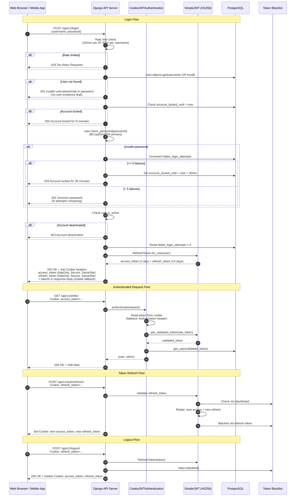
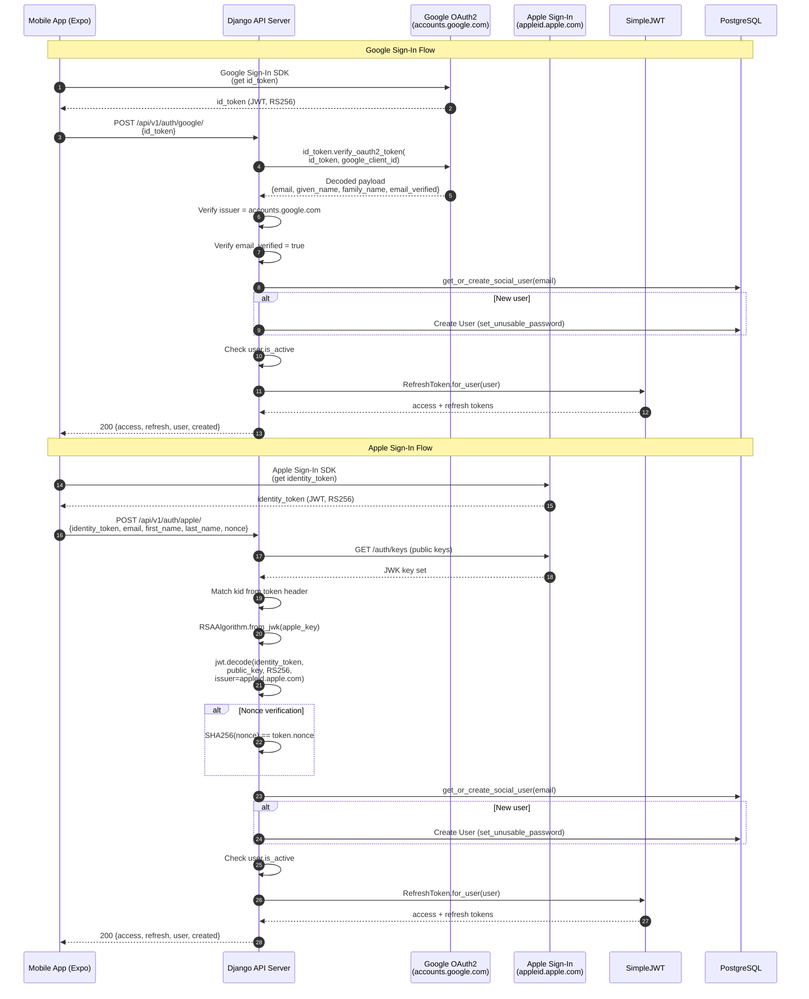
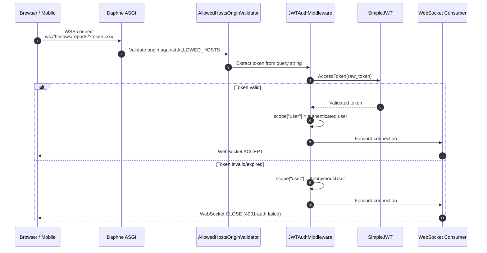

# Security Architecture

## Overview
Comprehensive security architecture covering authentication flows, role-based access control, data protection mechanisms, and security middleware. Intended for security engineers, auditors, and developers implementing auth-related features.

## 1. JWT Authentication Flow (Login with httpOnly Cookies)

## 2. Social Authentication Flow (Google & Apple)

## 3. WebSocket Authentication Flow

## 4. Role-Based Access Control (RBAC) Matrix

```mermaid
flowchart TB
    subgraph Roles["User Roles"]
        direction LR
        Staff["Staff<br/>(role='staff')"]
        Manager["Manager<br/>(role='manager')"]
        Admin["Admin<br/>(role='admin')"]
    end

    subgraph SecurityRoles["Security Roles (Staff Only)"]
        direction LR
        DS["Door Supervisor (ds)"]
        SG["Security Guard (sg)"]
        CCTV["CCTV Operator (cctv)"]
        CP["Close Protection (cp)"]
        KH["Key Holding (kh)"]
        CC["Cash/Valuables (cc)"]
        MA["Management (management)"]
        Event["Event Security (event)"]
    end

    subgraph StaffPerms["Staff Permissions"]
        direction TB
        SP1["View own shifts"]
        SP2["Check-in/out with GPS"]
        SP3["View/edit own profile"]
        SP4["View own invoices"]
        SP5["Submit shift exchanges"]
        SP6["Claim open shifts"]
        SP7["Submit leave requests"]
        SP8["View own leave balances"]
        SP9["View own availability"]
    end

    subgraph ManagerPerms["Manager Permissions (+ all Staff)"]
        direction TB
        MP1["View team shifts"]
        MP2["Approve/reject shifts"]
        MP3["View staff profiles"]
        MP4["Approve leave requests"]
        MP5["View team overview"]
        MP6["View team analytics"]
        MP7["Approve shift exchanges"]
        MP8["View compliance alerts"]
    end

    subgraph AdminPerms["Admin Permissions (+ all Manager)"]
        direction TB
        AP1["Full user CRUD"]
        AP2["Venue management"]
        AP3["Shift scheduling"]
        AP4["Invoice generation"]
        AP5["Pay rate management"]
        AP6["System settings"]
        AP7["Deputy integration"]
        AP8["Finance integrations (Xero/QB/Sage)"]
        AP9["Report generation"]
        AP10["Compliance management"]
        AP11["Leave policies & settings"]
        AP12["Company onboarding"]
        AP13["Recruitment management"]
        AP14["Employment type management"]
        AP15["Bank holiday management"]
    end

    subgraph CompanyPerms["Multi-Tenant (Company Membership)"]
        direction TB
        Owner["owner - Full company control"]
        CompAdmin["admin - Company administration"]
        CompMgr["manager - Team management"]
        CompStaff["staff - Basic member"]
    end

    Staff --> StaffPerms
    Manager --> ManagerPerms
    Admin --> AdminPerms
    Staff --> SecurityRoles

    %% Styling
    classDef role fill:#e3f2fd,stroke:#1565c0,stroke-width:2px,color:#0d47a1
    classDef perm fill:#e8f5e9,stroke:#2e7d32,stroke-width:1px,color:#1b5e20
    classDef secRole fill:#fff3e0,stroke:#e65100,stroke-width:1px,color:#bf360c
    classDef company fill:#f3e5f5,stroke:#6a1b9a,stroke-width:1px,color:#4a148c

    class Staff,Manager,Admin role
    class SP1,SP2,SP3,SP4,SP5,SP6,SP7,SP8,SP9,MP1,MP2,MP3,MP4,MP5,MP6,MP7,MP8,AP1,AP2,AP3,AP4,AP5,AP6,AP7,AP8,AP9,AP10,AP11,AP12,AP13,AP14,AP15 perm
    class DS,SG,CCTV,CP,KH,CC,MA,Event secRole
    class Owner,CompAdmin,CompMgr,CompStaff company
```

## 5. Data Protection Architecture

```mermaid
flowchart TB
    subgraph PasswordSecurity["Password Security"]
        direction TB
        BCrypt["BCryptSHA256PasswordHasher<br/>(primary)"]
        BCryptStd["BCryptPasswordHasher<br/>(fallback)"]
        PBKDF2["PBKDF2PasswordHasher<br/>(legacy migration)"]
        Validators["4 Password Validators<br/>(similarity, min length,<br/>common, numeric)"]
        Lockout["Account Lockout<br/>5 failures → 30min lock"]
    end

    subgraph TokenSecurity["JWT Token Security"]
        direction TB
        HS256["HS256 Signing<br/>(DJANGO_SECRET_KEY)"]
        HttpOnly["httpOnly Cookies<br/>(XSS protection)"]
        Secure["Secure flag<br/>(HTTPS only in prod)"]
        SameSite["SameSite=None (prod)<br/>SameSite=Lax (dev)"]
        Rotation["Token Rotation<br/>(blacklist after refresh)"]
        AccessTTL["Access: 1 day TTL"]
        RefreshTTL["Refresh: 14 days TTL"]
    end

    subgraph EncryptionAtRest["Encryption at Rest"]
        direction TB
        Fernet["Fernet Symmetric Encryption<br/>(FINANCE_ENCRYPTION_KEY env var)"]
        OAuthTokens["OAuth tokens encrypted<br/>(Xero, QuickBooks, Sage<br/>EncryptedJSONField)"]
        BankData["Bank details fields<br/>(account_number, sort_code<br/>marked for encryption)"]
        DeputyKey["Deputy API key<br/>(marked encrypted)"]
    end

    subgraph TransportSecurity["Transport Security"]
        direction TB
        SSL["SECURE_SSL_REDIRECT=True"]
        HSTS["HSTS: 1 year<br/>(includeSubdomains, preload)"]
        XFrame["X-Frame-Options: DENY"]
        NoSniff["X-Content-Type-Nosniff"]
        CSRFProd["CSRF: Secure cookies<br/>Trusted origins whitelist"]
        CORSPolicy["CORS: Explicit origin whitelist<br/>(no wildcard in production)"]
    end

    subgraph ChannelSecurity["WebSocket / Channel Security"]
        direction TB
        AllowedHosts["AllowedHostsOriginValidator"]
        WSTok["JWT token via query param"]
        EncChannels["Channel Layer Encryption<br/>(symmetric_encryption_keys<br/>= SECRET_KEY)"]
    end

    subgraph RateLimiting["Rate Limiting & Abuse Prevention"]
        direction TB
        LoginRL["Login: 20/min per IP<br/>+ 40/hr per username"]
        APIRL["API: django-ratelimit<br/>(per-view decorators)"]
        ProdThrottle["Production: 1000/hr user<br/>100/hr anonymous"]
        EnumPrev["Username enumeration prevention<br/>(generic error messages)"]
    end

    subgraph TenantIsolation["Multi-Tenant Data Isolation"]
        direction TB
        TenantMW["TenantMiddleware<br/>(X-Company-ID header)"]
        CompanyFilter["QuerySet filtering<br/>by company context"]
        MemberCheck["UserCompanyMembership<br/>role verification"]
    end

    %% Styling
    classDef password fill:#ffcdd2,stroke:#c62828,stroke-width:2px,color:#b71c1c
    classDef token fill:#e3f2fd,stroke:#1565c0,stroke-width:2px,color:#0d47a1
    classDef encrypt fill:#fff9c4,stroke:#f57f17,stroke-width:2px,color:#e65100
    classDef transport fill:#e8f5e9,stroke:#2e7d32,stroke-width:2px,color:#1b5e20
    classDef channel fill:#e8eaf6,stroke:#283593,stroke-width:2px,color:#1a237e
    classDef rate fill:#f3e5f5,stroke:#6a1b9a,stroke-width:2px,color:#4a148c
    classDef tenant fill:#fff3e0,stroke:#e65100,stroke-width:2px,color:#bf360c

    class BCrypt,BCryptStd,PBKDF2,Validators,Lockout password
    class HS256,HttpOnly,Secure,SameSite,Rotation,AccessTTL,RefreshTTL token
    class Fernet,OAuthTokens,BankData,DeputyKey encrypt
    class SSL,HSTS,XFrame,NoSniff,CSRFProd,CORSPolicy transport
    class AllowedHosts,WSTok,EncChannels channel
    class LoginRL,APIRL,ProdThrottle,EnumPrev rate
    class TenantMW,CompanyFilter,MemberCheck tenant
```

## Security Controls Summary

### Authentication Mechanisms

| Mechanism | Protocol | Scope | Implementation |
|-----------|----------|-------|----------------|
| **JWT httpOnly Cookie** | HS256 | Web primary | `CookieJWTAuthentication` reads `access_token` cookie |
| **JWT Bearer Header** | HS256 | Mobile / API fallback | `Authorization: Bearer <token>` header |
| **Google OAuth2** | RS256 via google-auth | Mobile social login | `verify_oauth2_token()` against Google public keys |
| **Apple Sign-In** | RS256 via PyJWT | Mobile social login | JWK verification against `appleid.apple.com/auth/keys` |
| **WebSocket JWT** | HS256 via query param | Real-time connections | `JWTAuthMiddleware` extracts `?token=` from URL |
| **Session Auth** | Django sessions | Admin panel only | `SessionAuthentication` for Django admin + browsable API |

### Token Configuration

| Parameter | Value | Notes |
|-----------|-------|-------|
| Access token lifetime | 1 day | `ACCESS_TOKEN_LIFETIME` |
| Refresh token lifetime | 14 days | `REFRESH_TOKEN_LIFETIME` |
| Algorithm | HS256 | Signed with `DJANGO_SECRET_KEY` |
| Rotation | Enabled | New refresh token on each refresh |
| Blacklisting | Enabled | Old refresh tokens blacklisted after rotation |
| Cookie: httpOnly | True | Prevents JavaScript access (XSS mitigation) |
| Cookie: Secure | True (prod) | HTTPS only in production |
| Cookie: SameSite | None (prod) / Lax (dev) | Cross-site for Vercel-to-Render |

### Account Security

| Control | Details |
|---------|---------|
| Password hashing | BCryptSHA256 (primary), PBKDF2 (legacy fallback) |
| Account lockout | 5 failed attempts triggers 30-minute lockout |
| Failed attempt tracking | `failed_login_attempts`, `last_failed_login`, `account_locked_until` |
| Enumeration prevention | Generic "Invalid username/email or password" on lookup failure |
| Social auth users | `set_unusable_password()` prevents password-based login |
| Active check | `is_active` flag verified on every login (including social) |

### Middleware Security Stack (Order Matters)

| Order | Middleware | Purpose |
|-------|-----------|---------|
| 1 | `SecurityMiddleware` | HSTS, SSL redirect, content-type nosniff |
| 2 | `WhiteNoiseMiddleware` | Compressed static file serving |
| 3 | `CorsMiddleware` | Cross-origin request policy enforcement |
| 4 | `SessionMiddleware` | Session management |
| 5 | `CommonMiddleware` | URL normalization |
| 6 | `CsrfViewMiddleware` | CSRF token validation |
| 7 | `AuthenticationMiddleware` | User authentication |
| 8 | `TenantMiddleware` | Multi-tenant company isolation |
| 9 | `MessageMiddleware` | Flash messages |
| 10 | `XFrameOptionsMiddleware` | Clickjacking protection (DENY) |

## Legend

| Color | Security Domain |
|-------|-----------------|
| Red | Password security and hashing |
| Blue | JWT token management |
| Yellow | Encryption at rest |
| Green | Transport layer security |
| Indigo | WebSocket/channel security |
| Purple | Rate limiting and abuse prevention |
| Orange | Multi-tenant data isolation |

## Notes
- Social auth users have unusable passwords, preventing password-based login attempts
- The `CookieJWTAuthentication` class tries cookies first, then falls back to `Authorization` header -- this supports both web (cookies) and mobile (header) clients
- Token rotation with blacklisting ensures that compromised refresh tokens cannot be reused
- Finance OAuth tokens (Xero, QuickBooks, Sage) are encrypted at rest using Fernet symmetric encryption with a dedicated `FINANCE_ENCRYPTION_KEY`
- The Channels layer uses `symmetric_encryption_keys` (set to `SECRET_KEY`) for encrypted WebSocket communication via Redis
- TenantMiddleware determines company context from: (1) `X-Company-ID` header, (2) URL parameter, (3) user default company
- Production CORS uses an explicit origin whitelist (not `*`), with `CORS_ALLOW_ALL_ORIGINS = True` only when `DEBUG = True`
- See `03_Component_Diagram.md` for the full middleware pipeline
- See `04_Deployment_Diagram.md` for SSL/TLS termination at the infrastructure level
- See `12_System_Architecture.md` for where auth fits in the layered architecture

## Source Files
- `backend/api/authentication.py` - `CookieJWTAuthentication` (httpOnly cookie primary, Bearer fallback)
- `backend/api/views.py:196-445` - `LoginView`, `LogoutView`, `CookieTokenRefreshView` with rate limiting and lockout
- `backend/api/social_auth.py` - Google (`verify_google_token`) and Apple (`verify_apple_token`) authentication
- `backend/api/middleware/websocket_auth.py` - `JWTAuthMiddleware` for WebSocket JWT from query params
- `backend/api/middleware/tenant_middleware.py` - `TenantMiddleware` for multi-tenant company isolation
- `backend/api/models.py:854-890` - `User` model with `ROLE_CHOICES`, `SECURITY_ROLE_CHOICES`, lockout fields
- `backend/api/models.py:407-445` - `UserCompanyMembership` with `MEMBERSHIP_ROLE_CHOICES`
- `backend/finance_integrations/models.py:1-40` - `EncryptedJSONField` using Fernet encryption
- `backend/core/settings.py:168-176` - `PASSWORD_HASHERS` (BCryptSHA256 primary)
- `backend/core/settings.py:343-374` - `SIMPLE_JWT` configuration (cookie settings, lifetimes, rotation)
- `backend/core/settings.py:503-511` - `CHANNEL_LAYERS` with `symmetric_encryption_keys`
- `backend/core/settings.py:533-561` - Production security settings (HSTS, SSL, secure cookies)
- `backend/core/asgi.py` - `AllowedHostsOriginValidator` + `JWTAuthMiddlewareStack`
