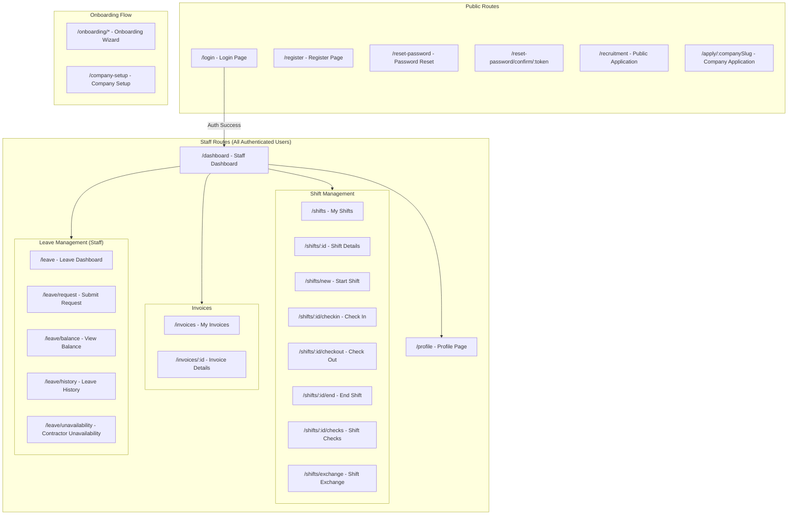
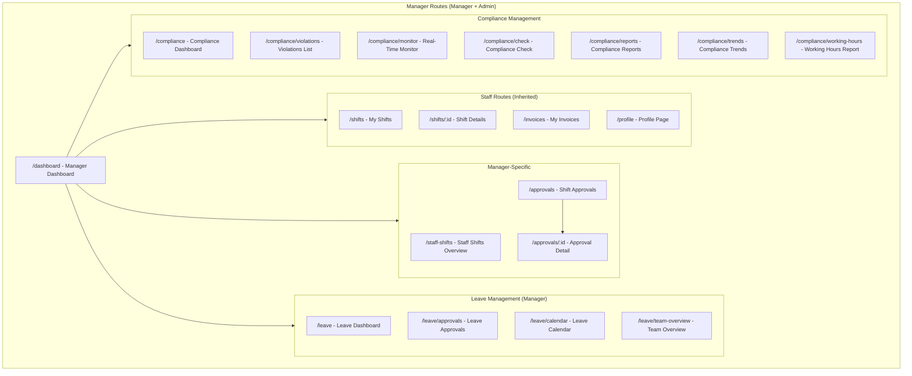
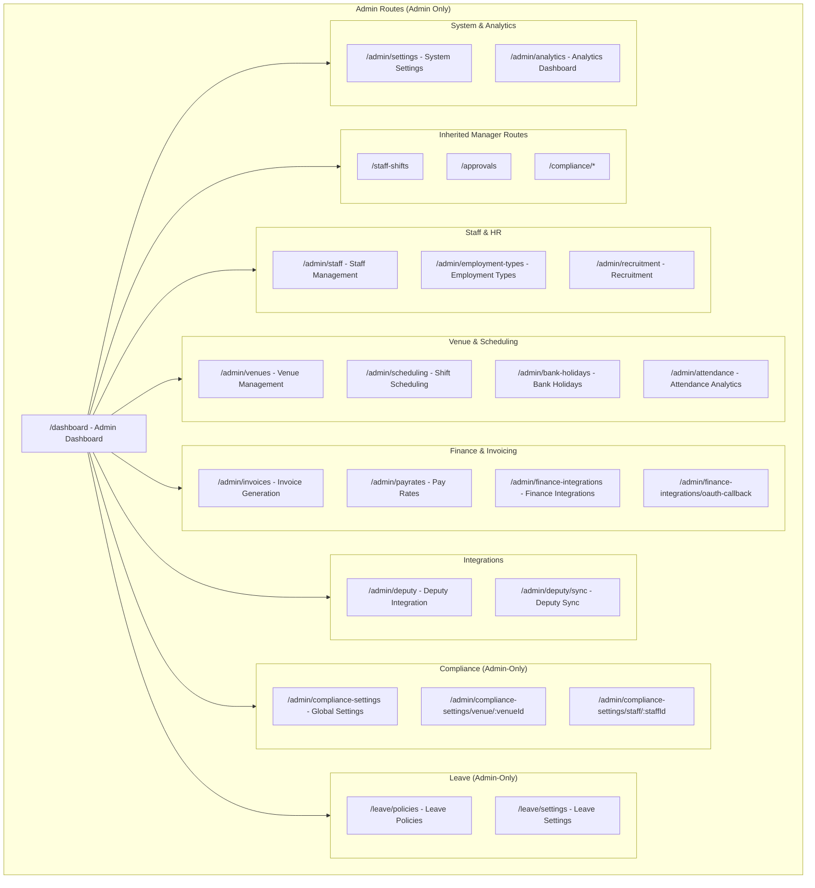
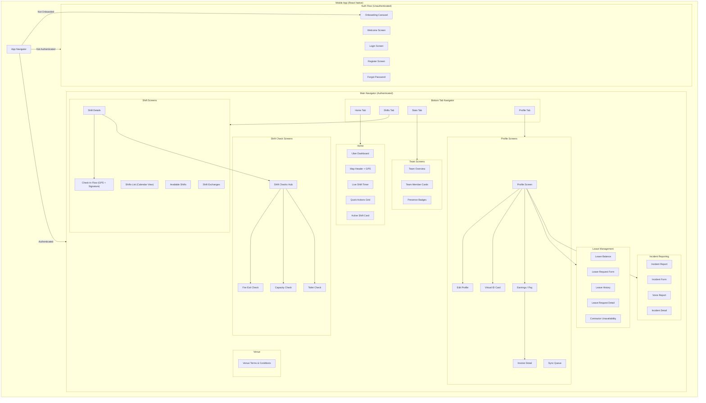

# Information Architecture

## Overview

Navigation sitemap for the Mead Security staff management system, organized by user role and platform. Shows all accessible routes, page hierarchies, and role-based access control boundaries across the web frontend (React) and mobile app (React Native).

## Web Application Sitemap by Role

### Staff Role Sitemap

### Manager Role Sitemap

### Admin Role Sitemap

## Mobile Application Screen Hierarchy

## Role-Based Access Control Matrix

```mermaid
flowchart TD
    subgraph RBAC["Access Control Overview"]
        direction TB

        subgraph PublicAccess["Public (No Auth)"]
            P1["/login"]
            P2["/register"]
            P3["/reset-password"]
            P4["/recruitment"]
            P5["/apply/:companySlug"]
        end

        subgraph AllAuth["All Authenticated Users"]
            A1["/dashboard (role-routed)"]
            A2["/shifts/*"]
            A3["/invoices/*"]
            A4["/profile"]
            A5["/leave (dashboard, request, balance, history)"]
        end

        subgraph ManagerAdmin["Manager + Admin"]
            M1["/staff-shifts"]
            M2["/approvals/*"]
            M3["/compliance/*"]
            M4["/leave/approvals"]
            M5["/leave/calendar"]
            M6["/leave/team-overview"]
        end

        subgraph AdminOnly["Admin Only"]
            AD1["/admin/staff"]
            AD2["/admin/venues"]
            AD3["/admin/scheduling"]
            AD4["/admin/invoices"]
            AD5["/admin/deputy"]
            AD6["/admin/recruitment"]
            AD7["/admin/employment-types"]
            AD8["/admin/bank-holidays"]
            AD9["/admin/attendance"]
            AD10["/admin/finance-integrations"]
            AD11["/admin/compliance-settings"]
            AD12["/admin/settings"]
            AD13["/admin/analytics"]
            AD14["/leave/policies"]
            AD15["/leave/settings"]
        end
    end

    PublicAccess -->|Login| AllAuth
    AllAuth -->|Role: Manager| ManagerAdmin
    ManagerAdmin -->|Role: Admin| AdminOnly
```

## Legend

| Symbol | Meaning |
|--------|---------|
| Rounded box | Page / Screen |
| Subgraph | Logical grouping / section |
| Arrow | Navigation path / access hierarchy |
| `/*` suffix | Contains nested sub-routes |
| `:param` | Dynamic URL parameter |
| Tab bar icons | Home, Shifts (Calendar), Stats (Team), Profile |

## Navigation Patterns

### Web Frontend
- **Role-based dashboard routing**: `/dashboard` renders `StaffDashboard`, `ManagerDashboard`, or `AdminDashboard` based on user role via `DashboardRouter`
- **AuthGuard**: All authenticated routes wrapped with `AuthGuard` component requiring completed onboarding
- **Lazy loading**: Heavy admin pages (`StaffManagement`, `VenueManagement`, `DeputyIntegration`, `RecruitmentManagement`, `Attendance`, `AnalyticsDashboard`, `BankHolidayManagement`) use React lazy loading
- **Nested route modules**: Leave (`/leave/*`) and Compliance (`/compliance/*`) use their own `Routes` with sidebar navigation
- **Owner role mapping**: Membership role `owner` maps to `admin` for access control

### Mobile App
- **Stack + Tab pattern**: `AppNavigator` (Stack) > `MainNavigator` (Stack) > `TabNavigator` (Bottom Tabs) > individual screens
- **Modal presentation**: Detail screens (`ShiftDetails`, `CheckInFlow`, etc.) presented as modals over the tab navigator
- **Onboarding gate**: `OnboardingCarousel` shown before auth flow for first-time users
- **Offline support**: `NetworkStatusBanner` and `SyncStatusBanner` shown at top of main navigator

## Notes

- Cross-reference with `16_User_Flows.md` for detailed journey maps through these screens
- Cross-reference with `17_Wireframes/index.md` for visual layout of key screens
- Cross-reference with `14_Security_Architecture.md` for detailed RBAC implementation
- Cross-reference with `11_DFD_Level2.md` for data flow through these interfaces

## Source Files

- `frontend/src/Router.tsx` - Main web routing configuration and DashboardRouter
- `frontend/src/pages/admin/*.tsx` - Admin page components (20 files)
- `frontend/src/pages/staff/*.tsx` - Staff page components (11 files)
- `frontend/src/pages/manager/*.tsx` - Manager page components (5 files)
- `frontend/src/pages/leave/LeaveManagement.tsx` - Leave sub-routing with role guards
- `frontend/src/pages/compliance/ComplianceManagement.tsx` - Compliance sub-routing with role guards
- `frontend/src/pages/public/RecruitmentApplication.tsx` - Public recruitment form
- `frontend/src/pages/shared/NotFoundPage.tsx` - 404 page
- `frontend/src/pages/shared/UnauthorizedPage.tsx` - 403 page
- `mobile/src/navigation/AppNavigator.tsx` - Root mobile navigator with auth gate
- `mobile/src/navigation/AuthNavigator.tsx` - Mobile auth flow (Welcome, Login, Register, ForgotPassword)
- `mobile/src/navigation/MainNavigator.tsx` - Authenticated mobile stack with modal screens
- `mobile/src/navigation/TabNavigator.tsx` - Bottom tabs (Home, Shifts, Stats, Profile)
- `mobile/src/screens/**/*.tsx` - 60+ mobile screen components
