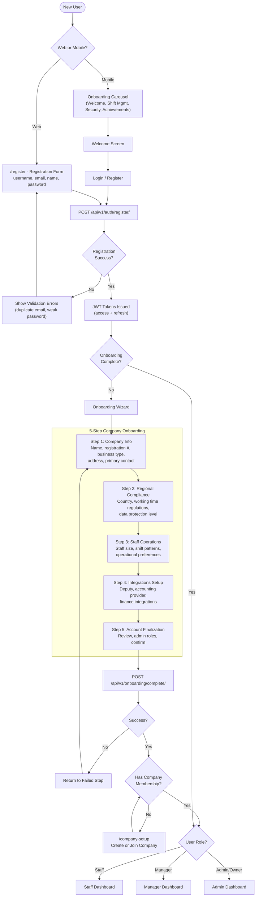
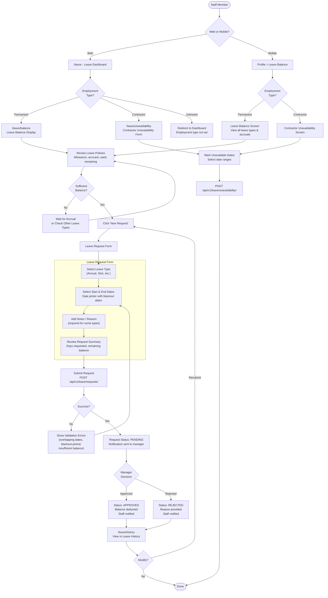
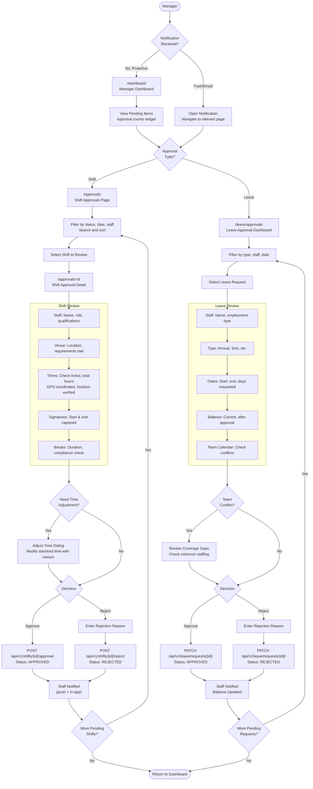
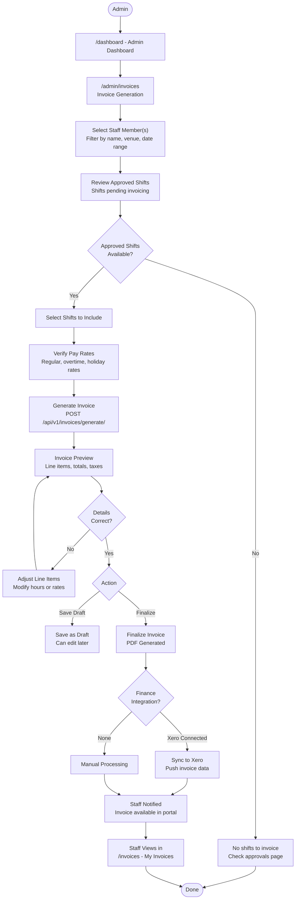

# User Flows

## Overview

Detailed user journey maps for the core workflows in the Mead Security staff management system. Each flow shows decision points, system interactions, and error handling paths across web and mobile platforms.

## Flow 1: Staff Onboarding Journey

Registration through to first dashboard access, covering account creation, company onboarding wizard, and profile setup.

## Flow 2: Daily Shift Workflow (Mobile)

The complete shift lifecycle from viewing schedule through GPS-verified check-in, on-shift checks, and check-out with digital signature.

```mermaid
flowchart TD
    Start([Staff Opens App]) --> Dashboard["Home Tab - Dashboard<br/>View active/upcoming shifts"]
    Dashboard --> HasActive{Active Shift?}

    HasActive -->|Yes| LiveTimer["Live Shift Timer<br/>Running clock, venue name"]
    HasActive -->|No| ViewSchedule["Shifts Tab - Calendar View<br/>Browse upcoming shifts"]

    ViewSchedule --> SelectShift["Tap Shift Card"]
    SelectShift --> ShiftDetail["Shift Details Screen<br/>Venue, time, requirements"]
    ShiftDetail --> TimeCheck{Within check-in<br/>window?}
    TimeCheck -->|No| WaitMessage["Not yet available<br/>(too early / too late)"]
    WaitMessage --> ViewSchedule

    TimeCheck -->|Yes| StartCheckIn["Tap 'Check In'"]
    StartCheckIn --> CheckInFlow["Check-In Flow Screen"]

    subgraph CheckIn["Multi-Step Check-In"]
        direction TB
        LocCheck["Step 1: GPS Location Verification<br/>Compare device GPS vs venue coords<br/>(100m radius)"]
        LocResult{Within<br/>Range?}
        LocCheck --> LocResult
        LocResult -->|No| LocError["Alert: Not at venue<br/>Retry / Cancel"]
        LocError -->|Retry| LocCheck

        LocResult -->|Yes| VenueTerms{Venue Has<br/>Terms?}
        VenueTerms -->|Yes| ShowTerms["Step 2: Accept Venue Terms<br/>Display T&Cs, require acceptance"]
        VenueTerms -->|No| Camera
        ShowTerms --> Camera

        Camera["Step 3: Take Photo<br/>Camera capture for verification"]
        Camera --> PhotoPreview["Review Photo<br/>Accept / Retake"]
        PhotoPreview -->|Retake| Camera
        PhotoPreview -->|Accept| Signature

        Signature["Step 4: Digital Signature<br/>Canvas capture for legal record"]
        Signature --> Processing["Step 5: Processing<br/>Submit check-in to API"]
    end

    CheckInFlow --> LocCheck
    Processing --> SubmitAPI["POST /api/v1/shifts/{id}/checkin/<br/>{location, photo, signature}"]

    SubmitAPI --> OnlineCheck{Device<br/>Online?}
    OnlineCheck -->|Yes| APIResponse{API<br/>Success?}
    OnlineCheck -->|No| QueueSync["Queue in SyncService<br/>Store locally (SQLite)"]
    QueueSync --> CheckedIn

    APIResponse -->|Yes| CheckedIn["Shift Active<br/>Live timer starts"]
    APIResponse -->|No| ErrorHandle["Show Error<br/>Retry submission"]
    ErrorHandle --> Processing

    %% On-Shift Activities
    CheckedIn --> OnShift{On-Shift<br/>Activities}

    OnShift -->|Checks Due| ShiftChecks["Shift Checks Screen"]
    subgraph Checks["Periodic Venue Checks"]
        FireExit["Fire Exit Check<br/>Verify exits clear"]
        CapCheck["Capacity Check<br/>Record current count"]
        ToiletCheck["Toilet Check<br/>Verify facilities"]
    end
    ShiftChecks --> FireExit
    ShiftChecks --> CapCheck
    ShiftChecks --> ToiletCheck
    Checks --> CheckedIn

    OnShift -->|Incident| IncidentReport["Incident Report<br/>Form / Voice Report"]
    IncidentReport --> CheckedIn

    OnShift -->|End Shift| CheckOut["Tap 'Check Out'"]

    subgraph CheckOutFlow["Check-Out Flow"]
        OutLoc["GPS Location Verification"]
        OutSig["Digital Signature Capture"]
        OutProcess["Submit Check-Out"]
    end

    CheckOut --> OutLoc
    OutLoc --> OutSig
    OutSig --> OutProcess
    OutProcess --> ShiftComplete["Shift Complete<br/>Hours calculated, pending approval"]
```

## Flow 3: Leave Request Journey

Staff member checking their leave balance, submitting a leave request, and tracking the approval outcome. Includes contractor vs permanent employee routing.

## Flow 4: Manager Approval Workflow

Manager reviewing and processing shift approvals and leave requests, including bulk operations.

## Flow 5: Incident Reporting (Mobile)

Staff reporting a security incident during an active shift, including voice reporting and photo evidence.

```mermaid
flowchart TD
    Start([Staff on Active Shift]) --> TriggerIncident{How to<br/>Report?}

    TriggerIncident -->|Quick Action| QuickAction["Dashboard Quick Actions<br/>Tap 'Report Incident'"]
    TriggerIncident -->|From Shift| ShiftAction["Shift Details<br/>Tap 'Report Incident'"]

    QuickAction --> IncidentReport["Incident Report Screen"]
    ShiftAction --> IncidentReport

    IncidentReport --> ReportType{Report<br/>Method?}

    ReportType -->|Written| IncidentForm["Incident Form Screen"]
    ReportType -->|Voice| VoiceReport["Voice Report Screen<br/>Audio recording + transcription"]

    VoiceReport --> Transcribe["Transcribe Audio<br/>Review & edit text"]
    Transcribe --> IncidentForm

    subgraph FormEntry["Incident Form"]
        IncType["Select Incident Type<br/>(Theft, Assault, Trespass, etc.)"]
        IncDesc["Description<br/>(text or transcribed voice)"]
        IncSeverity["Severity Level"]
        IncLocation["Location Details<br/>(auto-filled from GPS)"]
        IncPhotos["Attach Photo Evidence<br/>(camera or gallery)"]
        IncWitnesses["Add Witnesses<br/>(optional)"]
    end

    IncidentForm --> IncType
    IncType --> IncDesc
    IncDesc --> IncSeverity
    IncSeverity --> IncLocation
    IncLocation --> IncPhotos
    IncPhotos --> IncWitnesses

    IncWitnesses --> ReviewSubmit["Review Incident Report"]
    ReviewSubmit --> SubmitIncident["POST /api/v1/incidents/<br/>Submit with attachments"]

    SubmitIncident --> Online{Device<br/>Online?}
    Online -->|Yes| Submitted["Incident Logged<br/>Manager notified"]
    Online -->|No| Queued["Queued for Sync<br/>Stored in local DB"]
    Queued -->|When online| Submitted

    Submitted --> IncidentDetail["Incident Detail Screen<br/>View status and updates"]
    IncidentDetail --> End([Return to Shift])
```

## Flow 6: Admin Invoice Generation

Admin generating, reviewing, and managing invoices from approved shifts.

## Legend

| Symbol | Meaning |
|--------|---------|
| Rounded rectangle `([text])` | Start / End terminal |
| Rectangle `[text]` | Process / Action step |
| Diamond `{text}` | Decision point |
| Subgraph | Grouped related steps |
| Solid arrow | Primary flow path |
| `POST/PATCH/GET` | API endpoint called |

## Cross-Platform Considerations

| Flow | Web Support | Mobile Support | Offline Support |
|------|-------------|---------------|-----------------|
| Onboarding | Full wizard (5 steps) | Carousel + auth only | No |
| Shift Check-In/Out | Basic (location + signature) | Full (GPS + photo + signature) | Yes (sync queue) |
| Leave Request | Full (with sidebar nav) | Balance + request form | No |
| Manager Approvals | Full (shift + leave) | Not available | No |
| Incident Reporting | Not available | Full (form + voice + photo) | Yes (sync queue) |
| Invoice Generation | Full (admin only) | Not available | No |

## Notes

- Cross-reference with `15_Information_Architecture.md` for the complete page/screen inventory
- Cross-reference with `17_Wireframes/index.md` for visual layouts of key screens in these flows
- Cross-reference with `06_Sequence_Diagrams.md` for technical API call sequences
- Cross-reference with `08_Activity_Diagrams.md` for business process modeling

## Source Files

- `frontend/src/Router.tsx` - Route definitions and DashboardRouter role switching
- `frontend/src/pages/auth/LoginPage.tsx` - Web login with JWT and onboarding redirect
- `frontend/src/pages/auth/RegisterPage.tsx` - Web registration with Formik/Yup validation
- `frontend/src/components/onboarding/OnboardingWizard.tsx` - 5-step company onboarding wizard
- `frontend/src/pages/staff/ShiftCheckIn.tsx` - Web check-in with location + signature
- `frontend/src/pages/leave/LeaveManagement.tsx` - Leave sub-router with employment type guards
- `frontend/src/pages/manager/Approvals.tsx` - Shift approval list and actions
- `frontend/src/components/LeaveApprovalDashboard.tsx` - Leave approval interface
- `frontend/src/pages/admin/InvoiceGeneration.tsx` - Invoice creation and management
- `mobile/src/navigation/AppNavigator.tsx` - Root navigator with auth/onboarding gates
- `mobile/src/screens/shifts/CheckInFlowScreen.tsx` - Multi-step check-in (GPS, terms, photo, signature)
- `mobile/src/screens/leave/LeaveRequestScreen.tsx` - Mobile leave request form
- `mobile/src/screens/leave/LeaveBalanceScreen.tsx` - Mobile leave balance display
- `mobile/src/screens/incidents/IncidentFormScreen.tsx` - Incident reporting form
- `mobile/src/screens/incidents/VoiceReportScreen.tsx` - Voice-based incident reporting
- `mobile/src/screens/profile/EarningsScreen.tsx` - Mobile earnings and invoice viewing
