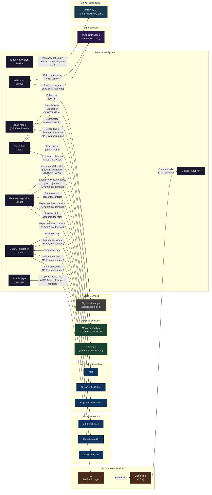

# Third-Party Integration Map

## Overview

This diagram documents all external system integrations for the Security HR platform, including data flow directions, authentication methods, sync frequencies, and the data exchanged. It serves as a reference for the integration team, architects, and developers working on external service connectivity.

## Integration Map

## Integration Summary Table

| External Service | Category | Data Direction | Auth Method | Sync Frequency | Data Exchanged |
|---|---|---|---|---|---|
| **Deputy** | Workforce Mgmt | Bidirectional | API Key (stored in DeputyConfig) | On-demand / Admin-triggered | Employees, timesheets, schedules |
| **Xero** | Accounting | Bidirectional | OAuth 2.0 (Fernet-encrypted tokens) | On-demand + Webhooks | Invoices, contacts, payroll, journals, VAT codes, accounts, payments |
| **QuickBooks Online** | Accounting | Bidirectional | OAuth 2.0 (Fernet-encrypted tokens) | On-demand | Invoices, contacts, company info, accounts, tax codes |
| **Sage Business Cloud** | Accounting | Bidirectional | OAuth 2.0 (Fernet-encrypted tokens) | On-demand | Invoices, contacts, business info, ledger accounts, tax rates |
| **Google Maps** | Geocoding / Location | Request-Response | API Key (settings.GOOGLE_MAPS_API_KEY) | Per-request (check-in/out) | Geocoding addresses, distance matrix verification |
| **Google OAuth** | Authentication | Inbound (ID token) | OAuth 2.0 ID Token verification | Per-login | User email, name, email_verified status |
| **Apple Sign-In** | Authentication | Inbound (identity token) | JWT RS256 verification via JWKS | Per-login | User email, name (first sign-in only) |
| **AWS S3** | Media Storage | Outbound (upload) | AWS Access Key + Secret Key | Per-upload | Profile photos, invoice PDFs, media files |
| **AWS CloudFront** | CDN | Outbound (delivery) | Public CDN URLs | Cached (TTL-based) | Static assets, media files |
| **Expo Push** | Notifications | Outbound | Expo SDK (token-based) | Real-time (event-driven) | Push messages: shift assignments, reminders, cancellations, exchanges |
| **Brevo SMTP** | Email | Outbound | SMTP credentials (host user/password) | Real-time (event-driven) | Transactional emails: shift assignments, removals, exchanges, approvals, open shifts |

## Authentication Details

| Provider | Auth Type | Token Storage | Token Refresh | Encryption |
|---|---|---|---|---|
| Deputy | API Key | `DeputyConfig.api_key` (DB) | N/A (static key) | Field-level (noted as "encrypted") |
| Xero | OAuth 2.0 Authorization Code | `ProviderConnection` model | Auto-refresh via `refresh_tokens()` (30 min expiry) | Fernet-encrypted `EncryptedJSONField` |
| QuickBooks | OAuth 2.0 Authorization Code | `ProviderConnection` model | Auto-refresh via `refresh_access_token()` (1 hour expiry) | Fernet-encrypted `EncryptedJSONField` |
| Sage | OAuth 2.0 Authorization Code | `ProviderConnection` model | Auto-refresh via `refresh_access_token()` (1 hour expiry) | Fernet-encrypted `EncryptedJSONField` |
| Google OAuth | OAuth 2.0 ID Token | Not stored (verified per-request) | N/A (stateless verification) | N/A |
| Apple Sign-In | JWT RS256 (Identity Token) | Not stored (verified per-request) | N/A (stateless verification) | N/A |
| Google Maps | API Key | `settings.GOOGLE_MAPS_API_KEY` | N/A (static key) | Environment variable |
| AWS S3 | Access Key + Secret Key | Environment variables | N/A (static credentials) | Environment variable |
| Expo Push | Device Token (ExponentPushToken) | `SNSDeviceToken` model (per device) | N/A (device registration) | N/A |
| Brevo SMTP | Username + Password | `settings.EMAIL_HOST_USER/PASSWORD` | N/A (static credentials) | Environment variable |

## Webhook Integrations

| Provider | Webhook Endpoint | Signature Verification | Events Handled |
|---|---|---|---|
| Xero | `/api/v1/finance/webhooks/xero/` | HMAC-SHA256 (webhook_key) | Invoice payment status updates |
| QuickBooks | `/api/v1/finance/webhooks/quickbooks/` | Configurable (placeholder) | Payment status updates |
| Sage | `/api/v1/finance/webhooks/sage/` | Configurable (placeholder) | Payment status updates |

## Legend

| Symbol | Meaning |
|---|---|
| Solid arrow with label | Data flow with description, auth method, and frequency |
| `-->` direction | Direction of primary data flow |
| Core (dark) nodes | Internal system modules |
| External nodes | Third-party services |

## Notes

- Accounting providers use a **Provider Factory pattern** (`ProviderFactory`) to instantiate the correct adapter (Xero, QuickBooks, or Sage) based on `provider_key`
- FreeAgent is listed in `AccountingProvider.PROVIDER_CHOICES` but does not yet have an implemented provider adapter
- OAuth tokens for accounting providers are stored encrypted at rest using `EncryptedJSONField` with Fernet symmetric encryption keyed by `FINANCE_ENCRYPTION_KEY`
- The Deputy integration uses a simpler API key model (not OAuth) with the key stored in `DeputyConfig.api_key`
- Push notifications use the `exponent_server_sdk` Python package; if not installed, notifications are logged but not sent
- Email delivery uses Django's SMTP backend configured for Brevo (smtp-relay.brevo.com) on port 587 with TLS
- Related diagrams: `03_Component_Diagram.md` (system components), `14_Security_Architecture.md` (auth flows), `19_API_Contracts.md` (API contract details)

## Source Files

- `backend/finance_integrations/providers/base.py` - Abstract accounting provider interface
- `backend/finance_integrations/providers/xero.py` - Xero OAuth2 and API implementation
- `backend/finance_integrations/providers/quickbooks.py` - QuickBooks OAuth2 and API implementation
- `backend/finance_integrations/providers/sage.py` - Sage OAuth2 and API implementation
- `backend/finance_integrations/providers/factory.py` - Provider factory pattern
- `backend/finance_integrations/models.py` - ProviderConnection, AccountMapping, webhook models
- `backend/finance_integrations/services.py` - FinanceIntegrationService, ConnectionSetupService
- `backend/finance_integrations/views.py` - OAuth flow endpoints, export views, webhook handler
- `backend/finance_integrations/urls.py` - Finance integration URL routing
- `backend/api/social_auth.py` - Google and Apple social authentication flows
- `backend/api/services/notification_service.py` - Expo push notification service
- `backend/api/services/email_notification_service.py` - Brevo SMTP email service
- `backend/api/models.py` - DeputyConfig, DeputyEmployee, DeputyTimesheet, Venue (GPS methods)
- `backend/core/settings.py` - Email (Brevo SMTP) and Google Maps API key configuration
- `backend/core/settings/production.py` - AWS S3/CloudFront configuration
