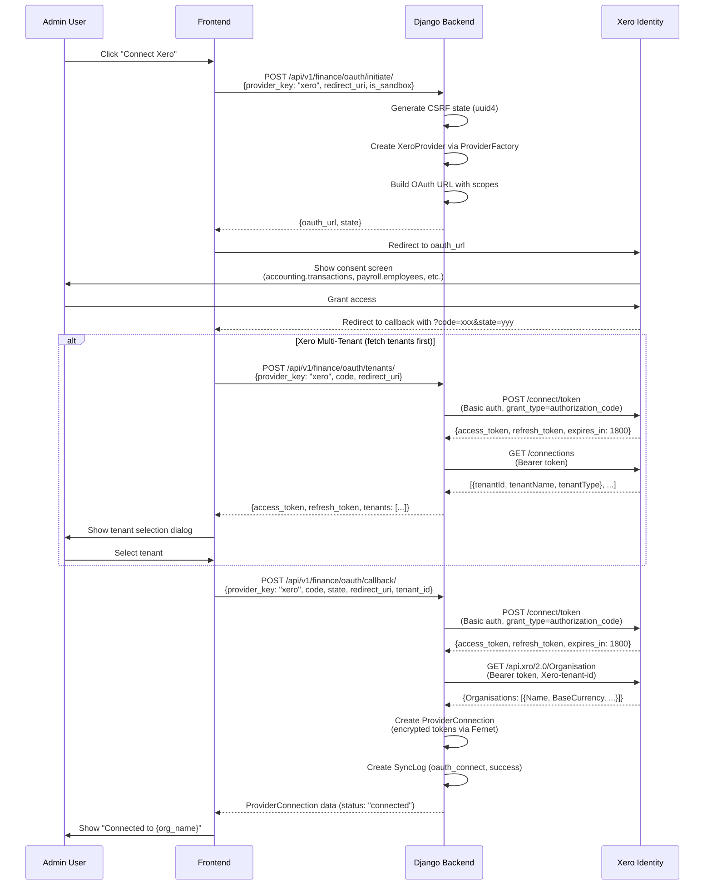
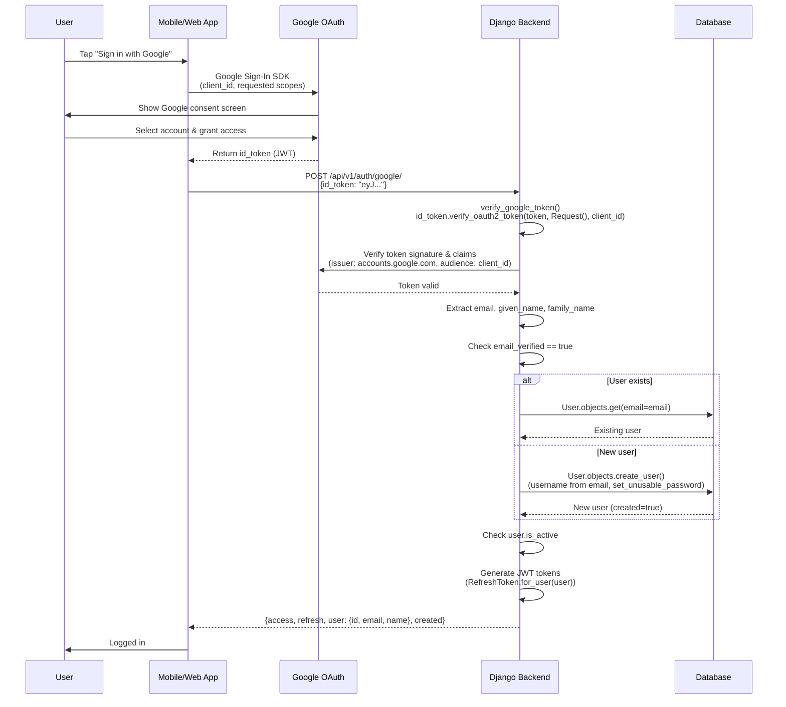
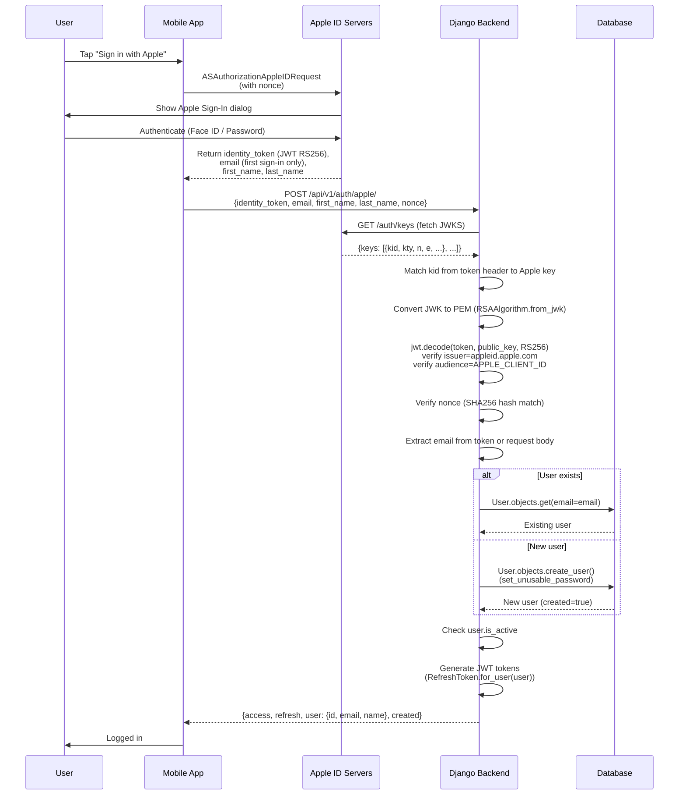
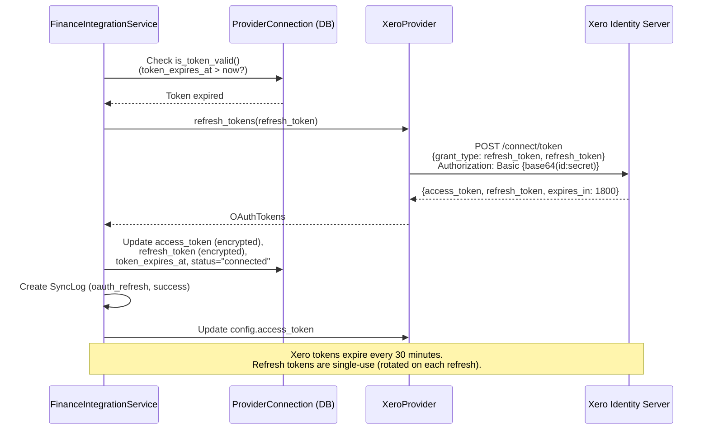

# External API Contracts

## Overview

This document details the external API contracts for all third-party integrations in the Security HR platform. It includes endpoint specifications, request/response formats, authentication details, and OAuth sequence diagrams. This serves as a reference for integration developers and architects.

## 1. Xero API Contracts

### 1.1 Xero OAuth 2.0 Endpoints

| Operation | Method | URL | Auth | Content-Type |
|---|---|---|---|---|
| Authorization | GET | `https://identity.xero.com/connect/authorize` | N/A (browser redirect) | N/A |
| Token Exchange | POST | `https://identity.xero.com/connect/token` | Basic (client_id:client_secret base64) | `application/x-www-form-urlencoded` |
| Token Refresh | POST | `https://identity.xero.com/connect/token` | Basic (client_id:client_secret base64) | `application/x-www-form-urlencoded` |
| Get Tenants | GET | `https://identity.xero.com/connections` | Bearer token | `application/json` |

### 1.2 Xero Accounting API Endpoints

Base URL: `https://api.xero.com/api.xro/2.0`

| Operation | Method | Endpoint | Required Headers | Request Body |
|---|---|---|---|---|
| Get Organisation | GET | `/Organisation` | `Authorization: Bearer {token}`, `Xero-tenant-id: {id}` | N/A |
| List Accounts | GET | `/Accounts` | `Authorization: Bearer {token}`, `Xero-tenant-id: {id}` | N/A |
| List Tax Rates | GET | `/TaxRates` | `Authorization: Bearer {token}`, `Xero-tenant-id: {id}` | N/A |
| Create/Update Contact | POST | `/Contacts` or `/Contacts/{id}` | `Authorization: Bearer {token}`, `Xero-tenant-id: {id}` | `{"Contacts": [{...}]}` |
| Create Invoice | POST | `/Invoices` | `Authorization: Bearer {token}`, `Xero-tenant-id: {id}` | `{"Invoices": [{...}]}` |
| List Payments | GET | `/Payments` | `Authorization: Bearer {token}`, `Xero-tenant-id: {id}` | N/A |
| Create Journal | POST | `/ManualJournals` | `Authorization: Bearer {token}`, `Xero-tenant-id: {id}` | `{"ManualJournals": [{...}]}` |
| Upload Attachment | POST | `/Invoices/{id}/Attachments/{filename}` | `Authorization: Bearer {token}`, `Xero-tenant-id: {id}` | Binary file content |

### 1.3 Xero Payroll API Endpoints

Base URL: `https://api.xero.com/payroll.xro/1.0`

| Operation | Method | Endpoint | Request Body |
|---|---|---|---|
| Create/Update Employee | POST | `/Employees` or `/Employees/{id}` | `{"Employees": [{...}]}` |
| Get Pay Items | GET | `/PayItems` | N/A |
| Create Pay Run | POST | `/PayRuns` | `{"PayRuns": [{...}]}` |

### 1.4 Xero OAuth Scopes

```
accounting.transactions
accounting.contacts.read
accounting.settings
payroll.employees
payroll.payruns
payroll.settings
files
```

### 1.5 Xero Invoice Request Format

```json
{
  "Invoices": [{
    "Type": "ACCREC",
    "Contact": {"ContactID": "abc-123"},
    "Date": "2026-02-13",
    "DueDate": "2026-03-15",
    "Status": "DRAFT",
    "InvoiceNumber": "INV-42",
    "Reference": "Staff Invoice for John Smith",
    "LineItems": [{
      "Description": "Venue A - 2026-02-10 (8.0 hours)",
      "Quantity": 8.0,
      "UnitAmount": 15.50,
      "AccountCode": "200",
      "TaxType": "OUTPUT2"
    }]
  }]
}
```

### 1.6 Xero Webhook Contract

| Header | Value |
|---|---|
| Endpoint | `/api/v1/finance/webhooks/xero/` |
| Signature Header | `X-Webhook-Signature` |
| Verification | HMAC-SHA256 with `webhook_key`, base64-encoded |

Payload format:
```json
{
  "eventType": "invoice.paid",
  "eventId": "evt-abc-123",
  "resourceId": "inv-xyz-789"
}
```

---

## 2. QuickBooks Online API Contracts

### 2.1 QuickBooks OAuth 2.0 Endpoints

| Operation | Method | URL | Auth |
|---|---|---|---|
| Authorization | GET | `https://appcenter.intuit.com/connect/oauth2` | N/A (browser redirect) |
| Token Exchange | POST | `https://oauth.platform.intuit.com/oauth2/v1/tokens/bearer` | Basic (client_id:client_secret base64) |
| Token Refresh | POST | `https://oauth.platform.intuit.com/oauth2/v1/tokens/bearer` | Basic (client_id:client_secret base64) |

### 2.2 QuickBooks Accounting API Endpoints

Base URL (Production): `https://quickbooks.api.intuit.com/v3/company/{companyId}`
Base URL (Sandbox): `https://sandbox-quickbooks.api.intuit.com/v3/company/{companyId}`

| Operation | Method | Endpoint | Auth |
|---|---|---|---|
| Get Company Info | GET | `/companyinfo` | Bearer token |
| List Accounts | GET | `/accounts?maxresults=1000` | Bearer token |
| List Customers | GET | `/customers?maxresults=1000` | Bearer token |
| List Vendors | GET | `/vendors?maxresults=1000` | Bearer token |
| List Tax Codes | GET | `/taxcodes?maxresults=1000` | Bearer token |

### 2.3 QuickBooks OAuth Scopes

```
com.intuit.quickbooks.accounting
```

---

## 3. Sage Business Cloud API Contracts

### 3.1 Sage OAuth 2.0 Endpoints

| Operation | Method | URL | Auth |
|---|---|---|---|
| Authorization | GET | `https://www.sageone.com/oauth2/auth/central` | N/A (browser redirect) |
| Token Exchange | POST | `https://oauth.accounting.sage.com/token` | client_id + client_secret in body |
| Token Refresh | POST | `https://oauth.accounting.sage.com/token` | client_id + client_secret in body |

### 3.2 Sage Accounting API Endpoints

Base URL: `https://api.accounting.sage.com/v3.1`

| Operation | Method | Endpoint | Auth |
|---|---|---|---|
| Get Business Info | GET | `/businesses` | Bearer token |
| List Ledger Accounts | GET | `/ledger_accounts` | Bearer token |
| List Customers | GET | `/contacts?contact_type=CUSTOMER` | Bearer token |
| List Suppliers | GET | `/contacts?contact_type=VENDOR` | Bearer token |
| List Tax Rates | GET | `/tax_rates` | Bearer token |

### 3.3 Sage OAuth Scopes

```
full_access
```

---

## 4. Google APIs Contracts

### 4.1 Google OAuth ID Token Verification

| Operation | Method | URL | Auth |
|---|---|---|---|
| Verify ID Token | Library call | `google.oauth2.id_token.verify_oauth2_token()` | `GOOGLE_CLIENT_ID` for audience verification |

**Token verification checks:**
- Token issuer must be `accounts.google.com` or `https://accounts.google.com`
- Token audience must match `settings.GOOGLE_CLIENT_ID`
- Token must not be expired

**Decoded token fields used:**
```json
{
  "email": "user@gmail.com",
  "given_name": "John",
  "family_name": "Smith",
  "email_verified": true,
  "iss": "accounts.google.com"
}
```

### 4.2 Google Maps Geocoding API

| Operation | Method | URL | Auth |
|---|---|---|---|
| Geocode Address | Library call | `googlemaps.Client.geocode()` | API Key (`settings.GOOGLE_MAPS_API_KEY`) |
| Distance Matrix | Library call | `googlemaps.Client.distance_matrix()` | API Key (`settings.GOOGLE_MAPS_API_KEY`) |

**Usage in system:**
- `Venue.update_coordinates()` - Geocodes venue address to lat/lng
- `Venue.verify_location(lat, lng)` - Verifies staff GPS is within venue `check_radius`

---

## 5. Apple Sign-In API Contracts

### 5.1 Apple Authentication Endpoints

| Operation | Method | URL | Auth |
|---|---|---|---|
| Fetch Public Keys | GET | `https://appleid.apple.com/auth/keys` | N/A |
| Verify Identity Token | Local JWT decode | N/A (local verification) | RS256 with Apple public key |

**Token verification process:**
1. Fetch JWKS from `https://appleid.apple.com/auth/keys`
2. Match `kid` from token header to Apple public key
3. Convert JWK to PEM via `RSAAlgorithm.from_jwk()`
4. Decode JWT with RS256, verify audience = `settings.APPLE_CLIENT_ID`, issuer = `https://appleid.apple.com`
5. Optionally verify nonce (SHA256 hash comparison)

**Decoded token fields used:**
```json
{
  "email": "user@privaterelay.appleid.com",
  "nonce": "hashed_nonce_value",
  "nonce_supported": true
}
```

**Request body from mobile client:**
```json
{
  "identity_token": "eyJ...",
  "authorization_code": "abc123",
  "user_id": "001234.abcdef",
  "email": "user@example.com",
  "first_name": "John",
  "last_name": "Smith",
  "nonce": "random_nonce_string"
}
```

---

## 6. Expo Push Notification API Contracts

### 6.1 Expo Push API

| Operation | Method | Library | Auth |
|---|---|---|---|
| Send Push (batch) | POST | `PushClient.publish_multiple()` | Expo Push Token per device (`ExponentPushToken[...]`) |

**Push message format (via SDK):**
```python
PushMessage(
    to="ExponentPushToken[xxxxxx]",
    title="New Shift Assigned",
    body="You've been assigned a shift at Venue A on Mon 10 Feb at 09:00",
    data={"type": "shift_assigned", "shiftId": 42, "screen": "ShiftDetails"},
    priority="high",
    channel_id="shift-reminders",
    sound="default"
)
```

**Notification types sent:**
| Type | Channel | Priority | Trigger |
|---|---|---|---|
| `shift_assigned` | shift-reminders | high | Shift assigned to staff |
| `advance_reminder` | shift-reminders | default | 3 hours before shift |
| `soon_reminder` | shift-reminders | high | 45 minutes before shift |
| `imminent_reminder` | shift-reminders | high | 5 minutes before shift |
| `checkin_reminder` | shift-reminders | high | Staff late to check in |
| `shift_removed` | shift-reminders | high | Staff removed from shift |
| `shift_reassigned` | shift-reminders | high | Shift reassigned |
| `shift_cancelled` | shift-reminders | high | Staff cancelled shift (sent to manager) |
| `coworker_assigned` | shift-reminders | default | New co-worker on grouped shift |

**Error handling:**
- `DeviceNotRegisteredError` -> Token deactivated in DB
- `PushServerError` -> Logged, notification silently fails
- SDK unavailable -> Notifications logged but not sent (graceful degradation)

---

## 7. Brevo SMTP Email API Contracts

### 7.1 SMTP Configuration

| Setting | Value |
|---|---|
| Host | `smtp-relay.brevo.com` |
| Port | `587` |
| TLS | Enabled |
| Auth | `EMAIL_HOST_USER` + `EMAIL_HOST_PASSWORD` (env vars) |
| From Address | `info@meadsecurity.co.uk` (configurable via `DEFAULT_FROM_EMAIL`) |

### 7.2 Email Types Sent

| Email Type | Template | Subject Pattern | Trigger |
|---|---|---|---|
| Shift Assignment | `emails/shift_assignment.html` | `New Shift Assigned at {venue} - {company}` | Shift assigned to staff |
| Shift Removal | `emails/shift_removal.html` | `Shift Removed - {venue} - {company}` | Staff removed from shift |
| Exchange Request | `emails/exchange_request.html` | `Shift Transfer Request from {name} - {company}` | Exchange requested |
| Exchange Accepted | `emails/exchange_accepted.html` | `Transfer Request Accepted by {name} - {company}` | Exchange accepted |
| Exchange Approved | `emails/exchange_approved.html` | `Shift Transfer Approved - {company}` | Exchange approved by manager |
| Open Shift (single) | `emails/open_shift_single.html` | `New Shift Available at {venue} - {company}` | Open shift published |
| Open Shifts (batch) | `emails/open_shifts_batch.html` | `{count} New Shifts Available - {company}` | Multiple open shifts |
| Shift Approved | `emails/shift_approved.html` | `Shift Approved - {venue} - {company}` | Completed shift approved |
| Claim Approved | `emails/claim_approved.html` | `Shift Claim Approved - {venue} - {company}` | Open shift claim approved |

**Email features:**
- HTML + plain text multipart (via `EmailMultiAlternatives`)
- `List-Unsubscribe` header with one-click unsubscribe URL
- User preference checking before sending (per notification type)
- Django template rendering with company branding context

---

## 8. AWS S3 API Contracts

### 8.1 S3 Configuration

| Setting | Value |
|---|---|
| Storage Backend | `storages.backends.s3boto3.MediaS3Boto3Storage` |
| Static Backend | `storages.backends.s3boto3.StaticS3Boto3Storage` |
| Auth | `AWS_ACCESS_KEY_ID` + `AWS_SECRET_ACCESS_KEY` (env vars) |
| Region | Configurable via `AWS_S3_REGION_NAME` (default: `us-east-1`) |
| ACL | `None` (private by default) |
| Cache-Control | `max-age=86400` (1 day) |

### 8.2 S3 Usage

| File Type | Storage Path | Access Pattern |
|---|---|---|
| Profile Photos | `media/profile_photos/` | Upload on profile update, served via CloudFront CDN |
| Invoice PDFs | `media/invoices/` | Generated on invoice creation, attached to Xero exports |
| Static Assets | `static/` | Collected via `collectstatic`, served via CloudFront CDN |

---

## 9. Deputy API Contracts

### 9.1 Deputy Configuration

| Setting | Storage |
|---|---|
| API Endpoint | `DeputyConfig.api_endpoint` (URL) |
| API Key | `DeputyConfig.api_key` (encrypted field) |
| Sync Status | `DeputyConfig.last_sync_date` |

### 9.2 Deputy Data Models

| Local Model | Deputy Entity | Key Fields Synced |
|---|---|---|
| `DeputyEmployee` | Employee | `deputy_id`, `first_name`, `last_name`, `email`, `phone`, `is_active` |
| `DeputyTimesheet` | Timesheet | `deputy_id`, `employee` (FK), `start_time`, `end_time`, `break_length`, `status` |

### 9.3 Deputy Mapping

| Local Entity | Deputy Entity | Mapping Field |
|---|---|---|
| `User` | Deputy Employee | `DeputyEmployee.mapped_to_user` (FK) |
| `Shift` | Deputy Timesheet | `DeputyTimesheet.mapped_to_shift` (OneToOne) |

---

## 10. OAuth Flow Sequence Diagrams

### 10.1 Xero OAuth 2.0 Flow



### 10.2 Google OAuth (Social Auth) Flow



### 10.3 Apple Sign-In Flow



### 10.4 Xero Token Refresh Flow



## Legend

| Symbol | Meaning |
|---|---|
| Solid arrow (`->>`) | Synchronous request |
| Dashed arrow (`-->>`) | Response |
| `alt` block | Conditional branch |
| `Note` | Additional context |

## Notes

- All accounting providers (Xero, QuickBooks, Sage) implement the abstract `AccountingProvider` interface defined in `base.py`, ensuring consistent data contracts internally
- The `ProviderFactory` pattern allows adding new providers without changing calling code
- Fernet encryption ensures OAuth tokens are encrypted at rest; the key is sourced from `FINANCE_ENCRYPTION_KEY` environment variable
- Google and Apple social auth are stateless (no tokens stored server-side); JWT session tokens are issued locally via `SimpleJWT`
- Webhook signature verification is implemented for Xero (HMAC-SHA256); QuickBooks and Sage have placeholder implementations
- Related diagrams: `18_Integration_Map.md` (integration overview), `14_Security_Architecture.md` (auth architecture)

## Source Files

- `backend/finance_integrations/providers/base.py` - Abstract provider interface with all data contracts
- `backend/finance_integrations/providers/xero.py` - Xero API implementation (OAuth, accounting, payroll)
- `backend/finance_integrations/providers/quickbooks.py` - QuickBooks API implementation
- `backend/finance_integrations/providers/sage.py` - Sage API implementation
- `backend/finance_integrations/providers/factory.py` - Provider factory registry
- `backend/finance_integrations/models.py` - ProviderConnection, EncryptedJSONField, webhook models
- `backend/finance_integrations/services.py` - FinanceIntegrationService, ConnectionSetupService
- `backend/finance_integrations/views.py` - OAuthView, OAuthCallbackView, OAuthTenantsView, WebhookView
- `backend/finance_integrations/urls.py` - URL routing for finance integration endpoints
- `backend/api/social_auth.py` - verify_apple_token(), verify_google_token(), apple_auth(), google_auth()
- `backend/api/services/notification_service.py` - PushNotificationService (Expo SDK)
- `backend/api/services/email_notification_service.py` - EmailNotificationService (Brevo SMTP)
- `backend/api/models.py` - DeputyConfig, DeputyEmployee, DeputyTimesheet, Venue.verify_location()
- `backend/core/settings.py` - EMAIL_HOST (Brevo), GOOGLE_MAPS_API_KEY
- `backend/core/settings/production.py` - AWS S3/CloudFront configuration
